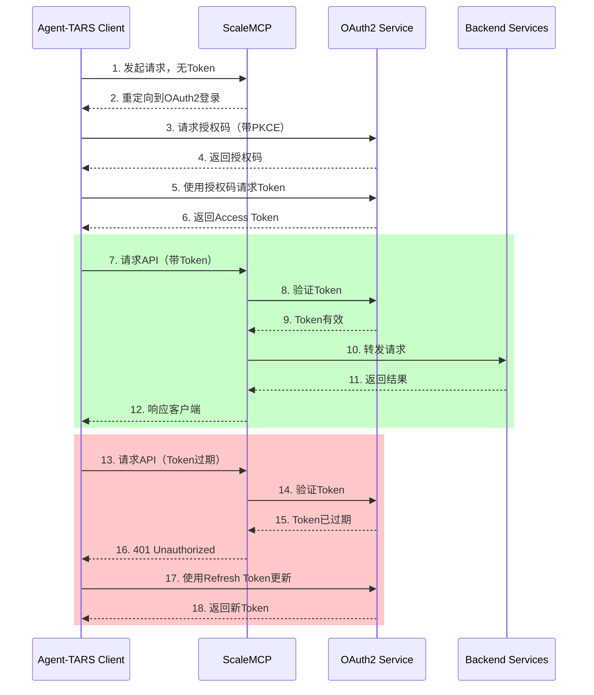

# 《Agent-TARS与Manus MCP Server联合架构设计与集成开发：总体战略及模块化计划修订版 V4》

文档版本： V4

## 产品背景

灵感岛是中国领先的企业级一站式内容营销增长服务商，背靠天下秀数字科技集团（A股代码：600556）。公司拥有15年+的内容营销行业服务经验、丰富的数据沉淀、AIGC技术加持和专业的企业服务能力。

### 产品愿景

灵感岛自媒体Manus（Social Manus）产品旨在为品牌商、广告代理公司及自媒体从业者提供全方位的数字营销解决方案，覆盖以下核心服务领域：

1. 品牌营销服务：
   - 多平台营销策略规划
   - 品牌内容矩阵设计
   - 营销效果追踪分析
   - ROI评估与优化建议

2. 达人营销服务：
   - 达人筛选与评估
   - 投放方案设计
   - 合作效果预测
   - 投放效果分析

3. 广告投放服务：
   - 平台广告策略制定
   - 投放预算规划
   - 广告创意优化
   - 投放效果监控

4. 内容创作服务：
   - 多平台内容规划
   - 爆款内容分析
   - 创意内容生成
   - 内容效果评估

### 目标用户群体

1. KOL、KOC和普通C端用户：
   - AI生成图文与视频内容
   - 爆文分析与专业知识获取
   - 多平台内容发布管理
   - 内容效果追踪

2. 中小企业(SMB)客户：
   - 内容策划与营销方案
   - 批量内容生成
   - 自动化发布服务
   - 营销效果分析

3. 大型企业客户：
   - 专业内容策划
   - 营销方案定制
   - 结案报告生成
   - 在线协同办公

### 核心技术架构

1. Agent技术：
   - 基于Agent-TARS开源项目
   - 实现专业的Social Media数据抓取RPA服务
   - 集成专业MCP服务（内容生成、数据分析、效果追踪）

2. LLM模型：
   - 采用DeepSeek的LLM模型
   - 提供强大的自然语言处理能力

3. 支持平台：
   - 国内：小红书、抖音、快手、B站、知乎
   - 国际：TikTok、X (Twitter)、Meta、Instagram、YouTube

版本修订说明：

-   V1.0 - V2.0: 参考《Agent-TARS与Manus MCP Server联合架构设计与集成开发：总体战略及模块化计划修订版 V2》及其前序版本。
-   V3.0: 基于用户最新指令要求及提供的所有参考文档（《模块1：核心架构原则与Manus MCP Server命名空间机制设计 - 详细设计文档 V1.3》、《模块2：用户中心与持久化服务 技术规范文档 (全面修订版) - V1.2_审阅反馈整合》、《模块3：集中式MCP存储库详细设计规范 (全面修订版)》、技术点专题综合分析报告、V3草案分析报告、V2计划文件），对联合架构的总体战略、核心模块设计方案、基础支撑系统规划、用户反馈及技术分析结论进行了全面集成与修订。重点明确了 ScaleMCP 的架构定位、Task Management 的服务器端执行能力、数据持久化与文件管理策略，并更新了模块化计划，旨在提供一份可执行且详细的 V3 项目蓝图。
-   V4.0: 基于用户最新反馈，更新了模块化计划。明确模块1范围调整为“核心架构原则与Manus MCP Server命名空间机制设计”，并暂停模块3（审计日志服务设计）。修订了后续工作计划流程图及模块详细规划文本。

## 1. 总体战略概述

联合架构的核心目标是构建一个可支撑百万级并发用户的、高度可扩展和模块化的AI Agent工具平台。平台以Agent-TARS为客户端载体，ScaleMCP为统一通信网关和工具管理层，Manus MCP Server为核心服务平台，并通过MCP协议提供丰富的工具能力。

核心挑战：

-   实现百万级用户下的高并发处理能力。
-   确保系统各组件的可扩展性与高可用性。
-   设计灵活高效的MCP工具发现、管理与调用机制。
-   提供稳定可靠、具备智能决策能力的服务器端托管任务执行能力。
-   构建安全、高效、具备数据保留与清理策略的数据持久化与文件管理方案。
-   在分布式环境中确保数据一致性与系统安全性。

联合架构高层概念：


*图1：联合架构高层概念示意 *

如图1所示 (此图基于模块1 V1.3的修订，清晰展示了 ScaleMCP 的关键地位)，Agent-TARS客户端通过ScaleMCP这一独立部署在服务器端的统一网关与Manus MCP Server平台的各种服务（核心服务、单应用 MCP Server 等）进行交互。ScaleMCP 负责连接管理、请求路由、初步认证与授权、权益检查，是所有客户端请求进入服务器端的唯一入口。Manus MCP Server平台提供用户中心、MCP存储库、认证、服务注册等基础能力，并托管各种MCP服务，包括专门用于服务器端托管执行的Task Management服务，以及Server File Management服务。

核心设计原则 ：

-   高性能 (High Performance)： 支持高并发、低延迟。
-   可扩展性 (Scalability)： 支持水平弹性伸缩。
-   模块化 (Modularity)： 服务解耦，独立开发部署。
-   高可用性 (High Availability)： 避免单点故障，自动恢复。
-   标准化 (Standardization)： 基于MCP协议及统一规范。
-   Agent 中心化 (Agent-Centric)： 服务Agent-TARS的工具调用需求。
-   数据一致性 (Data Consistency)： 分布式环境下的数据同步与最终一致性。
-   安全性 (Security)： 多层级认证授权与访问控制。
-   客户端-服务器端责任重塑 (Client-Server Responsibility Shift)： 将复杂的任务托管、状态管理等逻辑从客户端转移到服务器端，优化客户端体验，增强数据安全与可靠性。

本V4计划在此框架下，集成所有分析报告、用户反馈和决策，深化了关键 MCP 服务及基础支撑系统的设计思路，提供了更具指导性的开发规划，并根据用户最新指示修订了模块范围和计划。

## 2. 核心业务应用场景与技术方案设计

### 2.1 Task Management MCP Server (`sys.compute.general.task_management`)

-   业务场景： 支持Agent-TARS客户端将需要长时间运行、消耗服务器资源、或需要持续后台执行的任务托管到Manus MCP Server端执行。典型的应用包括：复杂数据分析、批量文件处理、持续监控、自动化流程等，特别是在百万并发场景下，将重计算和长任务从客户端卸载至服务器端至关重要。
-   技术方案设计：
    -   定位与职责： 作为Manus MCP Server平台提供的系统级计算服务，专注于托管任务的生命周期管理（创建、启动、暂停、恢复、中止、查询状态）和实际执行。它是一个无界面的执行环境。
    -   执行引擎设计： 服务器端托管任务的执行引擎需要复用或体现客户端AgentFlow的Loop (循环)、Aware (感知)、Executor (执行)核心理念，以便在无用户干预的环境下智能地推进任务。
        -   `Loop`： 引擎应实现一个自动化的执行循环，持续根据任务的当前状态和环境（如上一步工具的执行结果）决定下一步行动。
        -   `Aware`： 引擎包含分析逻辑，能够解析工具执行返回的`Observation`（观察结果），理解其含义，并根据预设的任务逻辑或依赖服务器端LLM（如果需要复杂决策）来智能地调整后续步骤或更新任务计划。它负责回答"接下来应该做什么？"
        -   `Executor`： 引擎能够动态选择和调用所需的MCP工具。根据`Aware`阶段的决策，`Executor`负责识别目标工具（通过命名空间），并利用Task Management服务与ScaleMCP的集成，通过ScaleMCP调用具体的后端MCP Server实例来执行工具，同时智能地组装工具调用所需的参数。它负责回答"如何去做？"
        -   这种设计确保了服务器端托管任务的动态性与智能化，而非简单的顺序脚本执行。
    -   百万并发下的实现考量： Task Management服务必须设计为高度可扩展和高可用的微服务。执行单元应尽量无状态，将任务的完整状态（包括执行历史、当前步骤、上下文数据）外部化到Persistence Service中。利用消息队列接收新任务请求、分发执行指令、处理执行结果回调，实现异步处理和解耦。采用集群部署和负载均衡。
    -   数据保留与清理策略 (整合技术分析报告结论)：
        -   存储需求与价值： `TaskContext.session_id` 用于关联托管任务与用户会话；`task_execution_history` 记录任务执行的详细日志（步骤、工具调用、输入输出、结果）。这些数据对任务调试、分析、回溯、审计及可能的断点续执行功能至关重要。
        -   无限期保留的挑战： 技术分析报告已明确，无限期保留将导致存储成本爆炸、数据库性能下降、隐私合规风险增加。
        -   定期清理/归档必要性与可行方案： 定期清理或归档是必要的。
            -   方案： 采用基于时间的自动清理/归档策略作为默认选项。例如，设定默认保留期限（如 3个月），超过期限的详细历史数据自动转移到成本更低的归档存储（如对象存储），或在确认无审计/合规需求后删除。
            -   可以考虑增加基于用户活跃度的策略辅助判断。
            -   实现： 在Persistence Service中设计相应的后台定时清理/归档服务。数据存储应考虑基于`user_id`或`task_id`（均为UUID V7）的分片/分区策略，优化大规模历史数据的管理和查询性能。
    -   核心 API 设计： `create_task` (客户端提交任务定义), `get_task_status` (查询状态), `list_user_tasks` (列出用户任务), `abort_task` (中止任务) 等。V4 计划暂不设计实现 `task_execution_history` 查询 API。
    -   与 ScaleMCP 及其他服务的交互： Task Management 执行引擎作为客户端，需要通过ScaleMCP调用其他后端MCP服务（如文件存储、数据处理等）。它也将任务状态更新等信息写入Persistence Service。

### 2.2 ScaleMCP (Unified Gateway)

-   业务场景： 作为Agent-TARS客户端（及潜在的其他客户端）与Manus MCP Server平台所有后端服务之间的唯一统一通信网关。它为客户端提供标准化的接入点，屏蔽了后端服务的网络位置、协议、负载均衡等细节，同时负责客户端请求的初步处理、认证、授权、路由和服务发现。
-   技术方案设计要点：
    -   定位与职责： ScaleMCP是一个独立部署在服务器端的关键服务组件，绝不部署在客户端。其核心职责包括：网络接入与连接管理、请求解析、网络路由（根据命名空间、版本、MCP Server 实例信息将请求转发到后端服务）、用户认证（与OAuth2服务协作）、权益反馈（根据用户权限检查服务访问）、重连与状态同步（管理客户端会话，帮助恢复上下文）、统一客户端API调用（提供基于MCP命名空间的抽象API，向下适配不同后端协议）。
    -   核心职责：
        -   网络接入与连接管理： 处理客户端网络连接。
        -   请求解析与转发： 解析客户端请求，基于命名空间、版本、MCP Server实例信息路由至后端实例。
        -   用户认证与授权： 执行认证 (与 OAuth2 协作) 和权限检查 (与用户中心协作)。V4 计划评估并倾向于将 OAuth2 作为独立服务设计。
        -   权益反馈： 基于用户权益控制服务访问。
        -   重连与状态同步： 管理客户端会话，支持重连后恢复上下文 (非核心任务状态)。
        -   统一客户端 API： 向上提供基于 MCP 命名空间的抽象接口。
        -   动态工具发现与管理： 定期或增量调用 MCP Repository (`sys.service.mcp_repository`) 同步元数据至本地缓存。客户端查询 ScaleMCP 的本地缓存发现工具。
    -   与 Agent-TARS 客户端交互设计： 客户端通过高效、持久化的网络协议（如WebSocket或HTTP/2）与服务器端的ScaleMCP集群通信。协议应支持请求/响应、异步通知（例如，任务状态更新）以及流式数据传输。
    -   与后端 MCP Server 交互设计： ScaleMCP需要适配与不同后端MCP Server通信的协议（可能是HTTP, gRPC等）。它内部维护到后端服务实例的连接池，并选择合适的后端实例转发请求。
    -   工具发现与同步机制 (与 MCP Repository 交互): ScaleMCP主动作为客户端，定期或增量地调用MCP Repository Service（`sys.service.mcp_repository.sync_mcp_metadata`等API），将所有可用的MCP功能元数据（命名空间、版本、Schema、描述、`service_id`等）同步到本地缓存中。Agent-TARS通过查询ScaleMCP的本地缓存来发现工具。
    -   百万并发下的实现考量： ScaleMCP是整个系统的流量入口，其性能是关键瓶颈之一。设计应尽量无状态，将用户会话状态存储在外部分布式缓存（如Redis）。采用高并发网络模型（如基于Epoll/Kqueue的异步IO）。部署多实例集群，并通过L4/L7负载均衡器分发客户端流量。实现限流、熔断等机制保护后端服务。

### 2.3 MCP Repository Service (`sys.service.mcp_repository`)

-   业务场景： 提供一个集中式、权威性的存储来管理Manus MCP Server生态系统中所有MCP功能（包括系统内置和扩展）的元数据。Agent-TARS通过ScaleMCP访问这些元数据，了解有哪些工具可用、如何调用、参数是什么等信息，实现动态工具发现。同时，MCP Server开发者也需要向Repository注册和更新其提供的功能。
-   技术方案设计：
    -   定位与职责： Manus MCP Server平台的核心服务，负责MCP功能定义的CRUD（创建、读取、更新、删除）和版本管理。它存储的是"我是谁？我能做什么？"这类定义性信息。
    -   数据模型设计： 核心实体包括：
        -   `Service`：表示一个逻辑服务单元，对应命名空间中的`<Service>`部分，具有唯一的`service_id` (UUID V7)。包含服务名称、描述等。
        -   `Function`：表示服务下的一个具体功能，对应命名空间中的`<Function>`部分。与`Service`关联。
        -   `FunctionVersion`：表示某个功能在特定版本下的定义。具有版本号(`version`)，唯一的`function_version_id` (UUID V7)。包含完整的MCP命名空间、输入Schema (`input_schema`, JSON Schema格式)、输出Schema (`output_schema`)、描述、功能标记(`client_required`, `is_stateful`等)、对应的`service_id`等。这是ScaleMCP同步的主要内容。
    -   核心 API 设计： `register_function` (注册或更新功能版本元数据), `list_mcp_functions` (按条件查询功能列表), `get_mcp_function_metadata` (获取特定功能版本的详细元数据), `sync_metadata_for_scalemcp` (优化接口，供ScaleMCP高效增量同步元数据，可能基于时间戳或版本号范围)。
    -   版本管理策略： 支持同一命名空间下注册和查询多个版本。调用方可通过指定版本号调用特定版本，默认为最新版本。
    -   与 ScaleMCP 的同步机制： ScaleMCP作为主要消费者，通过调用专门设计的同步接口，将FunctionVersion的元数据同步到本地缓存。同步策略应考虑效率，减少不必要的数据传输，例如仅同步自上次同步以来有变更的记录。
    -   百万并发下的实现考量： MCP Repository以读操作为主（ScaleMCP同步和Agent-TARS/ScaleMCP查询），写操作相对较少（新服务或功能发布）。读性能是关键。数据存储可采用关系型数据库（如PostgreSQL）。通过索引优化查询性能。考虑读写分离，支持 ScaleMCP 从只读副本同步。

### 2.4 Server File Management MCP Server (`sys.storage.server_file`)

-   业务场景： 
    -   场景1 - 任务文件管理：为Agent-TARS任务执行过程中产生或关联的文件（如Agent生成的报告、下载的图片、用户上传的文档等）提供服务器端的集中存储和管理。每个任务（session_id）拥有独立的虚拟文件系统，所有相关文件都在此任务目录下组织管理。
    -   场景2 - 知识库文件存储：为用户个人知识库提供文件存储服务。知识库文件按照user_id方式组织，确保每个用户的知识库独立管理且可在不同会话中共享访问。知识库作为用户级资源，在任何会话中都可以被查询和使用。
-   技术方案设计：
    -   定位与职责： Manus MCP Server平台提供的系统级存储服务，管理用户在任务/会话上下文中产生的文件数据和用户级知识库文件。
    -   存储方案设计：
        -   文件本身存储： 文件二进制数据存储在独立的、可扩展的文件存储系统上，如对象存储服务（AWS S3兼容服务）或分布式文件系统。保留存储系统本身提供的多副本备份机制。
        -   元数据存储： 根据文件类型采用不同的组织方式：
            -   任务相关文件： 在服务器端每个任务（session_id）对应的`/`目录下使用`.metadata.json`隐藏文件存储元数据。
            -   知识库文件： 在用户（user_id）的知识库根目录下统一管理元数据。
        -   元数据内容包含：
            -   文件基本信息： 文件名、大小、创建时间、最后修改时间、MIME类型等
            -   所有者信息： user_id、权限信息
            -   版本信息： 当前版本号、完整的版本历史链（包含每个版本的文件引用、修改时间、修改原因等）
            -   存储信息： 在文件存储系统中的路径或引用
            -   关联信息： 对于任务文件，包含与任务/对话的关联ID；对于知识库文件，包含知识库分类等信息
    -   客户端文件逻辑与本地缓存： 客户端需要维护本地文件缓存，提高访问性能并支持有限的离线访问。客户端通过ScaleMCP调用Server File Management MCP进行文件操作，同时管理本地缓存（包括缓存时长和清理策略）。
    -   核心 API 设计： 
        -   `upload_file` (上传文件，返回文件ID/URL)
        -   `download_file` (下载文件)
        -   `list_task_files` (列出与任务/会话关联的文件)
        -   `get_file_metadata` (获取文件元数据)
        -   `rewrite_file` (文件改写服务，创建新版本并维护版本历史)
        -   `get_file_history` (获取文件的版本历史)
        -   `get_file_version` (获取指定版本的文件)
    -   与 Task Management 及 Persistence Service 的关系： Task Management服务在执行任务时可能生成或处理文件，这些文件通过调用Server File Management MCP的API进行存储。文件ID/URL信息记录在任务历史(`task_execution_history`)或对话历史(`dialog_history`)中（存储在Persistence Service）。
    -   百万并发下的实现考量： 服务设计为无状态，支持水平扩展。上传下载接口支持断点续传。使用CDN加速文件下载。元数据的读写通过文件系统操作进行，需要适当的并发控制机制。

### 2.5 OAuth2 服务设计评估与方案

#### 2.5.1 系统定位与设计原则

OAuth2服务(`sys.service.oauth2`)作为Manus MCP Server平台的核心认证授权服务，采用以下设计原则：

-   简洁性： 采用单一认证流程，降低系统复杂度
-   安全性： 使用授权码模式 + PKCE确保安全性
-   可扩展性： 支持水平扩展以应对高并发
-   高性能： 采用多级缓存策略
-   可靠性： 关键数据持久化存储

#### 2.5.2 核心功能设计

##### 2.5.2.1 认证流程

采用授权码模式 + PKCE (Proof Key for Code Exchange)：

- 适用所有客户端类型（桌面、Web、移动）
- PKCE机制防止授权码拦截攻击
- 统一的用户认证体验
- 支持安全的令牌刷新机制

认证流程步骤：

1. 客户端初始化：
   - 生成PKCE的code_verifier和code_challenge
   - 准备client_id和redirect_uri

2. 授权请求：
   - 客户端重定向用户到授权端点
   - 携带code_challenge和code_challenge_method

3. 用户授权：
   - 用户完成身份认证
   - 确认授权范围（scopes）

4. 授权码颁发：
   - 服务器生成授权码
   - 重定向回客户端（带授权码）

5. 令牌交换：
   - 客户端使用授权码和code_verifier请求令牌
   - 服务器验证后颁发访问令牌和刷新令牌

##### 2.5.2.2 Token设计

JWT (JSON Web Token) 结构：

```json
{
  "header": {
    "alg": "RS256",
    "typ": "JWT"
  },
  "payload": {
    "iss": "sys.service.oauth2",
    "sub": "<user_id>",
    "aud": "<client_id>",
    "exp": 1735689600,
    "iat": 1735603200,
    "jti": "<uuid_v7>",
    "scope": ["read", "write"],
    "type": "access_token"
  }
}
```

Token策略：

1. Access Token：
   - 有效期：2小时
   - 格式：JWT，使用RS256签名
   - 包含用户身份和权限信息

2. Refresh Token：
   - 有效期：30天
   - 存储：安全存储在Redis集群
   - 支持自动刷新机制

3. 安全机制：
   - Token撤销机制
   - 黑名单管理
   - 并发会话控制

##### 2.5.2.3 核心API
```
sys.service.oauth2.authorize
- 功能：获取授权码
- 参数：client_id, redirect_uri, code_challenge, state
- 返回：authorization_code

sys.service.oauth2.token
- 功能：获取访问令牌
- 参数：client_id, code, code_verifier
- 返回：access_token, refresh_token

sys.service.oauth2.validate
- 功能：验证令牌
- 参数：token
- 返回：user_id, scope

sys.service.oauth2.refresh
- 功能：刷新访问令牌
- 参数：refresh_token
- 返回：new_access_token
```

#### 2.5.3 存储设计

##### 2.5.3.1 Redis存储结构与切片策略

核心缓存设计：

```redis
# Token相关数据（按user_id切片）
{user_shard_01}:access_tokens:<token_id> -> {
    user_id: string,
    client_id: string,
    expires_at: timestamp,
    scope: string[]
}

{user_shard_01}:refresh_tokens:<token_id> -> {
    user_id: string,
    client_id: string,
    expires_at: timestamp,
    scope: string[]
}

{user_shard_01}:user_sessions:<user_id> -> Set<token_id>

# 使用一致性哈希确保相同user_id的数据在同一分片
```

切片策略：
- 基于user_id（UUID V7）进行一致性哈希分片
- 每个Redis分片独立管理其负责范围内的用户Token数据
- 默认16个分片，支持动态扩展到32/64分片
- 分片间数据隔离，提高并发处理能力

##### 2.5.3.2 PostgreSQL表结构与分片策略

```sql
-- OAuth客户端表（不分片，数据量小）
CREATE TABLE oauth_clients (
    id UUID PRIMARY KEY DEFAULT uuid_generate_v7(),
    client_id VARCHAR(100) UNIQUE NOT NULL,
    client_secret TEXT NOT NULL,
    name TEXT NOT NULL,
    redirect_uris TEXT[],
    created_at TIMESTAMP WITH TIME ZONE DEFAULT CURRENT_TIMESTAMP
);

-- 授权记录表（按user_id分片）
CREATE TABLE oauth_authorizations_SHARD_XX (
    id UUID PRIMARY KEY DEFAULT uuid_generate_v7(),
    user_id UUID NOT NULL,
    client_id VARCHAR(100) NOT NULL,
    scope TEXT[],
    created_at TIMESTAMP WITH TIME ZONE DEFAULT CURRENT_TIMESTAMP,
    FOREIGN KEY (client_id) REFERENCES oauth_clients(client_id)
);

-- 分片索引
CREATE INDEX idx_auth_user_id_SHARD_XX ON oauth_authorizations_SHARD_XX (user_id);
CREATE INDEX idx_auth_client_created_SHARD_XX ON oauth_authorizations_SHARD_XX (client_id, created_at);

-- 审计日志表（按时间分片）
CREATE TABLE oauth_audit_logs_YYYYMM (
    id UUID PRIMARY KEY DEFAULT uuid_generate_v7(),
    user_id UUID,
    client_id VARCHAR(100),
    action VARCHAR(50),
    status VARCHAR(20),
    created_at TIMESTAMP WITH TIME ZONE DEFAULT CURRENT_TIMESTAMP
);

-- 分片索引
CREATE INDEX idx_audit_user_time_YYYYMM ON oauth_audit_logs_YYYYMM (user_id, created_at);
CREATE INDEX idx_audit_client_time_YYYYMM ON oauth_audit_logs_YYYYMM (client_id, created_at);
```

分片策略：

1. 授权记录表分片：
   - 基于user_id（UUID V7）进行范围分片
   - 默认16个分片，每个分片独立表
   - 分片键索引优化查询性能
   - 支持在线分片扩展

2. 审计日志表分片：
   - 基于时间进行分片（按月）
   - 自动创建新分片表
   - 支持历史数据归档
   - 保留最近3个月活跃数据

3. 分片路由：
   - 使用中间件实现分片路由
   - 支持跨分片查询
   - 分片元数据统一管理
   - 自动维护分片索引

4. 数据一致性：
   - 分片内事务保证
   - 全局事务ID跟踪
   - 分片间最终一致性
   - 异常情况回滚机制

#### 2.5.4 OAuth2 与 ScaleMCP 的关系说明



关系说明

1. 职责分工：
   - OAuth2服务：负责用户认证和授权管理
   - ScaleMCP：作为统一网关，负责请求的路由和转发

2. 交互流程：
   - 初始认证：客户端首先通过OAuth2获取访问令牌
   - 请求处理：ScaleMCP验证令牌并路由请求
   - 令牌刷新：当令牌过期时，客户端通过OAuth2更新

3. 安全机制：
   - 使用PKCE增强认证安全性
   - ScaleMCP对每个请求进行Token验证
   - 支持Token自动刷新机制

4. 设计优势：
   - 认证与网关职责清晰分离
   - 支持分布式部署和扩展
   - 统一的认证和访问控制 

#### 2.5.5 高可用设计

##### 2.5.5.1 存储高可用

Redis集群：

  * 采用主从复制 + 哨兵模式
  * 最小3节点集群配置
  * 定期数据持久化

PostgreSQL：

  * 主从复制架构
  * 读写分离策略
  * 定期备份机制

##### 2.5.5.2 服务高可用

监控指标

- 性能指标：
  * Token验证延迟
  * API请求QPS
  * 缓存命中率
- 业务指标：
  * 活跃token数量
  * 认证成功率
  * 异常登录统计

日志规范

- 统一日志格式
- 分级日志策略
- 关键操作审计
- 错误日志追踪

#### 2.5.6 监控运维

##### 2.5.6.1 监控指标

监控指标

- 性能指标：
  * Token验证延迟
  * API请求QPS
  * 缓存命中率
- 业务指标：
  * 活跃token数量
  * 认证成功率
  * 异常登录统计

##### 2.5.6.2 日志规范

日志规范

- 统一日志格式
- 分级日志策略
- 关键操作审计
- 错误日志追踪

## 3. 基础支撑系统架构方案设计

为支撑Manus MCP Server及ScaleMCP在百万级用户下的稳定运行，需要robust的基础
支撑系统。

-   Database Cluster (PostgreSQL)：
    -   作用： 存储用户数据、MCP 元数据、用户配置、MCP功能元数据（MCP Repository）等核心结构化数据。
    -   方案： 主备复制，读写分离。为百万用户，用户相关大表（用户、配置等）必须基于 UUID V7 (如 `user_id`) 进行数据分片/分区。将ScaleMCP同步元数据、任务状态查询等读密集型操作路由到只读副本。
    -   考量： 使用连接池管理数据库连接，避免频繁创建销毁。对核心查询语句进行性能优化，建立必要索引。实施定期清理/归档策略。

-   Redis Cluster：
    -   作用： 高性能缓存和临时数据存储。用于 MCP 元数据缓存 (ScaleMCP 回源)、用户会话、实时任务状态 (`task_state`)、分布式锁等。同时支持用户配置热数据、在线用户列表等实时状态数据的存储。
    -   方案： Cluster 模式，高可用、水平扩展。RDB/AOF 持久化。利用 Key Tag 按 `{ID}` 自动分片。根据数据重要性选择合适的持久化策略。
    -   考量： 内存管理、Key 策略、缓存命中率、容错。处理缓存穿透、击穿、雪崩问题。设计合理的Key命名空间和过期策略。

-   File Storage System (阿里云OSS)：
    -   作用： 集中存储文件二进制数据。包括Server File Management产生的文件、系统日志、备份数据等。
    -   方案： 
        - 存储类型： 标准存储（提供高可靠、高可用、高性能的对象存储服务）
        - 冗余策略： 同城冗余存储（提供99.9999999999%的数据可靠性）
        - 生命周期： 根据业务需求设置文件生命周期管理策略
        - 访问控制： 基于RAM和STS的细粒度权限控制
        - 性能优化：
            * 使用断点续传上传（适用于大文件传输）
            * 开启传输加速（针对跨地域访问场景）
            * 合理设置分片大小（建议1MB-5MB）
    -   考量：
        - 成本优化： 根据访问频率选择存储类型
        - 安全性： 开启服务端加密，使用HTTPS访问
        - 备份策略： 关键数据启用跨区域复制
        - 监控告警： 配置存储容量和请求量监控

-   Message Queue (Kafka)：
    -   作用： 系统解耦、削峰填谷、异步通信。支持日志收集、监控数据聚合、流式数据处理等场景。
    -   方案： 
        - 集群规模： 3节点起步，支持横向扩展
        - 分区策略： 根据topic吞吐量设置合理的分区数（建议分区数=预期峰值吞吐量/单分区吞吐量）
        - 副本因子： 关键topic配置3副本，一般topic配置2副本
        - 性能优化：
            * 合理设置batch.size（建议16KB-128KB）
            * 配置适当的linger.ms（建议5-100ms）
            * 启用压缩（建议使用lz4或snappy）
    -   考量：
        - 可靠性： acks=all保证数据不丢失
        - 性能： 合理配置生产者和消费者参数
        - 监控： 配置JMX监控，实时掌握集群状态
        - 运维： 提供完善的运维工具和预案

# 4. 后续工作计划与模块化设计及文档撰写战略

### 4.1 后续工作计划流程

以下流程图展示了模块化设计的整体流程、依赖关系和验证机制：

```mermaid
graph TD
    %% 开始节点
    Start["开始：需求分析与确认"] --> B1_V4

    %% 基础设施层
    subgraph "Infrastructure[基础设施层]"
        B1_V4["模块1: 核心架构原则与Manus MCP Server命名空间机制设计"] --> C1{"用户确认"}
        C1 -->|否| B1_V4
        C1 -->|是| B2
        
        B2["模块2: 持久化服务设计"] --> C2{"用户确认"}
        C2 -->|否| B2
        
        B3["模块3: 审计日志服务设计(暂停)"] --> C3{"用户确认"}
        C3 -->|否| B3
    end

    %% Core/Gateway/Business/Extension now depend on C2 confirming Module 2
    C2 -->|是| D1

    %% 核心服务层
    subgraph "Core[核心服务层]"
        D1["模块4: 用户中心服务设计"] --> E1{"用户确认"}
        E1 -->|否| D1
        E1 -->|是| D2
        
        D2["模块5: OAuth2服务设计"] --> E2{"用户确认"}
        E2 -->|否| D2
        E2 -->|是| D3
        
        D3["模块6: MCP存储库服务设计"] --> E3{"用户确认"}
        E3 -->|否| D3
    end

    %% 网关层
    subgraph "Gateway[网关层]"
        E3 -->|是| F1
        F1["模块7: ScaleMCP设计"] --> G1{"用户确认"}
        G1 -->|否| F1
    end

    %% 业务服务层
    subgraph "Business[业务服务层]"
        G1 -->|是| H1
        H1["模块8: Task Management服务设计"] --> I1{"用户确认"}
        I1 -->|否| H1
        I1 -->|是| H2
        
        H2["模块9: Server File Management服务设计"] --> I2{"用户确认"}
        I2 -->|否| H2
    end

    %% 扩展服务层
    subgraph "Extension[扩展服务层]"
        I2 -->|是| J1
        J1["模块10: 小红书MCP Server设计"] --> K1{"用户确认"}
        K1 -->|否| J1
        K1 -->|是| J2
        
        J2["模块11: 数字人MCP Server设计"] --> K2{"用户确认"}
        K2 -->|否| J2
    end

    %% 架构评估与整合
    K2 -->|是| L["模块12: 分布式架构评估"]
    L --> M{"用户确认"}
    M -->|否| L
    M -->|是| N["模块13: 整合与文档完善"]
    N --> O{"最终确认"}
    O -->|否| N
    O -->|是| End["项目完成"]

    %% 样式定义
    classDef infrastructure fill:#f9f,stroke:#333,stroke-width:2px
    classDef core fill:#bbf,stroke:#333,stroke-width:2px
    classDef gateway fill:#bfb,stroke:#333,stroke-width:2px
    classDef business fill:#fbb,stroke:#333,stroke-width:2px
    classDef extension fill:#ffb,stroke:#333,stroke-width:2px

    %% 应用样式
    class Infrastructure infrastructure
    class Core core
    class Gateway gateway
    class Business business
    class Extension extension

    %% 添加注释
    note_C3["Module 3 paused.<br>Proceed with Module 4<br>after Module 2 confirmation."]
    C3 --- note_C3
```



*注：每个模块完成后都需要进行跨模块验证，确保与已完成模块的一致性和兼容性。如发现问题，将优先修订相关模块。*

### 4.2 模块详细规划

基于系统分层架构，按照依赖关系和开发优先级，规划如下：

1. 基础设施层（Infrastructure Layer）：
   - 模块1：核心架构原则与Manus MCP Server命名空间机制设计：
     * 目标： 设计Manus MCP Server的核心架构原则、Manus MCP Server的命名空间机制、基础服务发现机制等。
     * 预期产出： 详细设计文档（核心原则、命名空间规范与应用、服务发现方案）
     * 验收标准： 清晰定义架构核心、命名空间使用规范、服务注册与发现集成方案
   
   - 模块2：持久化服务设计 (`sys.service.persistence`)：
     * 目标： 设计统一的数据持久化服务
     * 预期产出： 详细设计文档（存储策略、缓存机制、数据同步）
     * 验收标准： 支持高并发、数据一致性、分库分表
   
   - 模块3：审计日志服务设计 (`sys.service.audit`)：
     * 目标： 暂停。各服务暂时依赖自身日志机制。
     * 预期产出： 暂停。
     * 验收标准： 暂停。

2. 核心服务层（Core Layer）：
   - 模块4：用户中心服务设计 (`sys.service.user_center`)：
     * 目标： 设计用户管理与授权服务
     * 预期产出： 详细设计文档（用户模型、权限体系、API）
     * 验收标准： 支持百万用户、细粒度权限、高并发访问
   
   - 模块5：OAuth2服务设计 (`sys.service.oauth2`)：
     * 目标： 设计统一认证服务
     * 预期产出： 详细设计文档（认证流程、Token管理、安全机制）
     * 验收标准： 符合OAuth2规范、支持PKCE、高性能验证
   
   - 模块6：MCP存储库服务设计 (`sys.service.mcp_repository`)：
     * 目标： 设计MCP工具元数据管理服务
     * 预期产出： 详细设计文档（元数据模型、同步机制、版本控制）
     * 验收标准： 支持工具发现、版本管理、高效同步

3. 网关层（Gateway Layer）：
   - 模块7：ScaleMCP设计：
     * 目标： 设计统一网关服务
     * 预期产出： 详细设计文档（路由策略、负载均衡、服务发现）
     * 验收标准： 支持动态路由、高可用、可扩展

4. 业务服务层（Business Layer）：
   - 模块8：Task Management服务设计 (`sys.compute.general.task_management`)：
     * 目标： 设计任务管理服务
     * 预期产出： 详细设计文档（任务模型、执行引擎、状态管理）
     * 验收标准： 支持任务编排、状态追踪、错误恢复
   
   - 模块9：Server File Management服务设计 (`sys.storage.server_file`)：
     * 目标： 设计文件管理服务
     * 预期产出： 详细设计文档（存储策略、元数据管理、访问控制）
     * 验收标准： 支持大文件处理、版本控制、权限管理

5. 扩展服务层（Extension Layer）：
   - 模块10：小红书MCP Server设计：
     * 目标： 设计小红书专用服务
     * 预期产物： 详细设计文档（业务流程、接口定义、集成方案）
     * 验收标准： 满足小红书业务需求、支持平台集成
   
   - 模块11：数字人MCP Server设计：
     * 目标： 设计数字人服务
     * 预期产出： 详细设计文档（功能模型、交互接口、集成方案）
     * 验收标准： 支持数字人功能、平台兼容性

6. 架构评估与整合：
   - 模块12：分布式架构评估：
     * 目标： 评估系统分布式部署方案
     * 预期产出： 评估报告（可行性分析、风险评估、优化建议）
     * 验收标准： 完整的分布式方案、明确的实施路径
   
   - 模块13：整合与文档完善：
     * 目标： 整合所有模块文档
     * 预期产出： 完整的系统设计文档
     * 验收标准： 文档完整性、一致性、可执行性

### 4.3 跨模块验证与迭代优化规范

为确保系统的整体一致性和可维护性，建立以下验证与优化机制：

1. 跨模块验证流程：
   - 依赖关系验证： 确保模块间接口兼容
   - 性能指标验证： 验证系统整体性能
   - 安全机制验证： 确保安全策略统一
   - 数据流验证： 验证数据流转的完整性

2. 迭代优化机制：
   - 问题收集： 记录设计过程中发现的问题
   - 优化分析： 评估优化方案的可行性
   - 变更管理： 控制设计变更的影响范围
   - 文档同步： 确保文档及时更新

3. 验收标准：
   - 功能完整性： 满足所有功能需求
   - 性能达标： 满足性能指标要求
   - 可维护性： 代码结构清晰，文档完整
   - 可扩展性： 支持未来功能扩展

通过严格执行以上规范，确保系统设计的质量和可实施性。每个模块的设计都需要经过完整的验证流程，并在必要时进行优化调整。

## 5. 结论

《Agent-TARS与Manus MCP Server联合架构设计与集成开发：总体战略及模块化计划修订版 V4》全面整合了所有现有分析报告、用户反馈和关键决策，并根据最新指示修订了模块化计划。本文档清晰定义了 V4 阶段的关键内容：

1. 核心架构与基础支撑：
   - 明确了支撑百万级用户规模的分布式架构设计
   - 确立了基础支撑系统（PostgreSQL集群、Redis集群、文件存储系统、消息队列）的关键角色
   - 规范了系统各层级（基础设施层、核心服务层、网关层、业务服务层、扩展服务层）的职责边界
   - 完善了基础支撑系统架构方案设计，确保系统稳定性和可扩展性

2. 关键MCP服务设计：
   - Task Management (`sys.compute.general.task_management`): 复用AgentFlow的Loop、Aware、Executor理念，实现智能化的服务器端任务托管执行
   - ScaleMCP: 确立其作为统一网关的核心地位，负责请求路由、认证授权、服务发现等关键功能
   - MCP Repository (`sys.service.mcp_repository`): 作为功能元数据的权威存储，支持工具发现和版本管理
   - Server File Management (`sys.storage.server_file`): 采用基于session_id的虚拟文件系统设计，统一管理任务文件和知识库文件
   - OAuth2服务 (`sys.service.oauth2`): 采用授权码模式 + PKCE，确保认证安全性和可扩展性

3. 数据管理策略：
   - 明确了任务历史数据的保留和清理策略
   - 优化了文件存储的元数据管理方案
   - 完善了数据分片和缓存策略，支持百万用户规模
   - 规范了各类ID（user_id、session_id、task_id等）采用UUID V7标准

4. 系统集成与安全：
   - 建立了完整的服务注册与发现机制
   - 规范了跨服务通信和数据同步策略
   - 强化了安全防护和访问控制机制
   - 优化了服务间的依赖关系和交互模式

5. 模块计划修订：
   - 模块1范围更新为“核心架构原则与Manus MCP Server命名空间机制设计”
   - 模块3（审计日志服务设计）暂停

通过严格执行这些计划，我们将构建一个稳定、高效、可扩展的AI Agent工具平台，为百万级用户提供优质的服务。

## 6. 技术文档编写规范与要求

为确保Cursor AI能准确理解和实现技术方案，所有技术文档必须遵循以下要求：

1. 结构化描述
   - 采用清晰的层次结构，使用统一的标题级别
   - 每个模块必须包含：定位与职责、核心功能、技术方案、接口定义
   - 关键概念必须提供明确的定义和示例

2. 完整性保证
   - 详细描述所有核心组件和关键流程
   - 明确说明组件间的依赖关系和交互方式
   - 包含必要的配置参数和运行时要求

3. 精确性要求
   - 使用准确的技术术语，避免模糊表述
   - 为API和数据结构提供完整的规格说明
   - 明确标注可选项和必选项

4. 实现指导
   - 提供关键算法和核心逻辑的详细描述
   - 包含错误处理和异常情况的处理方案
   - 说明性能要求和优化建议

5. 可追溯性
   - 记录设计决策的原因和考虑因素
   - 说明与其他模块的关联和影响
   - 标注版本信息和变更历史

6. 命名空间规范
   - 严格遵循MCP四段式命名空间规范
   - 明确服务的Scope和Category定义
   - 保持命名的一致性和可理解性

我希望你从系统健壮性、设计方案简洁性开发门槛低、开发效率高、开发可控性高、系统稳定性强方面进行严谨设计。
通过遵循这些规范，确保技术文档能够为Cursor AI提供清晰、完整、准确的实现指导，减少开发过程中的歧义和不确定性。