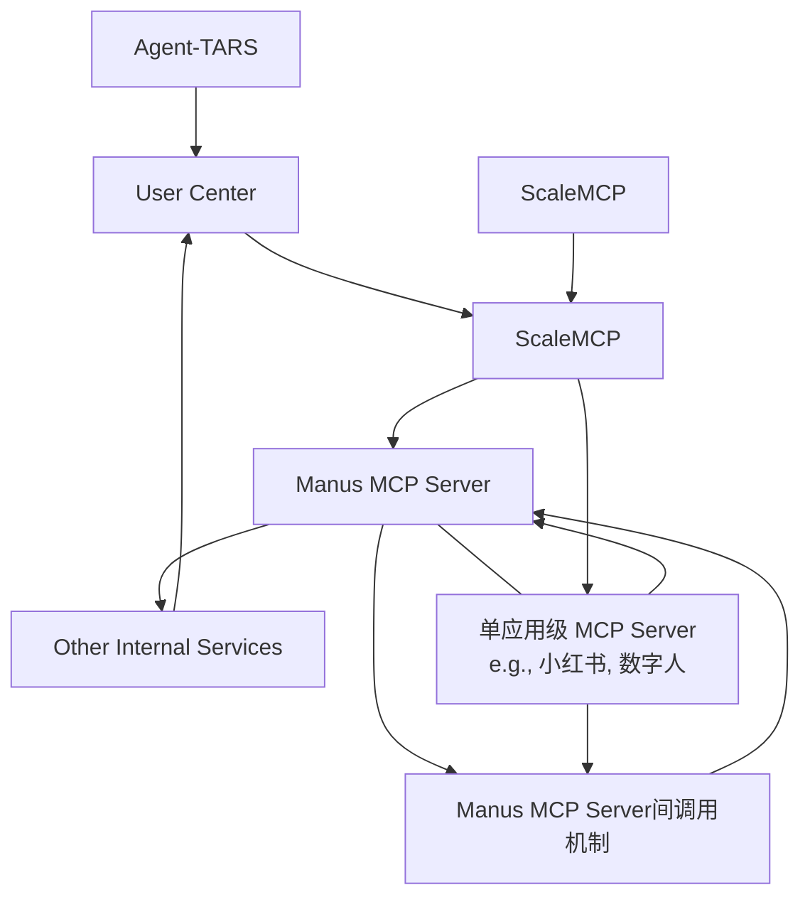
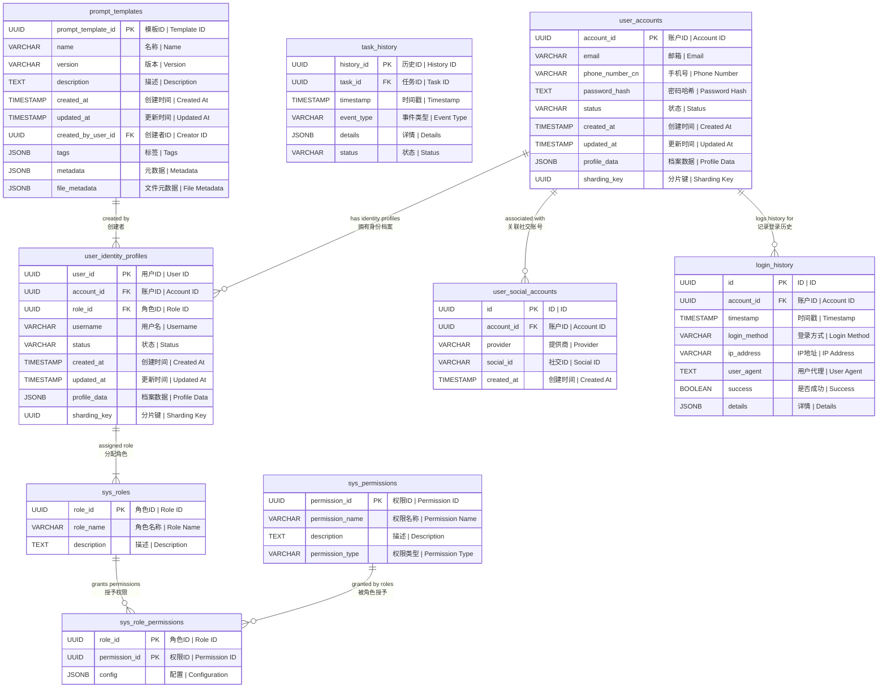
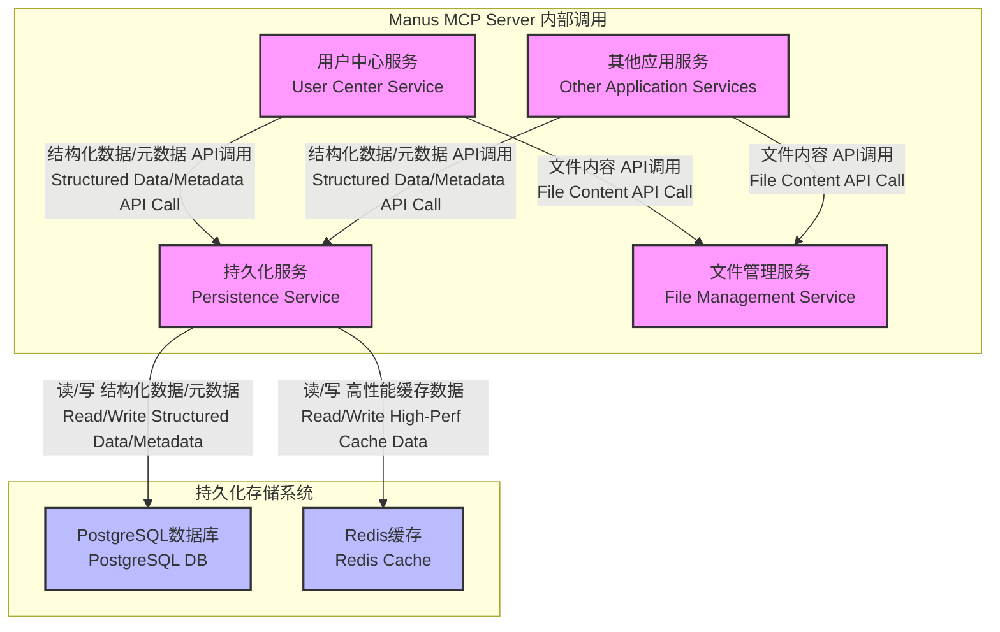
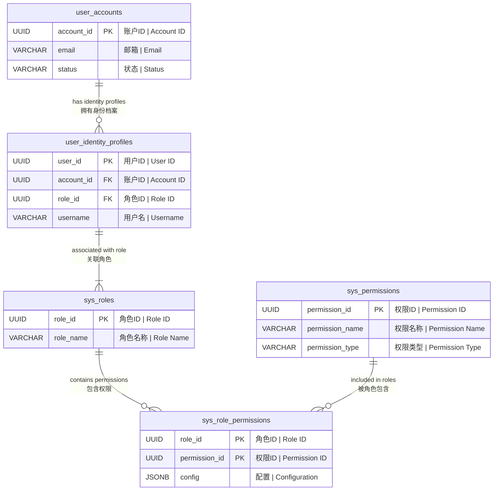

# Agent-TARS & Manus MCP Server 核心技术规范库 V1.2

## 目录

1.  概述
    1.1. 项目背景与总体战略
    1.2. Manus MCP Server 联合架构概念
    1.3. 文档范围与目标

2.  模块2：持久化服务核心规范 (`sys.storage.persistence`)
    2.1. 引言与服务定位
    2.2. 数据库设计与优化指南
        2.2.1. 最终数据模型（概念ER图与说明）
        2.2.2. 核心表结构详细设计
        2.2.3. 索引策略
        2.2.4. 数据库分片与分区策略
        2.2.5. 数据一致性与事务管理（PostgreSQL）
        2.2.6. 查询优化与SQL指南
    2.3. Redis缓存架构设计
        2.3.1. 缓存设计目标与原则
        2.3.2. Redis数据结构与Key命名规范
        2.3.3. 核心业务缓存方案
        2.3.4. 集群与高可用方案
        2.3.5. 缓存一致性策略（PG与Redis）
        2.3.6. 缓存淘汰与持久化
    2.4. 持久化服务详细实现规范
        2.4.1. 集成与依赖
        2.4.2. API实现逻辑
        2.4.3. 数据读/写流程（Cache-Aside Illustration）
        2.4.4. 事务管理
        2.4.5. 数据一致性保障
        2.4.6. 配置和初始化
        2.4.7. 错误处理和日志记录
    2.5. 持久化服务API规格说明
        2.5.1. 引言
        2.5.2. 通用设计原则
        2.5.3. API端点详述
        2.5.4. 数据模型/类型定义
        2.5.5. 词汇表/术语解释

3.  模块4：用户中心服务核心规范 (`sys.service.user_center`)
    3.1. 引言
    3.2. 用户中心服务详细设计 (修订版)
        3.2.1. 引言
        3.2.2. API接口规范 (初步)
        3.2.3. 数据模型设计
        3.2.4. 核心业务流程 (修订版)
        3.2.5. 用户认证与授权集成方案 (修订版)
        3.2.6. 技术选型与考量 (初步)
        3.2.7. 与模块1和模块2的集成 (修订版)
        3.2.8. 安全性设计 (修订版)
        3.2.9. 部署与运维考量 (初步)
    3.3. 权限管理系统设计
        3.3.1. 权限模型：基于多身份档案的RBAC模型
        3.3.2. 缓存集成：基于Redis的高性能权限数据存储
        3.3.3. 计算与验证：核心算法与流程
        3.3.4. API设计 (用户中心内部API)
    3.4. 用户中心服务API实现指南
        3.4.1. API接口总览
        3.4.2. 核心API实现逻辑与M2交互
        3.4.3. 核心业务流程图
        3.4.4. 错误处理和错误码
        3.4.5. 持久化服务 (M2) 交互细节
        3.4.6. 对AI代码生成的指导意义
    3.5. 用户中心服务与持久化服务联合开发技术文档 (修订版)
        3.5.1. 集成概述
        3.5.2. 模块2为模块4提供的数据库与Redis数据结构补充
        3.5.3. 模块2为模块4提供的API补充
        3.5.4. 数据交互流程与操作支持
        3.5.5. 文档对Cursor AI开发的适用性提升

4.  附录
    4.1. 数据库表结构设计脚本 (原始)
    4.2. P0级技术文档集交叉验证报告（结论与建议）
    4.3. 其他参考文档摘要
        4.3.1. 总体战略与模块化计划摘要
        4.3.2. Agent-TARS 系统摘要报告
        4.3.3. ScaleMCP 综合研究总结报告
        4.3.4. Agent-TARS MCP 系统交互与集成分析摘要
        4.3.5. Agent TARS Desktop 技术分析报告摘要
        4.3.6. MCP Prompt Server 与 Registry 评估摘要
        4.3.7. Flowith.io 协作规则

## 1. 概述

### 1.1. 项目背景与总体战略

Agent-TARS 与 Manus MCP Server 联合架构项目旨在构建一个多模态AI Agent平台的核心基础设施。总体战略强调系统的健壮性、设计简洁性、低开发门槛、高开发效率和系统稳定性。通过模块化设计，将复杂系统分解为高内聚、低耦合的组件，并采用迭代开发与跨模块验证流程，确保文档和代码质量。Manus MCP Server 作为平台的服务端核心，提供用户管理、持久化存储、权限控制、任务调度等基础能力，支撑 Agent-TARS 客户端通过 ScaleMCP 动态发现和调用工具。

### 1.2. Manus MCP Server 联合架构概念

Manus MCP Server 是 Agent-TARS 平台的服务端核心，与其他组件协同工作。


<div align="center">

***Manus MCP Server 联合架构概念图***

</div>

该架构概念图体现了：
- Agent-TARS 作为客户端通过 ScaleMCP 与 Manus MCP Server 交互。
- ScaleMCP 作为网关和工具注册中心。
- Manus MCP Server 提供核心基础服务（如用户中心、持久化）。
- 单应用级 MCP Server 是平台能力的特定业务应用实例。

### 1.3. 文档范围与目标

本文档是 Manus MCP Server 核心技术规范的 V1.2 版本，整合了已完成的 P0 级详细设计文档和相关参考资料。其目标是提供一套全面、一致、准确的技术规范，作为后续基于文档进行AI代码生成的直接依据。文档涵盖了持久化服务和用户中心服务的核心设计、数据模型、API 契约、实现逻辑及服务间交互，特别是用户账户与身份档案分离、基于身份档案 (`user_id`) 的权限管理以及高性能Redis缓存的应用。

## 2. 模块2：持久化服务核心规范 (`sys.storage.persistence`)

### 2.1. 引言与服务定位

持久化服务（`sys.storage.persistence`）是 Manus MCP Server 的基础服务之一，负责系统中结构化数据和文件元数据的持久化管理。它向上层业务模块提供统一的存储接口，屏蔽底层数据库和缓存的复杂性。服务名称遵循 `sys.storage.persistence` 的规范。

Persistence Service 的核心职责包括：
- 管理结构化数据（如用户、任务历史、系统配置）的生命周期。
- 管理文件的元数据，但不负责文件内容的存储、传输和管理（这由独立的 `Server File Management Service` 负责）。
- 提供基于PostgreSQL的关系型数据存储能力。
- 提供基于Redis Cluster的高性能缓存访问能力。
- 实现数据访问的内部认证和授权。
- 确保数据一致性（内部事务、跨存储最终一致性协调）。

### 2.2. 数据库设计与优化指南

#### 2.2.1. 最终数据模型（概念ER图与说明）

根据用户账户与身份档案分离的核心概念构建。



数据模型说明：
*   `user_accounts`: 顶层用户实体，`account_id` 为 PK。
*   `user_identity_profiles`: 用户账户下的身份档案，`user_id` 为 PK，关联 `account_id` 和 `role_id`。一个账户可有多个身份档案。
*   `sys_roles`, `sys_permissions`, `sys_role_permissions`: 角色、权限定义及关联。
*   `user_social_accounts`, `login_history`: 关联到 `user_accounts` 的辅助信息。
*   `task_history`: 任务执行历史，关联 `task_id`。
*   `prompt_templates`: Prompt 模板元数据，关联创建者 `user_id`。

#### 2.2.2. 核心表结构详细设计

（此部分包含 `user_accounts`, `user_identity_profiles`, `task_history`, `prompt_templates` 等表的详细 DDL 片段和注释，与原始文档内容一致，此处省略具体内容，请参考附录的原始文档或上方目录中对应的章节）。

#### 2.2.3. 索引策略

（此部分包含核心表的索引策略表格，与原始文档内容一致，此处省略具体内容，请参考上方目录中对应的章节）。

#### 2.2.4. 数据库分片与分区策略

-   分片 (Sharding): 基于用户账户ID (`account_id`) 对 `user_accounts`, `user_identity_profiles`, `user_social_accounts`, `login_history`, `prompt_templates` 等相关表进行分片。通过冗余 `sharding_key` 字段实现。系统表通常不分片。实现逻辑在 Persistence Service 的 DAL 层。
-   分区 (Partitioning): 对数据量大且按时间查询多的表（如 `task_history`, `login_history`）采用时间范围分区（RANGE Partitioning），利用 PostgreSQL 的声明式分区。

分片与分区可结合使用。

#### 2.2.5. 数据一致性与事务管理（PostgreSQL）

-   ACID 事务： 在 Persistence Service 内部对涉及多个 PG 操作的业务逻辑使用事务保障原子性。隔离级别默认为 `READ COMMITTED`。
-   跨存储一致性 (PG 与 Redis)： 采用最终一致性模型。PG 数据变化（真相来源）通过异步事件触发 Redis 缓存刷新（由 Module 4 协调，通过 Module 2 的 Redis API 进行原子更新）。
-   文件元数据与内容一致性： 依赖应用层协调（如 Prompt 模块），先文件服务上传文件，再调用 Persistence Service 存元数据。

#### 2.2.6. 查询优化与SQL指南

（此部分包含通用最佳实践、特定查询优化示例、性能分析工具等内容，与原始文档内容一致，此处省略具体内容，请参考上方目录中对应的章节）。

### 2.3. Redis缓存架构设计

#### 2.3.1. 缓存设计目标与原则

-   核心目标： 降低数据库负载、提升访问性能、支持高并发、保障数据最终一致性、高可用性与可伸缩性。
-   设计原则： Cache-Aside Pattern (旁路缓存模式)、关注特定场景（用户权限/权益）、简单实用、高内聚低耦合。
-   核心缓存场景： 用户身份档案权限校验、权益消耗扣减、热点数据读取（可选）。

#### 2.3.2. Redis数据结构与Key命名规范

-   Key命名规范： `project:module:entity:{id}:[sub_entity]:attribute`。使用 `{}` Key Tag 按 `user_id` 或 `account_id` 分片。
    -   用户身份档案权限配置: `mcp:user:perms:{user_id}`
    -   用户身份档案消耗计数: `mcp:user:cons:{user_id}:<right_name>`
-   数据结构设计：
    -   `mcp:user:perms:{user_id}`: `Hash`。存储特定 `user_id` 的生效权限/权益 JSON 配置。
    -   `mcp:user:cons:{user_id}:<right_name>`: `String`。存储特定 `user_id` 特定权益的消耗计数。
    -   潜在其他用途（账户/身份档案对象缓存、系统配置缓存）。

#### 2.3.3. 核心业务缓存方案

描述用户中心（M4）如何通过 Persistence Service（M2）访问 Redis：
-   权限校验 (`check_permission`): M4 调用 M2 Redis `HGET` 获取权限配置；如消耗型，再 `GET` 获取计数；缓存未命中触发后台刷新。
-   权益消耗 (`deduct_right_consumption`): M4 调用 M2 Redis `EVAL` 执行 Lua 脚本进行原子性检查 (`HGET` perms) 和扣减 (`SET`/`INCRBY` cons)。
-   后台权限/权益缓存刷新任务: M4 触发，从 PG 读取，计算，调用 M2 Redis `PIPELINE` (`DEL`+`HMSET` perms, `SET`/`SETNX` cons) 原子更新。

#### 2.3.4. 集群与高可用方案

推荐采用 Redis Cluster 方案：提供高可用、水平扩展和自动分片。Persistence Service 封装 Cluster 复杂性。不推荐 Redis Sentinel (无分片能力)。

#### 2.3.5. 缓存一致性策略（PG与Redis）

-   策略： 更新数据库（PG）后异步刷新/失效缓存。
-   机制： PG 数据变更触发异步任务（由 M4 触发），任务从 PG 读取最新数据，计算，调用 M2 Redis API（原子操作如 Pipeline, Lua）更新缓存。
-   考量： 最终一致性，存在短暂不一致窗口。对缓存未命中/过期，实时访问策略是拒绝并触发刷新（安全第一）。

#### 2.3.6. 缓存淘汰与持久化

-   淘汰策略： 核心业务数据（perms, cons）不设置 TTL。依赖业务逻辑显式 `DEL` 控制生命周期（如身份档案删除）。全局淘汰策略避免淘汰核心数据（如 `volatile-lru` 配合非核心数据设置 TTL）。
-   持久化： 强烈推荐启用 AOF (`appendfsync everysec`) 保障数据安全性，特别是消耗计数。可同时启用 RDB 作为辅助备份。

### 2.4. 持久化服务详细实现规范

#### 2.4.1. 集成与依赖

Persistence Service (`sys.storage.persistence`) 作为核心基础设施，通过直连 API 服务于 Manus MCP Server 内部其他模块（如 M4 用户中心）。依赖 PostgreSQL DB 和 Redis Cluster。不经过 ScaleMCP。


***(图：Persistence Service 集成示意图)***

#### 2.4.2. API实现逻辑

Persistence Service 对外暴露的 API 完整 URL 前缀为 `/sys/storage/persistence/v1`。 API 实现逻辑包括输入验证、内部授权、业务处理（与 DAL/Cache 交互）、结果处理和响应返回。CRUD 操作流程与原始文档一致。

#### 2.4.3. 数据读/写流程（Cache-Aside Illustration）

（此部分包含 Cache-Aside Read/Write Flow 图示和说明，与原始文档内容一致，此处省略具体内容，请参考上方目录中对应的章节）。

#### 2.4.4. 事务管理

主要针对 PostgreSQL 数据库，利用底层驱动实现 ACID 事务，保障多步操作原子性。事务边界由业务逻辑决定。默认隔离级别 `READ COMMITTED`。不跨越 PG 和 Redis。

#### 2.4.5. 数据一致性保障

-   PG to Redis Eventual Consistency: 通过异步更新/失效实现。调用方（如 M4）在 PG 数据变更后触发后台任务，任务从 PG 读取最新数据，计算，再通过 M2 的 Redis Write API（使用原子操作如 Pipeline/Lua）更新缓存。
-   处理缓存问题： 内部DAL/客户端实现防缓存穿透（短TTL缓存NotFound）、缓存击穿（热点Key加锁）、缓存雪崩（TTL加随机偏移或限流）策略。

#### 2.4.6. 配置和初始化

服务启动需加载配置（DB, Redis Cluster 连接信息、日志、服务地址等），初始化日志、DB连接池、Redis客户端、DAL和API端点。

#### 2.4.7. 错误处理和日志记录

实现统一错误码、异常包装，返回标准API错误响应。使用结构化日志，包含请求ID、模块身份、操作详情、依赖调用信息等上下文。

### 2.5. 持久化服务API规格说明

#### 2.5.1. 引言

定义 Persistence Service 对内暴露的 API 规范，基于详细设计，为调用方提供清晰接口定义。

#### 2.5.2. 通用设计原则

RESTful 风格，`/v1/` 版本控制，统一错误处理，基于模块身份的内部认证授权，敏感数据加密传输。API 完整 URL 前缀为 `/sys/storage/persistence/v1`。

#### 2.5.3. API端点详述

（此部分包含用户数据、任务执行历史、Prompt 模板元数据等 API 端点详细描述，包括 URL 路径（使用 `/sys/storage/persistence/v1` 前缀）、方法、参数、请求/响应结构、校验规则和错误码，与原始文档内容一致，此处省略具体内容，请参考上方目录中对应的章节）。

#### 2.5.4. 数据模型/类型定义

（此部分包含 API 中使用到的 User, TaskHistoryEntry, PromptTemplateMetadata, FileReference 等数据模型结构定义，与原始文档内容一致，此处省略具体内容，请参考上方目录中对应的章节）。

#### 2.5.5. 词汇表/术语解释

（此部分包含 Persistence Service, Server File Management Service, DAL, UUID, ISO 8601, Idempotency, Metadata 等术语解释，与原始文档内容一致，此处省略具体内容，请参考上方目录中对应的章节）。

## 3. 模块4：用户中心服务核心规范 (`sys.service.user_center`)

### 3.1. 引言

用户中心服务（`sys.service.user_center`，简称M4）是平台核心基础设施，负责用户账户、身份档案管理及权限支持。本次修订引入用户账户 (`account_id`) 与身份档案 (`user_id`) 分离模型，权限和权益严格关联到身份档案 (`user_id`)，并利用 Redis 实现高性能权限/权益读写。

### 3.2. 用户中心服务详细设计 (修订版)

#### 3.2.1. 引言

（同本节 3.1 引言）。

#### 3.2.2. API接口规范 (初步)

URL 前缀: `/sys/service/user_center/v1`。通用请求头部包含 `X-Account-Id`, `X-User-Id` 等。通用响应结构包含 `code`, `message`, `data`。
需要新增 API 用于查询/创建身份档案，以及基于 `user_id` 的权限检查/扣减/查询。

#### 3.2.3. 数据模型设计

-   逻辑模型: 用户账户 (`account_id`) 拥有多个身份档案 (`user_id`)，每个身份档案关联一个角色 (`role_id`)。权限/权益关联到身份档案 (`user_id`)。实时状态在 Redis。
-   物理模型 (数据库): `user_accounts`, `user_identity_profiles`, `user_social_accounts`, `login_history` (关联 `account_id`)，`sys_permissions`, `sys_roles`, `sys_role_permissions`。由 M2 管理。废弃 `user_roles`。
-   物理模型 (Redis): `user_perms:{user_id}` (Hash), `user_cons:{user_id}:<right_name>` (String)。由 M2 管理和提供访问。

#### 3.2.4. 核心业务流程 (修订版)

-   用户注册：创建账户 (`account_id`) 和初始身份档案 (`user_id`)，异步触发新 `user_id` 的 Redis 权限缓存初始化。
-   新增身份档案：为现有账户创建新的 `user_id`，异步触发新 `user_id` 的 Redis 权限缓存初始化。
-   认证与选择身份档案：OAuth2 认证账户 (`account_id`)，M4 提供该账户下的 `user_id` 列表供选择，Token 包含选定的 `user_id`。
-   身份档案切换：用户请求切换 `user_id`，M4 验证有效性，OAuth2 颁发新 Token。
-   用户信息更新：更新账户或身份档案信息。更新身份档案 `role_id` 触发该 `user_id` 的 Redis 权限缓存刷新。身份档案软删除（更新状态）后，也应触发清除对应的 Redis 权限缓存 (`mcp:user:perms:{userId}`)，以确保数据一致性。

#### 3.2.5. 用户认证与授权集成方案 (修订版)

-   认证: OAuth2 调用 M4 API 验证账户，获取 `account_id` 及关联的 `user_id` 列表。Token 包含 `account_id` 和选定的 `user_id`。
-   授权: 业务服务携带 Token 调用 M4 API (`check_permission`, `deduct_right_consumption`)，传入 Token 中的 `user_id`。M4 直接基于该 `user_id` 查询 Redis 进行实时权限判断或消耗扣减。

#### 3.2.6. 技术选型与考量 (初步)

（此部分包含技术选型表格，如密码哈希、服务框架、语言、Redis、消息队列、PG等，与原始文档内容一致，此处省略具体内容，请参考上方目录中对应的章节）。

#### 3.2.7. 与模块1和模块2的集成 (修订版)

-   模块1: 遵循命名空间 `sys.service.user_center` 和架构原则。
-   模块2: 通过调用 M2 API 操作 PG 数据。通过调用 M2 提供的接口操作 Redis 数据，M2 封装 Redis Cluster 和 Key 分片细节。数据一致性通过 M4 的异步任务协调 PG 和 Redis。依赖 M2 的高性能能力。

#### 3.2.8. 安全性设计 (修订版)

API 认证 (OAuth2)，服务间调用授权，基于 `user_id` 的细粒度授权检查（Redis 层面），敏感信息保护，输入验证，防常见 Web 攻击。

#### 3.2.9. 部署与运维考量 (初步)

（此部分包含部署、高可用、技术栈、监控指标、日志等内容，与原始文档内容一致，此处省略具体内容，请参考上方目录中对应的章节）。

### 3.3. 权限管理系统设计

#### 3.3.1. 权限模型：基于多身份档案的RBAC模型

基于 `user_accounts`, `user_identity_profiles`, `sys_roles`, `sys_permissions`, `sys_role_permissions` 构建。权限/权益严格关联到 `user_id` (身份档案)。


***权限模型实体关系图***

#### 3.3.2. 缓存集成：基于Redis的高性能权限数据存储

使用 Redis Key `mcp:user:perms:{user_id}` (Hash) 存储权限配置，`mcp:user:cons:{user_id}:<right_name>` (String) 存储消耗计数。Key Tags `{user_id}` 确保同槽位。PG 是真相来源，Redis 是实时读写缓存，最终一致性。

针对账户硬删除场景，必须补充相应的Redis数据清理机制。在数据库通过级联操作删除`user_identity_profile`后，必须同步触发Redis清理任务，删除与该`userId`相关的权限缓存（`mcp:user:perms:{userId}`）和权益消耗记录（`mcp:user:cons:{userId}:*`）。

#### 3.3.3. 计算与验证：核心算法与流程

-   生效权限计算与缓存刷新: M4 后台任务触发（身份档案创建/角色变更），从 PG 读取，计算生效配置，通过 M2 Redis API (`DEL`+`HMSET` perms, `SET`/`SETNX` cons) 原子更新。判断是否需要重置消耗计数器的具体业务逻辑：后台任务需查询或接收到新角色的配置，根据配置中的 `resets_at` 字段或特定重置标志位来决定是否执行 Redis `SET` 命令将计数器设为 0。
-   实时权限验证 (`check_permission`): M4 API，优先从 Redis (`HGET` perms, `GET` cons via M2 API) 读取，判断启用状态和限额。缓存未命中或配置缺失时拒绝并触发刷新。
-   权益消耗扣减 (`deduct_right_consumption`): M4 API，通过 M2 Redis API 执行 Lua 脚本，在 Redis 端原子检查 (`HGET` perms) 和扣减 (`SET` cons)。配额不足或配置缺失时拒绝并触发刷新。

#### 3.3.4. API设计 (用户中心内部API)

主要 API 列表（操作主体均为 `user_id`）：
- `/v1/accounts/{accountId}/identity-profiles` (GET, POST): 查询/创建身份档案列表。
- `/v1/identity-profiles/{userId}/permissions/check` (POST): 检查权限。
- `/v1/identity-profiles/{userId}/rights/deduct` (POST): 扣减权益。
- `/v1/identity-profiles/{userId}/permissions` (GET): 获取所有权限/权益列表。

### 3.4. 用户中心服务API实现指南

#### 3.4.1. API接口总览

（同本节 3.2.2 API接口规范）。

#### 3.4.2. 核心API实现逻辑与M2交互

详细阐述用户中心 API 如何调用 M2 的 PG 和 Redis API。
-   用户注册：调用 M2 PG API 创建 `user_accounts`, `user_identity_profiles`。触发异步缓存刷新。
-   新增身份档案：校验，调用 M2 PG API 创建 `user_identity_profiles`。触发异步缓存刷新。
-   查询身份档案列表：调用 M2 PG API 查询 `user_identity_profiles`。
-   检查身份档案权限：调用 M2 Redis API (`hget`, `get`)。
-   扣减身份档案消耗：调用 M2 Redis API 执行 Lua 脚本 (`eval_sha`)。
-   身份档案删除: 实现 `DELETE /v1/identity-profiles/{userId}` API。该流程应包括输入验证、授权检查、调用 M2 API 删除 PG 数据 (`DELETE /sys/storage/persistence/v1/user-identity-profiles/{userId}`)，并在 PG 删除成功后，触发后台任务或直接调用 M2 的 Redis 删除 API (`DEL`) 来清除对应的 `mcp:user:perms:{userId}` Hash 和 `mcp:user:cons:{userId}:*` Keys，以保证 PG 和 Redis 在数据生命周期上的最终一致性。

#### 3.4.3. 核心业务流程图

（此部分包含用户注册、新增身份档案、认证与选择、身份档案切换、用户信息更新等流程图，与原始文档内容一致，此处省略具体内容，请参考上方目录中对应的章节）。

#### 3.4.4. 错误处理和错误码

M4 定义业务错误码（如 `user.validation.invalid_input`, `user.account.not_found`, `user.right.insufficient`），映射到 HTTP 状态码。捕获并转换 M2 错误。

#### 3.4.5. 持久化服务 (M2) 交互细节

M4 通过调用 M2 的 RESTful API 操作 PG 数据。通过调用 M2 提供的抽象接口/SDK 操作 Redis 数据。详细列出 M4 可能调用的 M2 PG CRUD API 和 Redis 操作抽象（`hget`, `get`, `hmset`, `set`, `incrby`, `eval_sha` 等）。

#### 3.4.6. 对AI代码生成的指导意义

文档提供明确 API 契约、处理步骤、显式依赖调用、数据模型一致性、流程图、错误处理规范、原子性需求说明和异步操作识别，指导 AI 生成代码。

### 3.5. 用户中心服务与持久化服务联合开发技术文档 (修订版)

#### 3.5.1. 集成概述

M4 依赖 M2 实现数据持久化和高性能访问。M2 管理 PG 和 Redis。M4 新设计围绕 `account_id` 和独立 `user_id` 的身份档案模型。

#### 3.5.2. 模块2为模块4提供的数据库与Redis数据结构补充

明确 M2 需要管理的 PG 表 (`user_accounts`, `user_identity_profiles` 等) 和 Redis 数据结构 (`user_perms:{user_id}`, `user_cons:{user_id}:<right_name>`)，并说明这些结构如何支撑 M4 的新模型。废弃 `user_roles` 表。

#### 3.5.3. 模块2为模块4提供的API补充

列出 M2 为 M4 提供的针对新表和新 Redis 结构（基于 `user_id`）的 CRUD API 和 Redis 操作接口。Persistence Service 对外暴露的 API 完整 URL 前缀为 `/sys/storage/persistence/v1`。

#### 3.5.4. 数据交互流程与操作支持

描述用户注册、新增身份档案、选择/切换身份档案、权限检查/消耗等核心流程中，M4 如何调用 M2 的 PG 和 Redis API，强调 `account_id` 和身份档案 `user_id` 的使用场景。明确创建新 `user_id` 实例时，M2 提供创建 `user_identity_profiles` 记录和初始化 Redis Keys 的操作支持。

#### 3.5.5. 文档对Cursor AI开发的适用性提升

修订版文档精确化数据模型、Redis 关联、API 调整和交互流程，提升对 AI 开发的指导性。

## 4. 附录

### 4.1. 数据库表结构设计脚本 (原始)

```sql
-- 模块2：持久化服务数据库表结构设计脚本 - 修订版 (采纳用户反馈 Oxn2P)
-- 目标数据库系统: PostgreSQL

-- 1. 概述
-- 本脚本根据《模块2：持久化服务设计 详细设计文档》和《持久化服务API规格说明》生成，
-- 并已根据用户在任务Oxn2P中提供的反馈进行修订。
-- 修订核心内容：调整“用户表 (users)”结构，支持多种注册和登录方式。
-- 脚本用于在 PostgreSQL 数据库中创建 Manus MCP Server 持久化服务所需的表结构。
-- 设计遵循服务设计文档中确立的数据模型和实体关系，确保与API规格说明中定义的数据结构一致。

-- 注意：此脚本是基于旧的单一 users 表模型的原始脚本，与本规范库中描述的 user_accounts + user_identity_profiles 新模型存在差异。最新的表结构设计请参考上方 2.2.2 节。

-- 2. 数据库环境
-- 本脚本专为 PostgreSQL 数据库系统设计。

-- 3. 通用约定
-- - 命名规范：表名和列名使用小写字母和下划线分隔单词 (snake_case)。
-- - 主键：采用 UUID 类型作为主键，并在应用层生成，确保全局唯一性。
-- - 时间戳：使用 TIMESTAMP WITH TIME ZONE 类型存储时间信息，推荐使用 UTC 时间。
-- - 复杂结构：对于可变结构或嵌套数据，优先使用 JSONB 类型存储。
-- - 字符串：使用 VARCHAR 存储有限长度字符串，TEXT 存储可变长文本。
-- - 唯一约束：对于支持多种注册方式的字段，UNIQUE 约束仅对非 NULL 值生效（PostgreSQL 默认行为）。

-- 4. SQL DDL脚本

-- 删除现有 users 表（如果存在，用于脚本的幂等性，实际部署时需谨慎）
-- DROP TABLE IF EXISTS users CASCADE;
-- DROP TABLE IF EXISTS task_history CASCADE;
-- DROP TABLE IF EXISTS prompt_templates CASCADE;

-- 4.1 用户表 (users)
-- 用于存储 Manus MCP Server 用户实体数据，支持多种注册方式。
-- 对应 API 3.1 (修订后的逻辑模型) 和 数据模型 4.1 (修订后的逻辑模型)。
CREATE TABLE users (
    user_id UUID PRIMARY KEY NOT NULL, -- 用户唯一标识符，UUID类型，主键，应用层生成
    username VARCHAR(255), -- 用户名，可选，可以用于展示或作为一种登录方式，但需考虑唯一性策略或允许NULL
    registration_method VARCHAR(50) NOT NULL, -- 注册方式/来源 (e.g., 'EMAIL', 'GOOGLE', 'APPLE', 'PHONE_CHINA', 'WECHAT_CHINA')
    -- 可以使用ENUM类型以强制限定可选值，例如：
    -- registration_method ENUM('EMAIL', 'GOOGLE', 'APPLE', 'PHONE_CHINA', 'WECHAT_CHINA') NOT NULL,
    -- 但考虑到未来扩展性，VARCHAR并配合应用层校验或CHECK约束可能更灵活。此处使用VARCHAR。

    -- 邮箱注册/登录相关字段
    email VARCHAR(255), -- 邮箱地址，可选，仅在邮箱注册时必填
    password_hash VARCHAR(255), -- 密码的哈希值，可选，仅在邮箱注册时必填
    email_verified BOOLEAN DEFAULT FALSE NOT NULL, -- 邮箱是否已验证

    -- 中国大陆手机号注册/登录相关字段
    phone_number_china VARCHAR(11), -- 中国大陆手机号码 (11位)，可选，仅在手机号注册时必填
    phone_verified BOOLEAN DEFAULT FALSE NOT NULL, -- 手机号是否已验证

    -- 第三方账户注册/登录相关字段
    google_id VARCHAR(255), -- Google账户的唯一标识符，可选
    apple_id VARCHAR(255), -- Apple账户的唯一标识符，可选
    wechat_openid VARCHAR(255), -- 微信OpenID (特定应用下用户唯一标识)，可选
    wechat_unionid VARCHAR(255), -- 微信UnionID (同一开放平台下用户唯一标识)，可选

    created_at TIMESTAMP WITH TIME ZONE NOT NULL, -- 创建时间，带时区
    updated_at TIMESTAMP WITH TIME ZONE NOT NULL, -- 更新时间，带时区
    status VARCHAR(50) NOT NULL, -- 用户状态 (e.g., 'active', 'inactive', 'suspended')
    profile_data JSONB, -- 其他用户配置或属性，JSON对象

    -- 约束：确保主要登录/识别字段在其非空时是唯一的
    CONSTRAINT uq_users_username UNIQUE (username), -- 用户名唯一性（允许NULL）
    CONSTRAINT uq_users_email UNIQUE (email),       -- 邮箱唯一性（允许NULL）
    CONSTRAINT uq_users_phone_china UNIQUE (phone_number_china), -- 中国手机号唯一性（允许NULL）
    CONSTRAINT uq_users_google_id UNIQUE (google_id), -- Google ID唯一性（允许NULL）
    CONSTRAINT uq_users_apple_id UNIQUE (apple_id),   -- Apple ID唯一性（允许NULL）
    CONSTRAINT uq_users_wechat_openid UNIQUE (wechat_openid), -- 微信OpenID唯一性（允许NULL）
    CONSTRAINT uq_users_wechat_unionid UNIQUE (wechat_unionid) -- 微信UnionID唯一性（允许NULL）
    -- 注意：对于同一个用户，可以关联多种登录方式，例如通过邮箱注册后绑定Google。
    -- 上述UNIQUE约束是针对不同用户的同一类型标识符。
    -- 同一个用户关联多个第三方账号的需求，可能需要额外的关联表，
    -- 但根据当前需求，重点在于支持用户通过其中任一方式注册和登录。
);

-- 添加注释
COMMENT ON TABLE users IS '存储Manus MCP Server用户实体数据，支持多种注册和登录方式';
COMMENT ON COLUMN users.user_id IS '用户唯一标识符，UUID，主键';
COMMENT ON COLUMN users.username IS '用户名，可选，唯一';
COMMENT ON COLUMN users.registration_method IS '用户的注册方式/来源 (e.g., EMAIL, GOOGLE, APPLE, PHONE_CHINA, WECHAT_CHINA)';
COMMENT ON COLUMN users.email IS '邮箱地址，可选，邮箱注册时必填';
COMMENT ON COLUMN users.password_hash IS '用户密码的哈希值，可选，邮箱注册时必填';
COMMENT ON COLUMN users.email_verified IS '邮箱是否已验证';
COMMENT ON COLUMN users.phone_number_china IS '中国大陆手机号码，可选，手机号注册时必填';
COMMENT ON COLUMN users.phone_verified IS '手机号是否已验证';
COMMENT ON COLUMN users.google_id IS 'Google账户的唯一标识符，可选，唯一';
COMMENT ON COLUMN users.apple_id IS 'Apple账户的唯一标识符，可选，唯一';
COMMENT ON COLUMN users.wechat_openid IS '微信OpenID，可选，唯一';
COMMENT ON COLUMN users.wechat_unionid IS '微信UnionID，可选，唯一';
COMMENT ON COLUMN users.created_at IS '创建时间 (UTC)';
COMMENT ON COLUMN users.updated_at IS '更新时间 (UTC)';
COMMENT ON COLUMN users.status IS '用户状态 (如: active, inactive)';
COMMENT ON COLUMN users.profile_data IS '其他用户配置或属性 (JSONB)';

-- 索引
-- 自动创建主键索引 on users.user_id
-- 自动创建唯一约束索引 on username, email, phone_number_china, google_id, apple_id, wechat_openid, wechat_unionid (PostgreSQL UNIQUE on nullable columns acts as UNIQUE for non-null values)
CREATE INDEX idx_users_registration_method ON users (registration_method); -- 提升按注册方式过滤效率
-- 注意：常用的登录查找字段已通过 UNIQUE 约束自动创建索引，无需重复创建。
-- 如果需要按 verified 状态和方法组合查询，可考虑组合索引
-- CREATE INDEX idx_users_email_verified ON users (email_verified) WHERE email IS NOT NULL;
-- CREATE INDEX idx_users_phone_verified ON users (phone_verified) WHERE phone_number_china IS NOT NULL;


-- 4.2 任务执行历史表 (task_history)
-- 用于记录任务执行过程中的历史事件。对应 API 3.2 和 数据模型 4.2，以及设计文档 5 节。
-- 注意：此处假设存在一个 tasks 表，task_id 是其主键。
CREATE TABLE task_history (
    history_id UUID PRIMARY KEY NOT NULL, -- 历史记录唯一标识符，UUID类型，主键
    task_id UUID NOT NULL, -- 关联的任务实体 ID
    timestamp TIMESTAMP WITH TIME ZONE NOT NULL, -- 记录产生时间，带时区
    event_type VARCHAR(100) NOT NULL, -- 事件类型 (e.g., 'PlanningStart', 'ToolCall')
    details JSONB, -- 事件详细信息，JSON对象
    status VARCHAR(50) -- 记录发生时的相关状态信息
    -- 理论上应有外键约束到 tasks 表，但 tasks 表结构未定义，此处仅列出字段
    -- CONSTRAINT fk_task_history_task_id FOREIGN KEY (task_id) REFERENCES tasks (task_id) ON DELETE CASCADE -- 任务删除时，历史记录级联删除
);

-- 添加注释
COMMENT ON TABLE task_history IS '存储任务执行过程中的历史记录';
COMMENT ON COLUMN task_history.history_id IS '任务执行历史记录唯一标识符，UUID';
COMMENT ON COLUMN task_history.task_id IS '关联的任务实体ID，UUID';
COMMENT ON COLUMN task_history.timestamp IS '历史记录产生时间 (UTC)';
COMMENT ON COLUMN task_history.event_type IS '记录的事件类型';
COMMENT ON COLUMN task_history.details IS '事件相关的详细信息 (JSONB)';
COMMENT ON COLUMN task_history.status IS '记录发生时的相关状态信息';

-- 索引
-- 自动创建主键索引 on task_history.history_id
CREATE INDEX idx_task_history_task_id ON task_history (task_id); -- 提升按任务ID查询历史记录效率
CREATE INDEX idx_task_history_timestamp ON task_history (timestamp); -- 提升按时间排序或范围查询效率
CREATE INDEX idx_task_history_event_type ON task_history (event_type); -- 提升按事件类型过滤效率
-- 组合索引：用于按任务ID和时间范围查询历史记录，并按时间排序
CREATE INDEX idx_task_history_task_id_timestamp ON task_history (task_id, timestamp);

-- 考虑对 details 列的 JSONB 内容建立索引，以便进行基于内容的查询 (如果需要)
-- 一个通用的 GIN 索引，支持查询JSONB内部的键或键值对是否存在
CREATE INDEX idx_task_history_details_gin ON task_history USING GIN (details jsonb_ops);


-- 4.3 Prompt 模板元数据表 (prompt_templates)
-- 用于存储 Prompt 模板的元数据信息，不包含文件内容。对应 API 3.3 和 数据模型 4.3, 4.4。
CREATE TABLE prompt_templates (
    prompt_template_id UUID PRIMARY KEY NOT NULL, -- Prompt 模板唯一标识符，UUID类型，主键
    name VARCHAR(255) NOT NULL, -- 模板名称
    version VARCHAR(50) NOT NULL, -- 模板版本号
    description TEXT, -- 模板描述，可选
    created_at TIMESTAMP WITH TIME ZONE NOT NULL, -- 创建时间，带时区
    updated_at TIMESTAMP WITH TIME ZONE NOT NULL, -- 最后更新时间，带时区
    created_by_user_id UUID NOT NULL, -- 创建该模板的用户 ID
    tags JSONB, -- 关联的标签列表，存储为 JSONB 数组 (e.g., '["tag1", "tag2"]')
    metadata JSONB, -- 其他自定义元数据，JSON对象
    file_metadata JSONB NOT NULL, -- 关联文件的元数据 (file_id, file_size, mime_type, upload_time等)
    -- 外键约束到 users 表
    CONSTRAINT fk_prompt_templates_created_by_user_id FOREIGN KEY (created_by_user_id) REFERENCES users (user_id) ON DELETE RESTRICT, -- 创建用户不能删除，如果其还拥有模板
    -- 确保名称和版本组合的唯一性
    CONSTRAINT uq_prompt_templates_name_version UNIQUE (name, version)
);

-- 添加注释
COMMENT ON TABLE prompt_templates IS '存储Prompt模板的元数据信息';
COMMENT ON COLUMN prompt_templates.prompt_template_id IS 'Prompt模板唯一标识符，UUID';
COMMENT ON COLUMN prompt_templates.name IS '模板名称';
COMMENT ON COLUMN prompt_templates.version IS '模板版本号';
COMMENT ON COLUMN prompt_templates.description IS '模板描述';
COMMENT ON COLUMN prompt_templates.created_at IS '创建时间 (UTC)';
COMMENT ON COLUMN prompt_templates.updated_at IS '最后更新时间 (UTC)';
COMMENT ON COLUMN prompt_templates.created_by_user_id IS '创建该模板的用户ID，UUID';
COMMENT ON COLUMN prompt_templates.tags IS '关联的标签列表 (JSONB)';
COMMENT ON COLUMN prompt_templates.metadata IS '其他自定义元数据 (JSONB)';
COMMENT ON COLUMN prompt_templates.file_metadata IS '关联文件的元数据 (JSONB)';

-- 索引
-- 自动创建主键索引 on prompt_templates.prompt_template_id
-- 自动创建唯一约束索引 on prompt_templates (name, version)
CREATE INDEX idx_prompt_templates_created_by_user_id ON prompt_templates (created_by_user_id); -- 提升按创建用户查询模板效率
CREATE INDEX idx_prompt_templates_updated_at ON prompt_templates (updated_at); -- 提升按更新时间排序效率

-- 考虑对 tags、metadata 或 file_metadata 的 JSONB 内容建立索引 (如果需要频繁查询其内部字段或元素)
CREATE INDEX idx_prompt_templates_tags_gin ON prompt_templates USING GIN (tags jsonb_ops); -- 支持查询tags数组中的元素是否存在
CREATE INDEX idx_prompt_templates_metadata_gin ON prompt_templates USING GIN (metadata jsonb_ops); -- 支持查询metadata的键或键值对是否存在
CREATE INDEX idx_prompt_templates_file_metadata_gin ON prompt_templates USING GIN (file_metadata jsonb_ops); -- 支持查询file_metadata的键或键值对是否存在

-- 4.4 分片/分区逻辑说明
-- 设计文档中提及分片/分区是未来的性能优化考虑，并未指定具体策略和实现。
-- 对于数据量可能迅速增长的表（如 task_history），可以考虑使用PostgreSQL的声明式分区。
-- 常见的分区策略包括：
-- - 按时间范围分区 (RANGE Partitioning): 适用于 task_history 按时间戳存储的场景，例如每月或每年一个分区。
--   示例 (概念): CREATE TABLE task_history (...) PARTITION BY RANGE (timestamp);
--                CREATE TABLE task_history_y2023m10 PARTITION OF task_history FOR VALUES FROM ('2023-10-01 00:00:00+00') TO ('2023-11-01 00:00:00+00');
-- - 按列表分区 (LIST Partitioning): 适用于有明显分类键的场景，例如按租户ID (如果设计中引入租户ID) 或特定业务ID。
--   示例 (概念): CREATE TABLE prompt_templates (...) PARTITION BY LIST (tenant_id);
--                CREATE TABLE prompt_templates_tenant_a PARTITION OF prompt_templates FOR VALUES IN ('tenant_a_uuid');
-- 具体的分区方案需要在实际部署和数据增长模式分析后确定，并据此生成相应的分区表和规则 DDL。
-- 本脚本提供的表结构是未分区的基础表定义。

-- 5. 数据一致性与完整性保障措施
-- - 约束 (Constraints): 通过 PRIMARY KEY, FOREIGN KEY, NOT NULL, UNIQUE 约束在数据库层面强制执行数据的唯一性、关联性和非空性，保障基本的数据完整性。
-- - 事务 (Transactions): 在服务内部执行涉及多个数据库操作的业务逻辑时，利用数据库事务（ACID特性）确保操作的原子性，防止部分更新导致的数据不一致。
-- - 应用层协调: 对于文件元数据 (prompt_templates.file_metadata) 与实际文件内容 (由独立文件存储服务管理) 之间的一致性，将依赖 Persistence Service 在应用层实现的协调逻辑（如先上传文件内容，成功后再写入元数据；删除元数据时触发文件内容删除），必要时结合消息队列或补偿机制。

-- 6. 脚本执行说明
-- 1. 确保目标 PostgreSQL 数据库已创建且连接信息正确。
-- 2. 使用具有创建表、添加约束和索引权限的数据库用户执行此脚本。
-- 3. 按顺序执行脚本中的各个 CREATE TABLE 语句。
-- 4. 如果需要建立 task_history 到 tasks 表的外键约束，请确保 tasks 表已存在并具有 task_id 主键。由于当前设计文档未提供 tasks 表结构，该外键语句已被注释。
-- 5. 脚本执行成功后，持久化服务所需的基础表结构即创建完成。

-- 注意：此脚本仅创建表结构和基本索引。数据库用户管理、权限配置、连接池设置、备份恢复策略、监控告警配置等属于数据库运维范畴，需另行配置。
```

### 4.2. P0级技术文档集交叉验证报告（结论与建议）

> 评估总结：
> 本次交叉验证审核针对 Manus MCP Server 项目的五份核心 P0 级技术文档：《模块2：DetailedDesign - 数据库设计与优化指南》、《模块2：DetailedDesign - Redis缓存架构设计》、《模块2：DetailedDesign - 持久化服务详细实现规范》、《模块4：DetailedDesign - 权限管理系统设计》和《模块4：DetailedDesign - 用户中心服务API实现指南》。审核范围聚焦于文档间的术语命名、API调用契约、数据模型、逻辑流程及依赖关系一致性。
>
> 总体评估结论：这份文档集在核心概念、数据结构、服务职责以及主要业务流程（特别是用户账户/身份档案、权限管理）方面保持了高度的一致性和清晰的依赖关系。用户账户与身份档案分离的模型在数据库设计、权限设计和用户中心API实现中得到了全面且一致的应用。Redis 缓存架构与上层服务对缓存的使用方式严格匹配。Persistence Service 作为底层存储抽象层的角色得到了一致认可和体现。
>
> 然而，审核过程中也发现了一些需要澄清或完善的细节问题和文档间的细微不一致，主要集中在个别流程的完整性描述和特定场景的处理逻辑精度上。未发现根本性的模型冲突或逻辑断层。
>
> 详细发现：
>
> 以下列出本次交叉验证发现的具体问题：（...省略具体问题描述，请参考原始报告...）
>
> 结论：
>
> 本次对五份 P0 级技术文档的交叉验证显示，文档集在核心技术决策和跨模块（持久化与用户中心/权限）设计上具有良好的一致性。关键的数据模型、存储策略、服务职责划分和高性能缓存方案得到了协同体现。发现的问题属于细节完善和文档覆盖范围层面的，不影响整体架构的合理性和一致性基础。
>
> 通过采纳上述修订建议，特别是补充缺失的文档和细化流程描述，文档集将更加完善，能为后续基于文档的 AI 代码生成提供更精确、更无歧义的输入，从而进一步提升开发效率和代码质量。在当前状态下，文档集已基本满足指导 AI 进行核心模块开发的需求，但建议在开发前完成这些修订，以降低潜在的理解偏差和返工风险。
>
> 本次审核未发现以下方面的重大不一致：（...省略无重大不一致描述，请参考原始报告...）
>
> 总的来说，这是一个结构良好、协同性较强的 P0 级文档集合。

### 4.3. 其他参考文档摘要

#### 4.3.1. 总体战略与模块化计划摘要

项目总体战略是构建AI Agent平台核心基础设施，强调健壮、简洁、高效、稳定。采用模块化迭代开发，包含跨模块验证。架构概念包括 Agent-TARS, ScaleMCP, Manus MCP Server, 单应用 MCP Server 协同。单应用 Server 是平台能力实例，如小红书 MCP Server 调用 Prompt Server。MCP Server 扩充开发需遵循统一规范。

#### 4.3.2. Agent-TARS 系统摘要报告

Agent-TARS 是基于 UI-TARS Desktop 的桌面AI Agent应用。核心组件包括 Agent Flow System (任务规划执行), UI Components, MCP (模型上下文协议), Search System, Provider Factory (管理插件), Settings Management。工作机制推测涵盖任务接收、规划、执行循环、工具调用、结果处理、反思再规划、状态管理。

#### 4.3.3. ScaleMCP 综合研究总结报告

ScaleMCP 是 Agent-TARS 这类 LLM 代理的工具管理和调用层。通过 MCP 协议从可信源同步工具元数据，提供工具发现、选择、调用的标准接口。Manus MCP Server 可作为其单一可信工具源。Agent-TARS 通过调用 ScaleMCP 的 "MCP Retrieval Tool" 来获取和使用工具。

#### 4.3.4. Agent-TARS MCP 系统交互与集成分析摘要

Agent-TARS 使用 `@agent-infra/mcp-client` 作为核心与 MCP 服务器交互，管理服务器生命周期、连接、工具发现和调用。`@agent-infra/mcp-shared` 定义通用类型和协议结构。支持 Stdio, SSE, Streamable HTTP, BuiltIn 等传输方式。客户端是主动方，根据配置与服务器建立连接并发送请求。

#### 4.3.5. Agent TARS Desktop 技术分析报告摘要

Agent TARS Desktop 是基于 Electron 的多模态 AI Agent 应用，通过视觉解释网页驱动浏览器操作，集成命令行和文件系统。架构采用主进程/渲染进程分离，通过 IPC 通信。核心功能包括高级浏览器操作、全面工具支持 (含 MCP 工具)、增强桌面UI、工作流编排。技术栈包括 Electron, React, MCP SDK 等。

#### 4.3.6. MCP Prompt Server 与 Registry 评估摘要

MCP Prompt Server 是 Node.js 实现的 MCP 服务器，核心功能是 Prompt 模板化 (YAML/JSON)、参数化，将 Prompt 注册为 MCP 工具通过 stdio 提供服务，支持热加载。MCP Registry 是 Go/MongoDB 实现的服务器注册与发现服务，提供 API 注册服务器信息，客户端可查询列表，支持 GitHub OAuth2 认证发布。

#### 4.3.7. Flowith.io 协作规则

强调里程碑交付与审核；开源项目/论文理解采用代码分析与需求-代码双向验证双轨制；任务终止需经确认；改进工作若3次未达目标需暂停并讨论；技术文档需严格适配 Cursor AI 处理要求（清晰、完整、无歧义、符合格式）。