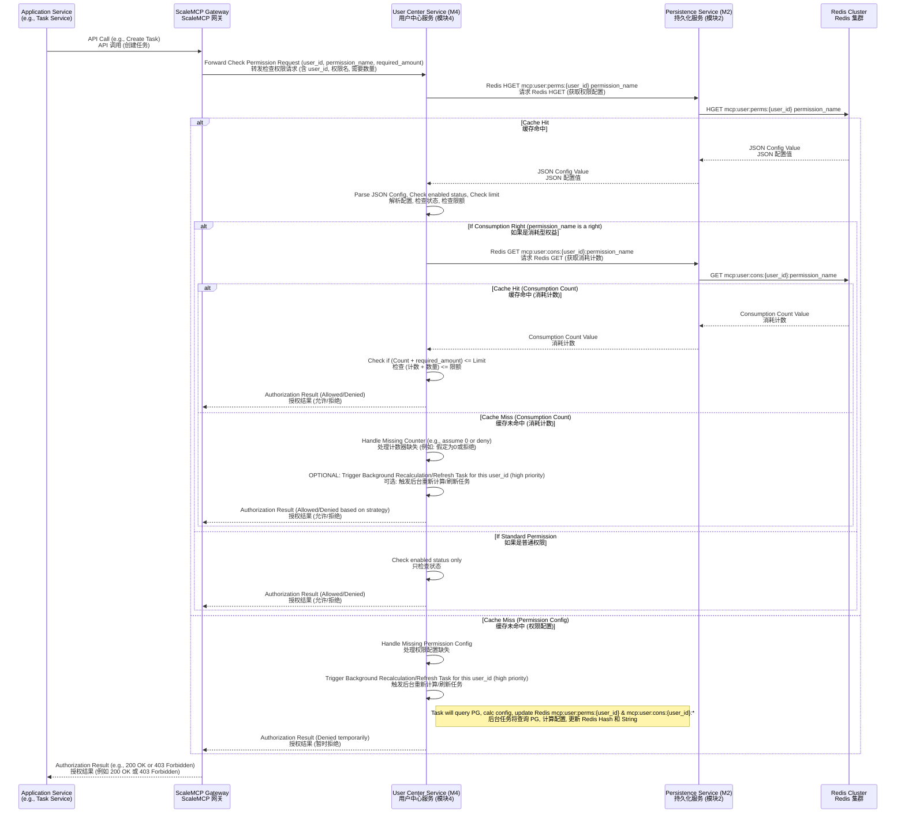
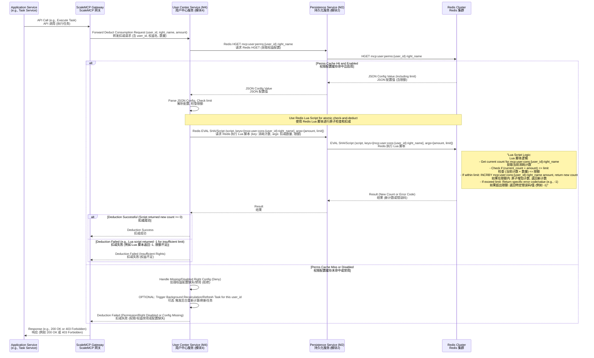
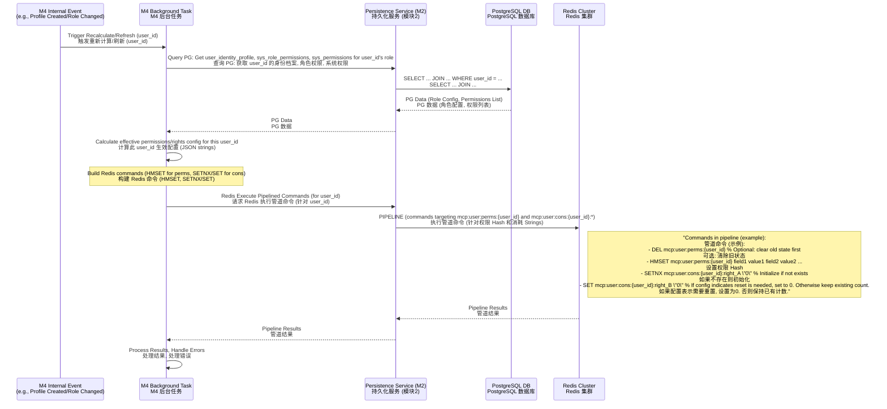
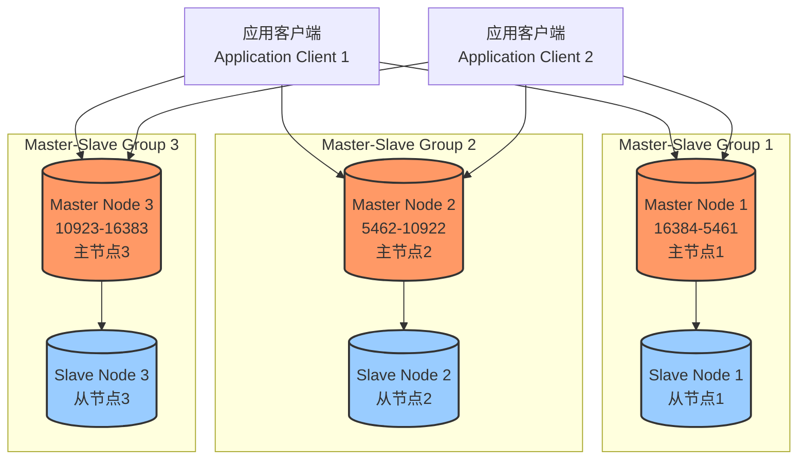

# 模块2：DetailedDesign - Redis缓存架构设计

## 1. 引言

本文档作为《技术文档完善项目执行计划》中模块2的P0级交付物（任务编号P2.3），旨在详细阐述 Manus MCP Server 持久化服务（`sys.storage.persistence`）所管理和提供的 Redis 缓存层架构设计。其核心目标是为依赖方（特别是用户中心服务 Module 4）提供高性能、高可用、数据一致的缓存访问能力，以支撑如用户身份档案实时权限校验、权益消耗扣减等高频、低延迟的关键业务场景。

本文档基于《模块2：DetailedDesign - 数据库设计与优化指南》中定义的数据库结构，特别是用户账户与身份档案分离的模型，并紧密结合《模块4：用户中心服务详细设计文档（修订版）》中对 Redis 缓存的具体使用需求（如 `user_perms:{user_id}` 和 `user_cons:{user_id}:<right_name>` 等数据结构）。它将聚焦于 Persistence Service 如何构建、管理和暴露 Redis 缓存能力，包括数据结构映射、访问规范、集群方案、一致性策略、淘汰与持久化等实现细节，以满足后续 AI 开发的精确指导需求。

## 2. 缓存设计目标与原则

Redis 缓存层在 Manus MCP Server 架构中扮演加速器和缓冲区的角色，其设计目标与原则如下：

-   核心目标：
    -   降低数据库负载： 将高频读取、对实时性要求较高的数据（如用户身份档案的生效权限和权益配置）从 PostgreSQL 卸载到 Redis，减少数据库压力。
    -   提升访问性能： 利用 Redis 的内存访问速度，显著降低数据读取延迟，满足用户身份认证后的权限校验和权益消耗等场景对响应时间的要求。
    -   支持高并发： Redis 的高并发处理能力适用于支撑大量并发用户对缓存数据的访问。
    -   保障数据一致性（最终一致性）： 在满足高性能需求的同时，设计合理策略保障缓存数据与持久化存储（PostgreSQL）之间的数据最终一致性。
    -   高可用性与可伸缩性： 采用适当的集群方案，确保缓存服务不成为单点故障，并能随着用户规模增长进行水平扩展。

-   设计原则：
    -   Cache-Aside Pattern (旁路缓存模式): 这是核心应用模式。应用程序（此处指用户中心服务 Module 4，通过 Persistence Service 的 API 访问 Redis）负责管理缓存的读写和失效逻辑。
        -   读操作: 先读缓存。如果缓存命中，直接返回；如果未命中，读数据库，并将数据写入缓存（可选设置过期时间），然后返回。
        -   写操作: 先更新数据库，然后使缓存失效（或更新缓存）。对于本系统，更倾向于“更新数据库后使缓存失效/更新”，特别是权限数据，需要重新计算后更新 Redis。
    -   关注特定场景： 缓存主要用于加速读操作，特别是针对用户身份档案相关的权限和权益数据。不适用于所有数据类型或写密集型场景。
    -   简单实用： 避免过度设计，采用成熟稳定的 Redis 特性，便于理解、实现和维护。
    -   高内聚，低耦合： Persistence Service 封装 Redis 的具体操作和集群细节，向上层服务提供简单、清晰的缓存访问 API，减少业务服务对 Redis 底层实现的感知。

核心缓存场景：

-   用户身份档案权限校验： 加速 `check_permission` API 调用，通过缓存快速判断特定 `user_id` 是否拥有某权限以及配置详情。
-   用户身份档案权益消耗： 加速 `deduct_right_consumption` API 调用，通过 Redis 原子操作实现消耗计数的实时增减，并基于缓存的权益配置 (`limit`, `resets_at`) 进行配额检查。
-   热点数据读取： 缓存那些被频繁读取且变化不频繁的系统元数据或少量用户热点数据（如常用的 Prompt 模板元数据，如果适用）。

## 3. Redis数据结构与Key命名规范

为了支持上述核心业务场景并保证 Redis 集群环境下的数据管理效率，定义以下数据结构和Key命名规范。

### 3.1 Key命名规范

采用层级命名方式，使用冒号 `:` 分隔层级，并利用 Redis Cluster 的 [Key Tags](https://redis.io/docs/latest/operate/oss_cluster/introduction/#key-tags) `{}` 功能，将相关联的数据强制分片到同一节点，以便进行多键原子操作（如 Lua 脚本）。

```
project:module:entity:{id}:[sub_entity]:attribute
```

-   `project`: 项目名称缩写，例如 `mcp`。
-   `module`: 模块名称缩写，例如 `user` (用户中心相关), `task` (任务相关)。
-   `entity`: 实体类型，例如 `perms` (权限), `cons` (消耗), `account` (账户), `profile` (身份档案)。
-   `{id}`: Key Tag，用于 Redis Cluster 分片。通常使用主键或关联ID，如 `user_id` 或 `account_id`，确保同一用户的相关数据落在同一节点。
-   `sub_entity`: 可选，进一步细分实体，例如 `rights` (权益)。
-   `attribute`: 可选，具体属性名称，例如 `model:gpt4:calls` (权限/权益名称)。

示例 Key 命名:

-   用户身份档案 (`user_id`) 的生效权限配置: `mcp:user:perms:{user_id}`
-   用户身份档案 (`user_id`) 的模型调用权益消耗计数: `mcp:user:cons:{user_id}:model:gpt4:calls`

### 3.2 Redis数据结构设计

基于《模块4：用户中心服务详细设计文档（修订版）》中的要求，核心数据结构设计如下：

1.  用户身份档案生效权限配置:
    -   Key Pattern: `mcp:user:perms:{user_id}`
    -   Data Type: `Hash`
    -   Description: 存储特定用户身份档案（`user_id`）当前生效的所有权限和权益的配置。Hash 的 Field 是权限/权益的名称，Value 是该权限/权益的 JSON 字符串配置。
    -   Fields & Values:
        -   `field`: `<permission_name>` (例如: `task:create`, `model:gpt4:calls`, `storage:quota_bytes`)
        -   `value`: `<JSON string of effective config>`
            -   例如，对于普通权限: `'{"enabled":true}'`
            -   例如，对于消耗型权益: `'{"enabled":true, "limit":100, "resets_at":1678881994}'` (limit: 配额上限, resets_at: 重置时间戳)
    -   Justification: Hash 结构适合存储多个相关联的字段（权限项），可以通过 `HGETALL` 一次获取所有权限，或通过 `HGET` 按需获取特定权限，效率高。`user_id` 作为 Key Tag 确保同一身份档案的权限数据位于同一 Redis 节点。
    -   Consistency Source: PostgreSQL (`user_identity_profiles`, `sys_role_permissions`, `sys_permissions`). 更新由 M4 的后台任务触发，从 PG 读取最新配置，计算后原子性地写入 Redis Hash。

2.  用户身份档案消耗型权益计数:
    -   Key Pattern: `mcp:user:cons:{user_id}:<right_name>`
    -   Data Type: `String`
    -   Description: 存储特定用户身份档案（`user_id`）特定消耗型权益（`<right_name>`）的当前已消耗数量。
    -   Value: `<current_consumption_count>` (例如: `"42"`, `"536870912"`)
    -   Justification: String 结构简单高效，适用于存储单个计数。使用独立的 Key 方便进行原子增减操作（`INCRBY`, `DECRBY`）。同样使用 `user_id` 作为 Key Tag，确保与 `mcp:user:perms:{user_id}` 位于同一节点，方便在 Lua 脚本中同时访问权限配置和消耗计数。
    -   Consistency Source: 用户行为触发的实时消耗扣减。通过 Redis 原子命令保障自身一致性。与 `user_perms` 中的 `limit` 一致性通过业务逻辑（M4 的 `deduct_right_consumption` 实现）在扣减前检查 `user_perms:{user_id}` 中的配置来保障。

3.  潜在其他用途 (暂不作为 P0 强制要求):
    -   用户账户/身份档案对象缓存:
        -   Key Pattern: `mcp:user:account:{account_id}`, `mcp:user:profile:{user_id}`
        -   Data Type: `Hash`
        -   Description: 缓存 PostgreSQL 中的 `user_accounts` 或 `user_identity_profiles` 记录的完整对象或常用字段。
        -   Justification: 如果按 `account_id` 或 `user_id` 查询用户/身份档案对象非常频繁且 PG 压力大，可以考虑缓存。Value 可以是将整个对象序列化为 JSON 存储在 Hash 的某个 Field 中（如 `data` Field），或者将对象的每个字段映射为 Hash 的一个 Field。
        -   Consistency Source: PostgreSQL (`user_accounts`, `user_identity_profiles`). 更新 PG 后，需要失效或更新对应缓存 Key。
    -   系统配置/元数据缓存:
        -   Key Pattern: `mcp:sys:config:<config_key>`, `mcp:sys:metadata:<metadata_type>:{id}`
        -   Data Type: `String`, `Hash`, `List` 等，取决于元数据结构。
        -   Description: 缓存不经常变动的系统配置、角色定义、权限定义等。
        -   Justification: 减少对 PG 系统表的读取。变化时通过管理接口或后台任务更新 Redis。
        -   Consistency Source: PostgreSQL (如 `sys_roles`, `sys_permissions`, `sys_role_permissions`).

总结 Redis 数据结构:

| Key Pattern                            | Data Type | Key Tag   | Description                                        | Consistency Source | Used by Module 4? |
| :------------------------------------- | :-------- | :-------- | :------------------------------------------------- | :----------------- | :---------------- |
| `mcp:user:perms:{user_id}`             | Hash      | `{user_id}` | 用户身份档案生效权限配置 (Field: 权限名, Value: JSON Config) | PostgreSQL         | Yes               |
| `mcp:user:cons:{user_id}:<right_name>` | String    | `{user_id}` | 用户身份档案消耗型权益计数                         | Redis Atomic Ops   | Yes               |
| `mcp:user:account:{account_id}`        | Hash      | `{account_id}` | 用户账户对象缓存 (Optional)                        | PostgreSQL         | Potential         |
| `mcp:user:profile:{user_id}`           | Hash      | `{user_id}` | 用户身份档案对象缓存 (Optional)                    | PostgreSQL         | Potential         |
| `mcp:sys:*`                            | Various   | None      | 系统配置/元数据缓存 (Optional)                     | PostgreSQL         | Potential         |

## 4. 核心业务缓存方案

本节详细描述用户中心服务 (Module 4) 如何通过 Persistence Service (Module 2) 提供的 Redis 访问能力实现核心业务场景的缓存交互。Persistence Service 作为 Redis 的代理层，负责连接管理、命令路由（在 Cluster 模式下）和基本的错误/重试处理。

### 4.1 用户身份档案权限校验 (`check_permission`)

目标：快速判断特定 `user_id` 是否拥有某个权限/权益，并检查消耗型权益是否超出限制。



*权限校验流程示意图*

说明:

-   Module 4 调用 Persistence Service 的通用 Redis Get/HGet API。
-   缓存未命中时，Module 4 应触发一个后台任务去 PostgreSQL 重新计算并刷新该 `user_id` 的权限及权益缓存。这个后台任务是保障 PG 与 Redis 最终一致性的关键部分，由 Module 4 实现或协调。
-   在权限配置缓存未命中期间，为了保证安全，可以选择临时拒绝该权限请求。
-   消耗计数缓存 (`mcp:user:cons:{user_id}:<right_name>`) 理论上应与权限配置缓存 (`mcp:user:perms:{user_id}`) 同步创建。如果消耗计数 Key 缺失而权限配置 Key 存在，可能是一致性问题，处理策略需要明确（例如，假定计数为 0 或拒绝并触发后台刷新）。

### 4.2 用户身份档案权益消耗 (`deduct_right_consumption`)

目标：原子性地扣减特定 `user_id` 的某项消耗型权益计数，并在配额不足时失败。



*权益消耗流程示意图*

说明:

-   权益消耗必须是原子性的，以避免并发扣减导致超卖。Redis Lua 脚本是实现跨多个操作（检查限制和扣减计数）原子性的标准做法。
-   Lua 脚本在 Redis 节点上执行，由于 `mcp:user:perms:{user_id}` (Hash) 和 `mcp:user:cons:{user_id}:<right_name>` (String) 使用相同的 Key Tag `{user_id}`，它们保证位于同一个 Redis Cluster 节点上，满足 Lua 脚本对 Key 的同槽位要求。
-   扣减前必须检查权限配置 (`mcp:user:perms:{user_id}`)，确保权益启用且有足够的配额（尽管 Lua 脚本内部也会再次检查）。
-   权限配置缓存未命中时，无法进行扣减，应拒绝请求并触发后台刷新。

### 4.3 后台权限/权益缓存刷新任务

由 Module 4 触发，通过 Persistence Service 将用户身份档案的最新权限/权益配置及初始消耗计数写入 Redis。



*后台权限/权益缓存刷新流程示意图*

说明:

-   这个后台任务是实现 PG 到 Redis 最终一致性的主要机制。
-   触发时机包括：创建用户身份档案、更新身份档案的 `role_id`、更新角色权限配置 (`sys_role_permissions`)。这些事件由 Module 4 监听或主动触发。
-   任务首先从 PG 读取事实来源数据，然后在 Module 4 内部（或一个独立的权限计算模块）计算出最终生效的权限和权益配置 JSON。
-   计算结果通过 Persistence Service 使用 Redis Pipeline 原子性地更新 Redis 缓存。对于消耗计数，如果是新创建身份档案，则初始化为 0；如果是更新 `role_id`，则根据新角色的配置决定是否重置计数，否则保留已有计数。
-   `DEL` + `HMSET` 可以确保旧的权限配置被完全清除并替换为新的。
-   由于 Pipeline 中的命令都针对同一个 Key Tag `{user_id}`，它们会在 Redis Cluster 的同一个节点上执行，保证原子性。

## 5. 集群与高可用方案

考虑到系统的预期规模和对高可用性的要求，推荐采用 Redis Cluster 作为 Redis 的部署方案。

-   方案：Redis Cluster
    -   描述： Redis Cluster 是 Redis 官方提供的分布式解决方案，通过分片（Sharding）在多个节点上自动分布数据，并通过主从复制（Replication）提供高可用性。数据被分割到 16384 个哈希槽（Hash Slots），每个 Key 根据其哈希值映射到特定的槽。Cluster 节点负责维护槽位信息和节点间的通信。
    -   部署架构：
        -   至少需要 3 个主节点以保证在单节点失效时集群仍然可用。
        -   每个主节点应至少配备一个从节点，以提供故障转移能力。
        -   推荐部署 `N` 个主节点，每个主节点有 `M` 个从节点，总节点数 `N * (1 + M)`。 例如，6 节点 (3主3从) 或 9 节点 (3主6从)。
        -   节点应部署在不同的可用区或物理机上，避免单点故障。



**(示意图：Redis Cluster 架构)**

-   优缺点分析：
    -   优点：
        -   高可用性 (HA)： 自动故障转移，当主节点失效时，其从节点会自动晋升为主节点，服务持续可用（有短暂的切换延迟）。
        -   水平可伸缩性： 可以通过增加节点来扩展读写能力和存储容量。
        -   数据分片： 数据自动分散到不同节点，单个节点无需承担全部负载。
    -   缺点：
        -   客户端复杂性： 客户端需要支持 Cluster 协议，能够感知槽位信息和节点变化。Persistence Service 作为代理层需要处理这种复杂性。
        -   多键操作限制： 原子性的多键操作（如 `MGET`, `MSET`, 事务, Lua 脚本）只能在位于同一个槽位的 Key 上执行。通过 Key Tags `{}` 可以强制相关 Key 落到同一槽位，从而支持跨 Key 的原子操作。
        -   运维复杂度： 相比单实例或 Sentinel 模式，Cluster 的部署、监控和维护更复杂。

-   适用场景：
    -   适用于对性能、容量和高可用性都有较高要求的场景，特别是用户规模较大，需要支撑大量并发用户请求的业务。本系统的百万用户规模目标使其非常适合采用 Redis Cluster。
    -   通过 Persistence Service 封装，对上层业务服务（如 Module 4）隐藏了 Cluster 的复杂性。

-   备选方案：Redis Sentinel
    -   描述： Sentinel 是 Redis 的高可用性解决方案，它通过 Sentinel 进程监控 Redis 主节点和从节点，并在主节点失效时自动进行故障转移，选举一个从节点晋升为主节点。数据存储在单个主节点及其从节点上（无分片）。
    -   优缺点：
        -   优点：配置和运维相对简单；支持所有 Redis 命令，无跨 Key 限制；客户端相对简单（连接 Sentinel 获取主节点地址）。
        -   缺点：无法进行数据分片和水平扩展写入能力； 所有数据都在单个主节点上，单点写入压力是瓶颈；容量受限于单个节点的内存大小。
    -   适用场景： 数据量和写入 QPS 相对较小，但需要高可用的场景。不适用于本系统的百万用户规模及其对 Redis 写入/容量的预期需求。

结论： 强烈推荐使用 Redis Cluster。Persistence Service 内部应实现支持 Redis Cluster 协议的客户端逻辑，处理 Key 到 Slot 的映射和请求路由。对上层服务暴露的缓存操作 API 保持简单一致。

## 6. 缓存一致性策略

确保缓存数据与持久化存储（PostgreSQL）之间的数据一致性是关键。对于本系统，核心缓存数据（用户身份档案权限配置 `mcp:user:perms:{user_id}` 和消耗计数 `mcp:user:cons:{user_id}:<right_name>`）的真实来源是 PostgreSQL 中的用户身份档案、角色、权限及角色权限关联配置。

-   策略：更新数据库后异步刷新/失效缓存 (Cache Invalidation / Asynchronous Update)

    -   描述： 当 PostgreSQL 中的事实来源数据发生变化时，不立即同步更新 Redis 缓存，而是通过异步方式触发缓存的刷新或失效。
    -   具体流程 (针对 `mcp:user:perms:{user_id}`):
        1.  PostgreSQL 更新： 用户中心服务 Module 4 或管理端通过 Persistence Service API 修改了 PostgreSQL 中与用户身份档案权限相关的表，例如：
            -   `user_identity_profiles` 表记录被创建、更新（特别是 `role_id` 字段）或删除。
            -   `sys_roles`, `sys_permissions`, `sys_role_permissions` 表的配置发生变化。
        2.  触发异步任务： Module 4 监听这些 PG 数据的变化事件（例如，通过数据库的触发器、应用层发布消息到 Kafka 或直接调用后台任务）。
        3.  后台任务执行： Module 4 的后台任务接收到事件通知，针对受影响的 `user_id`：
            -   从 PostgreSQL 读取该 `user_id` 及其关联角色、权限的最新配置。
            -   根据读取的数据，在 Module 4 内部（或独立的权限计算服务）重新计算该 `user_id` 生效的权限和权益配置（生成新的 JSON 字符串）。
            -   调用 Persistence Service 提供的 Redis 写 API，使用 Pipeline 或 Lua 脚本原子性地更新 `mcp:user:perms:{user_id}` Hash 和相关的 `mcp:user:cons:{user_id}:<right_name>` Strings (例如，重置计数或初始化)。
        4.  Redis 更新： Persistence Service 将原子写请求发送到 Redis Cluster，完成缓存的刷新。

    ```mermaid
    sequenceDiagram
        participant UserCenter as User Center (M4)<br>业务逻辑/管理界面
        participant PersistenceSvc as Persistence Service (M2)<br>持久化服务
        participant PostgreSQL as PostgreSQL DB<br>事实来源
        participant MessageQueue as Message Queue<br>(e.g., Kafka)
        participant M4Task as M4 Background Task<br>M4 后台任务
        participant Redis as Redis Cluster<br>缓存层
        
        UserCenter->>PersistenceSvc: Update PG Data (e.g., Change user_identity_profile.role_id)<br>更新 PG 数据 (修改身份档案角色)
        PersistenceSvc->>PostgreSQL: UPDATE user_identity_profiles ...<br>执行 UPDATE
        PostgreSQL-->>PersistenceSvc: Update Success<br>更新成功
        PersistenceSvc-->>UserCenter: Operation Result<br>操作结果
        
        UserCenter->>MessageQueue: Publish "IdentityProfileUpdated" Event (user_id)<br>发布事件 (user_id)
        
        MessageQueue->>M4Task: Event Consumed<br>事件被消费
        M4Task->>PersistenceSvc: Query PG for latest config (user_id)<br>查询 PG 获取最新配置
        PersistenceSvc->>PostgreSQL: SELECT ... JOIN ... WHERE user_id = ...<br>查询 PG
        PostgreSQL-->>PersistenceSvc: Latest Config Data<br>最新配置数据
        PersistenceSvc-->>M4Task: Latest Config Data<br>最新配置数据
        
        M4Task->>M4Task: Calculate New Cache State<br>计算新的缓存状态
        M4Task->>PersistenceSvc: Redis Write Operations (Pipeline/Lua Script) for mcp:user:perms:{user_id} and mcp:user:cons:{user_id}:*<br>执行 Redis 写操作
        PersistenceSvc->>Redis: Execute Pipelined/Scripted Writes<br>执行写操作
        Redis-->>PersistenceSvc: Write Results<br>写结果
        PersistenceSvc-->>M4Task: Write Results<br>写结果
        M4Task->>M4Task: Task Complete<br>任务完成
    ```
    *PostgreSQL 到 Redis 的异步一致性刷新流程*

-   针对 `mcp:user:cons:{user_id}:<right_name>`:
    -   这些 Key 的更新是实时发生的，由 Module 4 在业务流程中直接调用 Persistence Service 的 Redis 原子扣减 API (`INCRBY`, `DECRBY`, Lua EVAL) 完成。这保障了消耗计数的实时一致性（在 Redis 层面）。
    -   消耗计数的重置（例如，按月或按年重置配额）由 Module 4 的定时任务触发，调用 Persistence Service 的 Redis SET API 将计数 Key 设置回 "0"。

-   一致性考量与权衡：
    -   最终一致性 (Eventual Consistency): 采用异步刷新策略意味着在 PG 数据更新成功到 Redis 缓存刷新完成之间存在一个短暂的时间窗口，期间 Redis 中的数据可能与 PG 不一致（读到旧数据）。
    -   影响： 在这个窗口期内，用户身份档案的权限校验或权益消耗可能会基于旧的配置进行。
    -   可接受性： 对于用户权限/权益这种场景，短暂的不一致通常是可接受的，因为相比强一致性带来的复杂性和性能损耗，最终一致性结合高性能缓存更能满足业务需求。通过优化异步任务的处理速度，可以尽量缩短不一致窗口。
    -   关键场景处理： 对于创建身份档案或更新角色这种立即影响权限的关键操作，应尽量提高后台刷新任务的优先级，甚至考虑同步刷新（虽然这会增加写路径延迟）或在刷新完成前临时限制相关功能访问（例如，新创建的身份档案在缓存刷新前无法使用需要权限的功能）。P0 阶段可先实现异步刷新，后续根据实际情况和用户反馈决定是否需要更强的保障机制。

## 7. 缓存淘汰与持久化

### 7.1 缓存淘汰策略 (Eviction)

当 Redis 内存使用达到 `maxmemory` 阈值时，需要根据配置的策略淘汰部分 Key 以释放内存。

-   全局淘汰策略 (`maxmemory-policy`):
    -   对于存储用户权限 (`mcp:user:perms:{user_id}`) 和消耗 (`mcp:user:cons:{user_id}:<right_name>`) 这种核心业务数据，它们代表用户的实时状态，不应该被随意淘汰。这些 Key 通常不会设置 TTL。
    -   如果 Redis 实例中还缓存了其他类型的 Key (例如，带有 TTL 的 session 数据，或者不带 TTL 的系统元数据)，可以根据实际情况选择淘汰策略。
    -   推荐策略：
        -   `volatile-lru`: 只淘汰带有 TTL 且最近最少使用的 Key。适用于大部分核心数据不设 TTL 的情况。
        -   `allkeys-lru`: 淘汰所有 Key 中最近最少使用的。如果 Redis 中所有 Key 都很重要且不希望被随意淘汰，应避免内存达到阈值。
        -   建议： 仔细规划哪些 Key 设置 TTL，哪些不设置。对于 `mcp:user:perms:{user_id}` 和 `mcp:user:cons:{user_id}:<right_name>` 不设置 TTL，并确保 `maxmemory-policy` 不会导致它们被淘汰（例如使用 `volatile-lru` 配合仅给非核心 Key 设置 TTL，或者根据业务重要性给非核心 Key 设置较低的 TTL）。主要的内存压力应通过增加 Redis 节点容量来解决，而非依赖淘汰核心业务 Key。

-   局部淘汰 (TTL):
    -   对于某些非核心或临时缓存数据，可以设置合适的过期时间 (`EXPIRE` 命令)。例如，未来如果缓存了用户列表、搜索结果等，可以根据其时效性设置 TTL。
    -   核心的 `mcp:user:perms:{user_id}` 和 `mcp:user:cons:{user_id}:<right_name>` 不应设置由 Redis 自动过期的 TTL，它们的生命周期由业务逻辑（如身份档案删除）控制，由 Module 4 在 PG 数据删除后触发 Persistence Service 进行显式的 `DEL` 操作。

### 7.2 持久化配置 (Persistence)

为了在 Redis 节点重启或崩溃后恢复数据，需要启用持久化功能。

-   RDB (Redis Database Backup):
    -   描述： 在指定的时间间隔内生成数据集的时间点快照（以 `.rdb` 文件格式存储）。
    -   优点： RDB 文件紧凑，适合备份和灾难恢复；恢复速度快。
    -   缺点： 丢失数据风险较大，如果 Redis 在生成快照期间崩溃，自上次快照之后的所有数据都会丢失。不适合对数据丢失敏感的场景。
    -   适用性： 可以作为完整备份的手段，用于冷备或数据迁移。

-   AOF (Append-Only File):
    -   描述： 记录 Redis 服务器接收到的所有写操作命令，以追加的方式写入文件。重建数据时，重新执行 AOF 文件中的命令。
    -   优点： 数据安全性高，丢失数据的风险取决于 `appendfsync` 的配置（`everysec` 模式通常最多丢失1秒数据）。
    -   缺点： AOF 文件通常比 RDB 文件大；恢复速度相对较慢；可读性较差。
    -   适用性： 强烈推荐启用 AOF 持久化，特别是对于 `mcp:user:cons:{user_id}:<right_name>` 等消耗计数数据，这些数据代表用户的权益消耗，丢失是不可接受的。 推荐配置 `appendfsync everysec`，在性能和数据安全性之间取得平衡。

-   持久化配置建议：
    -   启用 AOF： 配置 `appendonly yes`。
    -   AOF 同步策略： 配置 `appendfsync everysec`。
    -   AOF 重写： 配置自动触发 AOF 重写 (`auto-aof-rewrite-percentage`, `auto-aof-rewrite-min-size`)，减小 AOF 文件大小。
    -   可选 RDB： 可以同时启用 RDB 作为辅助备份手段，例如每天定时生成一个 RDB 快照用于完整备份。配置 `save` 规则。
    -   Cluster 环境： Redis Cluster 环境下，每个节点独立进行持久化。主从复制提供高可用，持久化提供节点重启后的数据恢复。

总结： 对于核心的权限和消耗计数缓存，不设置 TTL 并通过显式 `DEL` 控制生命周期。启用 AOF 并配置 `everysec` 同步策略，保障数据的最低丢失风险。可以辅以 RDB 进行定时完整备份。

这份详细设计文档涵盖了 Redis 缓存层的引言、设计目标、数据结构、核心业务方案、集群与高可用、一致性策略以及淘汰与持久化配置。它为 Persistence Service 模块构建和管理高性能 Redis 缓存提供了全面的技术规范，并详细阐述了如何支持用户中心服务对用户身份档案实时权限和权益的管理需求。这些细节应作为后续 AI 开发和运维部署的直接依据。