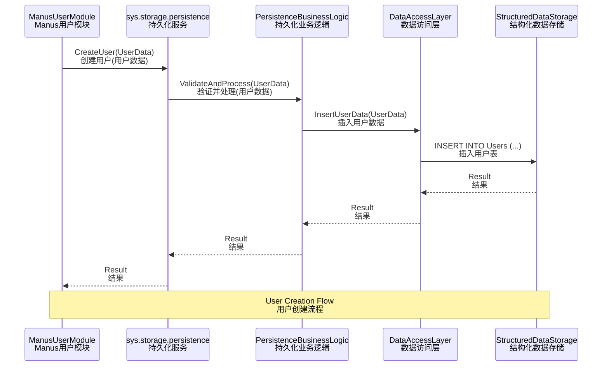

# 模块2：持久化服务设计 详细设计文档

## 1. 引言与文档定位

本文档详细阐述了 Manus MCP Server 体系中持久化服务（Persistence Service）的设计方案，并被正式确立为 Manus MCP Server 体系内的“持久化存储机制设计规范”。

本规范是 Manus MCP Server 架构的核心组成部分之一，旨在为系统中所有需要进行数据持久化（存储、检索、更新、删除）的模块提供统一、稳定、高效且健壮的基础设施。后续所有模块（包括但不限于模块4、模块8等）在进行自身数据模型的定义、与持久化相关的业务逻辑设计以及代码实现时，必须严格遵循本规范所确立的设计原则、服务交互方式及数据模型约定。

本规范的设计严格遵循《Agent-TARS与Manus MCP Server联合架构设计与集成开发：总体战略及模块化计划修订版 V4》中确立的各项总体战略原则，特别是系统健壮性、设计方案简洁性、开发门槛低、开发效率高、开发可控性高以及系统稳定性强等核心要求。文档内容吸纳了此前分析报告及共识会议的成果，体现了经过审慎考量后确定的技术路线和实现细节，并整合固化了针对先前版本提出的关键反馈意见所形成的最终设计决策，确保了 Persistence Service 设计的完整性、一致性和权威性。

## 2. Persistence Service 服务命名规范

根据 Manus MCP Server 整体的服务命名体系规划和已采纳的设计决策，持久化服务的正式名称被确定为 `sys.storage.persistence`。

命名规范说明：

该命名采用了分层的结构化方式，清晰地界定了服务在系统中的层级、领域和具体职责：

*   `sys`：表示服务位于系统的核心层，是 Manus MCP Server 运行的基础服务之一。
*   `storage`：表示服务所属的技术领域，即数据存储与管理。
*   `persistence`：表示服务的具体职能，即提供数据持久化能力。

这一命名方式增强了服务的可识别性，有助于模块间的协作和系统的整体可维护性，符合通用服务命名及系统内部组件标识的标准。本文档所有涉及持久化服务名称之处，均统一使用 `sys.storage.persistence`。

## 3. Persistence Service 集成交互及内部调用规范

### 3.1 集成交互示意图与场景示例

以下 Mermaid 图清晰地展示了 `sys.storage.persistence` 服务在 Manus MCP Server 体系中的集成位置及其与其他模块和底层存储系统的交互方式。图示区分了结构化数据/元数据持久化与非结构化文件内容存储管理的不同交互路径。

```mermaid
graph TD
    A[Manus MCP Server Module X<br><i>(e.g., User, Task, Prompt for Metadata)</i>] -->|Direct API Call<br>(Internal, Structured/Metadata)| B[sys.storage.persistence]
    A -->|Direct API Call<br>(Internal, File Content)| H[Server File Management Service<br><i>(Separated)</i>]
    C[Manus MCP Server Module Y<br><i>(e.g., Workflow, Analytics)</i>] -->|Direct API Call<br>(Internal, Structured/Metadata)| B
    B --> D[Persistence Business Logic<br><i>(Metadata & Structured Data)</i>]
    D --> E[Data Access Layer (DAL)<br><i>(Metadata & Structured Data)</i>]
    E --> F[Structured Data Storage<br><i>(e.g., Database)</i>]
    H --> I[Unstructured File Storage<br><i>(e.g., Object Storage, File System)</i>]

    subgraph Manus MCP Server
        A
        C
        B
    end

    subgraph sys.storage.persistence Internal
        D
        E
    end
```

图例详细说明：

*   `Manus MCP Server Module X/Y`: 代表 Manus MCP Server 内部的其他功能模块（如用户管理、任务调度、Prompt 管理等），这些模块需要调用 `sys.storage.persistence` 提供的接口来执行结构化数据（包括文件元数据）的持久化操作。对于文件内容，这些模块直接调用 `Server File Management Service`。
*   `sys.storage.persistence`: 本规范描述的持久化服务核心实现，专注于结构化数据和文件元数据管理。
*   `Server File Management Service (Separated)`: 一个独立的、专门负责非结构化文件内容（二进制文件、文本文件等）存储、检索和管理的系统服务。
*   `Direct API Call (Internal, Structured/Metadata)`: Manus MCP Server 内部模块调用 `sys.storage.persistence` 服务时，通过内部直连 API 的方式进行，处理结构化数据和文件元数据。
*   `Direct API Call (Internal, File Content)`: Manus MCP Server 内部模块（如 Prompt 模块在处理文件上传下载时）调用 `Server File Management Service` 时，通过内部直连 API 的方式进行，处理文件内容。
*   `Persistence Business Logic (Metadata & Structured Data)`: `sys.storage.persistence` 服务的内部业务逻辑层，负责处理对结构化数据和文件元数据的请求。
*   `Data Access Layer (DAL) (Metadata & Structured Data)`: 数据访问层，是 `sys.storage.persistence` 内部与具体底层结构化存储技术无关的抽象层，负责将业务逻辑的数据请求转化为底层存储系统的具体操作。
*   `Structured Data Storage`: 存储系统中的结构化数据部分，通常由关系型数据库或其他支持结构化存储的系统实现。这部分存储包含业务结构化数据以及文件的元数据。
*   `Unstructured File Storage`: 实际存储非结构化文件内容的底层存储系统（例如对象存储服务如 S3/OSS，或分布式文件系统如 HDFS，或本地文件系统），由 `Server File Management Service` 管理。

具体示例场景与协作：

1.  用户模块 (Module 4) 注册用户：
    *   用户模块接收新用户注册请求。
    *   用户模块生成用户实体数据。
    *   用户模块通过直连 API 调用 `sys.storage.persistence` 服务的“创建用户”接口。
    *   `sys.storage.persistence` 在内部 DAL 层将用户数据写入结构化数据库。
    *   `sys.storage.persistence` 返回成功或失败结果给用户模块。


2.  任务模块 (Module 8) 记录任务执行历史：
    *   任务模块在任务执行过程中产生新的历史记录（如工具调用、步骤完成）。
    *   任务模块构造任务执行历史实体数据，包含 `task_id` 和 `history_id` 等。
    *   任务模块通过直连 API 调用 `sys.storage.persistence` 服务的“添加任务历史”接口。
    *   `sys.storage.persistence` 内部 DAL 层将历史数据写入结构化数据库的 `TaskExecutionHistory` 表。
    *   `sys.storage.persistence` 返回结果。
```mermaid
sequenceDiagram
    participant MTM as ManusTaskModule<br>Manus任务模块
    participant PS as sys.storage.persistence<br>持久化服务
    participant PBL as PersistenceBusinessLogic<br>持久化业务逻辑
    participant DAL as DataAccessLayer<br>数据访问层
    participant SDS as StructuredDataStorage<br>结构化数据存储

    MTM->>PS: AddTaskHistory(HistoryData)<br>添加任务历史(历史数据)
    PS->>PBL: ValidateAndProcess(HistoryData)<br>验证并处理(历史数据)
    PBL->>DAL: InsertTaskHistory(HistoryData)<br>插入任务历史数据
    DAL->>SDS: INSERT INTO TaskExecutionHistory (...)<br>插入任务执行历史表
    SDS-->>DAL: Result<br>结果
    DAL-->>PBL: Result<br>结果
    PBL-->>PS: Result<br>结果
    PS-->>MTM: Result<br>结果

    note over MTM,SDS: Task History Recording Flow<br>任务历史记录流程
 ```

3.  Prompt 模块处理 Prompt 模板文件：
    *   Prompt 模块接收用户上传的 Prompt 模板文件。
    *   Prompt 模块 (ManusPromptModule) 直接调用独立的 Server File Management 服务上传文件内容。
    *   Server File Management 服务负责将文件内容存储到非结构化存储。
    *   Server File Management 服务返回存储成功后的文件标识符/路径给 Prompt 模块。
    *   Prompt 模块根据返回的文件标识符和 Prompt 模板的其他元数据（名称、作者、版本等），构建 Prompt 模板实体数据。
    *   Prompt 模块通过直连 API 调用 `sys.storage.persistence` 服务的“创建 Prompt 模板元数据”接口。
    *   `sys.storage.persistence` 内部 DAL 层将 Prompt 模板元数据写入结构化数据库。`sys.storage.persistence` 不参与文件内容上传下载的协调。
    *   `sys.storage.persistence` 返回元数据存储结果给 Prompt 模块。Prompt 模块综合文件上传和元数据存储结果，返回最终结果给用户。
```mermaid
sequenceDiagram
    participant MPM as ManusPromptModule<br>Manus提示模块
    participant SFMS as ServerFileManagementService<br>服务器文件管理服务
    participant UFS as UnstructuredFileStorage<br>非结构化文件存储
    participant PS as sys.storage.persistence<br>持久化服务
    participant PBL as PersistenceBusinessLogic<br>持久化业务逻辑
    participant DAL as DataAccessLayer<br>数据访问层
    participant SDS as StructuredDataStorage<br>结构化数据存储

    MPM->>SFMS: UploadFileContent(FileContent)<br>上传文件内容
    SFMS->>UFS: Store File<br>存储文件
    UFS-->>SFMS: File Identifier/Path<br>文件标识符/路径
    SFMS-->>MPM: File Identifier/Path<br>文件标识符/路径
    MPM->>PS: CreatePromptMetadata(Metadata, FileIdentifier)<br>创建提示元数据
    PS->>PBL: ProcessMetadataRequest(Metadata, FileIdentifier)<br>处理元数据请求
    PBL->>DAL: InsertPromptMetadata(Metadata, FileIdentifier)<br>插入提示元数据
    DAL->>SDS: INSERT INTO PromptTemplates (...)<br>插入提示模板表
    SDS-->>DAL: Result<br>结果
    DAL-->>PBL: Result<br>结果
    PBL-->>PS: Result<br>结果
    PS-->>MPM: Metadata Storage Result<br>元数据存储结果

    note over MPM,SDS: Prompt Template Upload and Metadata Storage Flow<br>提示模板上传和元数据存储流程
```

这些示例场景展示了不同模块如何通过标准 API 调用 `sys.storage.persistence` 进行结构化数据/元数据持久化，以及如何直接调用 `Server File Management Service` 处理文件内容。`sys.storage.persistence` 的职责仅限于结构化数据和元数据管理。

### 3.2 关于省略 ScaleMCP 作为内部调用层的规范细则与决策背景

根据系统架构设计原则和已采纳的决策， Manus MCP Server 内部模块调用 `sys.storage.persistence` 服务和 `Server File Management Service` 服务时，应采用直连 API 的方式，省略 ScaleMCP 作为中间调用层。

决策背景、原因及权衡：

1.  ScaleMCP 的设计初衷与定位： ScaleMCP（参考 `ScaleMCP Comprehensive Research Summary Report` 和 `Agent-TARS 系统摘要报告`）的核心价值在于为 Agent-TARS 这类客户端 LLM 代理提供大量 MCP 工具的动态发现和智能调用能力。它通过同步 MCP Registry 或 Manus MCP Server 中暴露的工具元数据，构建可检索的工具索引，使 Agent 能够在运行时按需获取和使用工具。`sys.storage.persistence` 和 `Server File Management Service` 是 Manus MCP Server 内部的基础系统服务，并非设计为供外部 Agent 直接发现和调用的“工具”。
2.  内部服务调用特性： `sys.storage.persistence` 和 `Server File Management Service` 仅服务于 Manus MCP Server 内部的其他核心模块。这些调用方模块是系统内已知、可信且相对稳定的组件。它们的调用需求是确定的服务接口，而非动态发现。
3.  性能与复杂性考量： 引入 ScaleMCP 作为内部服务调用的中间层，会增加额外的网络跳数、数据序列化/反序列化、路由查找等开销，降低服务调用的效率和响应速度。这与《总体战略》中追求的“简洁性、开发门槛低、开发效率高、系统稳定性强”原则相悖。直连方式则最大程度地减少了调用路径，提升了效率。
    *   *权衡：* 牺牲了 ScaleMCP 带来的潜在的统一内部服务发现机制（尽管对于核心稳定服务价值不大）和外部工具管理能力（Persistence Service 和 File Management Service 并非外部工具）。换取了更高的调用效率和更简单的内部架构。
4.  内部访问控制能力： `sys.storage.persistence` 和 `Server File Management Service` 在设计上都具备在其业务逻辑层实现细粒度的访问控制能力。基于调用方身份、请求上下文（如用户ID、任务ID）以及数据所有权信息，服务内部可以进行必要的权限验证。因此，无需依赖 ScaleMCP 或其他外部组件提供的统一认证/授权框架来保护内部数据。

结论： 决定省略 ScaleMCP 作为 Persistence Service 和 Server File Management Service 的内部调用和发现层。Manus MCP Server 内部模块通过直连方式调用这两个服务提供的 API，这是基于服务定位、性能需求、架构简洁性以及内部访问控制能力等因素综合权衡后的最优决策，符合项目总体战略原则。

### 3.3 Persistence Service 内部访问控制规范

`sys.storage.persistence` 服务应在其内部业务逻辑层实现精细化的数据访问控制。鉴于调用方均为 Manus MCP Server 的内部模块，访问控制可以基于以下信息进行判断：

*   调用模块的身份： 不同模块被赋予不同的数据访问权限。例如，用户模块有权限创建、读取、更新用户数据，但任务模块可能仅有读取权限或在特定上下文下的更新权限。
*   请求中携带的上下文信息： 例如用户 ID、任务 ID、租户 ID 等。服务根据这些 ID 和数据记录中存储的所有权信息判断调用方是否有权访问特定数据实体。
*   数据实体自身的所有权信息： 数据模型中应包含所有者 ID、所属任务 ID 或所属租户 ID 等字段，用于在访问时进行权限校验。
*   操作类型： 根据是读取、写入、更新还是删除操作，应用不同的权限规则。

具体的访问控制策略应根据不同的数据实体类型和业务需求在 `sys.storage.persistence` 内部进行详细设计和实现。例如：用户数据通常只能由代表该用户的请求或用户管理模块访问；任务数据可能只能由任务调度模块或与该任务相关的用户访问；系统配置数据仅允许具有特定系统权限的内部组件访问。这种内部控制机制利用了调用方是已知可信的内部服务这一前提，简化了权限验证流程，并保证了数据安全。

*(注：尽管用户反馈提及“3.3 Prompt 模板文件管理”，但原文档中该节不存在。此处保留原“3.3 Persistence Service 内部访问控制规范”，并根据文件管理职责调整，强调 Persistence Service 的访问控制仅针对其管理的结构化数据和文件元数据。Server File Management Service 将有其独立的访问控制机制来保护文件内容本身。) *

## 4. Server File Management 独立服务规范与决策背景

根据已采纳的设计决策，处理非结构化文件存储和管理的 Server File Management 功能应作为独立的系统服务实现，与 `sys.storage.persistence` 的核心结构化数据持久化职责相分离。

决策背景、原因及权衡：

1.  职责分离（Separation of Concerns）： 这是核心驱动力。`sys.storage.persistence` 的主要职责是管理结构化数据的生命周期（CRUD），包括数据模型定义、关系维护、事务管理、结构化查询优化等。而文件管理涉及二进制数据的存储、传输、流处理、分块上传、校验、版本控制等，是一套完全不同的技术领域和复杂性。将两者分离，使得每个服务都可以聚焦于自身的核心任务，降低了单个服务的复杂性。
    *   *权衡：* 增加了系统中的服务数量；需要在 Manus MCP Server 内部模块与 Server File Management Service 之间设计和维护接口，以及在 Persistence Service 和 Server File Management Service 之间处理元数据与内容的一致性问题。
2.  技术栈灵活性： 结构化数据通常最适合用关系型数据库或其他强模式存储系统来管理，注重ACID特性和复杂查询。非结构化文件存储则更适合使用对象存储（如 S3、OSS、MinIO）、分布式文件系统（如 HDFS）或专门的文件存储系统，这些技术擅长处理大文件、提供高吞吐量、具备成本效益和弹性扩展能力。将文件管理独立，允许我们根据文件存储的特点自由选择和优化底层技术栈，无需受限于关系化数据库的限制。
    *   *权衡：* 增加了技术栈的多样性，可能对运维带来一定挑战。
3.  独立扩展性： 结构化数据和文件存储的访问模式和增长速度可能差异巨大。例如，系统可能有大量的结构化用户数据，但文件存储量可能更大但访问频率较低，或者反之。独立的服务能够根据各自的负载特征和性能瓶颈进行独立的水平扩展，提高了系统的整体弹性。
4.  服务复用性： 一个独立的文件管理服务不仅能为需要存储文件的 MCP Server 模块（如 Prompt 模块）提供文件内容存储能力，还可能被 Manus MCP Server 体系内其他不直接依赖 Persistence Service 的模块（如日志收集服务、模型训练数据管理服务）直接复用其文件存储、上传、下载能力。

设计实现规范：

*   `sys.storage.persistence` 服务负责管理文件的元数据。文件元数据模型（存储在结构化数据库中）应包含指向实际文件存储位置或标识符的信息（例如 Server File Management Service 返回的唯一文件ID或路径）。
*   MCP Server 内部需要处理文件内容的模块（例如 Prompt 模块）应直接调用独立的文件存储服务提供的标准 API 来完成文件内容的上传、下载、删除等操作。 `sys.storage.persistence` 服务不再承担文件内容上传下载的协调角色，其职责仅限于管理与文件关联的结构化元数据。
*   独立的文件存储服务负责与底层的非结构化文件存储系统（如 S3、OSS、HDFS 等）进行交互，并处理文件的实际读写、分块、校验、版本控制等细节。
*   需要在需要处理文件内容的 MCP Server 模块、`sys.storage.persistence` 和 Server File Management Service 之间设计合适的接口和协调机制，以确保文件元数据和文件内容的同步与一致性（例如，采用事务补偿机制，确保文件上传成功后元数据才入库，或在删除元数据时触发文件删除操作）。

## 5. 数据模型规范：任务执行历史主键名称

根据已采纳的设计决策和系统全局数据模型命名规范（参考《全局主键命名规范文档》），任务执行历史实体（Task Execution History Entry）的主键名称被规范为 `history_id`。

决策原因：

全局主键命名规范推荐使用更具描述性的名称（如 `实体名_id` 或 `业务场景_id`）来增强字段的可读性和自解释性。将任务执行历史的主键命名为 `history_id` 明确指出了该 ID 标识的是一条历史记录，而非泛泛的实体 ID，这符合命名规范的精神，有助于提升数据模型和代码的可读性及可维护性。

数据模型规范（任务执行历史实体示例）：

| 字段名称      | 数据类型 | 约束     | 描述                           |
| :------------ | :------- | :------- | :----------------------------- |
| `history_id` | UUID     | 主键（Primary Key） | 任务执行历史记录的唯一标识符，采用 UUID 类型确保全局唯一性。 |
| `task_id`     | UUID     | 外键（Foreign Key） | 关联的任务实体 ID。             |
| `timestamp`   | Timestamp | 不为空（Not Null） | 历史记录产生的时间戳。           |
| `event_type`  | String   | 不为空（Not Null） | 记录的事件类型（例如 PlanningStart, ToolCall, StepComplete, Result）。 |
| `details`     | JSON/Text | 可选（Optional） | 事件相关的详细信息，如工具的输入/输出、LLM 的中间思考过程、错误信息等，格式可为 JSON 或文本。 |
| `status`      | String   | 可选（Optional） | 记录发生时的相关状态信息。       |
| ...           | ...      | ...      | 其他可能相关的字段，根据具体业务需求定义。 |

所有涉及任务执行历史的数据操作和服务接口，均应使用 `history_id` 作为该实体的主键标识符。

## 6. 交付物文件命名规范

为了提升项目交付物的可组织性、可检索性和统一性，特制定以下交付物文件命名规范。本规范适用于 Manus MCP Server 项目体系内的所有重要交付物（包括但不限于设计文档、API 规范、代码库、测试报告等）。

规范格式：

`[分类缩写]_[模块名/服务名]_[文档类型/内容描述]_[版本/状态].ext`

规范说明：

*   `[分类缩写]`：标识交付物所属的顶层分类。例如：
    *   `SYS`: 系统核心层相关交付物。
    *   `APP`: 应用层或具体 MCP 相关的交付物。
    *   `SPEC`: 跨模块或全局性的规范文档。
    *   `REPORT`: 各类报告（测试报告、分析报告等）。
*   `[模块名/服务名]`：标识交付物所属的具体模块或服务名称。例如 `Module2`, `PersistenceService`, `UserModule`, `ScaleMCP`, `FileManagementService`。
*   `[文档类型/内容描述]`：清晰描述交付物的具体类型或内容。例如 `DetailedDesign`, `APISpec`, `SourceCode`, `TestReport`, `UserManual`, `NamingConvention`。
*   `[版本/状态]`：标识交付物的版本号或当前状态。例如 `V1.0`, `V1.1`, `RevA`, `RevFinal`, `Draft`。
*   `.ext`: 标准的文件扩展名（如 `.md`, `.pdf`, `.zip`, `.tar.gz`）。

命名示例：

*   系统核心模块2持久化服务的详细设计文档最终版： `SYS_PersistenceService_DetailedDesign_RevFinal.md` (此处使用更具体的服务名 `PersistenceService` 代替 `Module2`)
*   系统核心文件管理服务的 API 规范 V1.0： `SYS_FileManagementService_APISpec_V1.0.pdf`
*   系统核心模块4用户模块 API 规范 V1.0： `SYS_UserModule_APISpec_V1.0.pdf`
*   Agent-TARS 适配 MCP 的源代码 V1.0： `APP_AgentTARSAdapter_SourceCode_V1.0.zip`
*   项目全局命名规范 V1.1： `SPEC_GlobalNamingConvention_V1.1.md`
*   模块2持久化服务测试报告草稿： `SYS_PersistenceService_TestReport_Draft.pdf`

执行要求：

所有项目成员在创建、命名和提交项目交付物时，均需严格遵循本规范。这有助于形成一致的项目资产管理体系，极大地方便文档的查找、归档和历史追溯。

## 7. 工程实践考量

为了确保 `sys.storage.persistence` 服务的高质量实现和稳定运行，设计和开发过程中需充分考虑以下工程实践要素：

### 7.1 错误处理与重试机制

*   统一错误码规范： 定义一套清晰、分层的错误码体系，用于标识持久化操作过程中可能出现的各类错误（如数据库连接失败、SQL执行错误、数据不存在、权限不足等）。服务接口应返回统一格式的错误响应，包含错误码和简要描述。需要注意的是，与 `Server File Management Service` 交互的错误处理逻辑应由直接调用方模块（如 Prompt 模块）负责，并将其转换为上层模块自己的错误码体系，或将 Server File Management Service 的错误信息封装后报告给调用方。`sys.storage.persistence` 仅需处理其自身与结构化存储交互的错误。
*   异常处理： 捕获底层存储驱动抛出的异常，并转换为Persistence Service定义的统一错误类型进行处理和报告。避免直接向上层抛出底层技术细节相关的异常。
*   服务内重试： 对于某些瞬时性错误（如数据库连接超时、临时网络抖动），可在 Persistence Business Logic 或 DAL 层实现有限次数的自动重试逻辑，以提高操作的成功率，减少对上层调用方的干扰。重试策略需考虑指数退避等机制，并设置最大重试次数和超时时间。
*   幂等性考量： 设计部分关键写操作接口时，应考虑幂等性，即使重试多次也不会产生副作用或不一致数据。

### 7.2 数据一致性保障策略

*   ACID事务： 对于涉及多个相关结构化数据操作的场景（例如创建用户及其关联的初始配置），应利用底层数据库的事务能力，确保操作的原子性、一致性、隔离性和持久性。
*   分布式一致性（文件元数据与文件内容）： 由于文件元数据由 `sys.storage.persistence` 管理，而文件内容由 `Server File Management Service` 管理，需要设计策略保障两者的一致性。例如，在创建涉及文件的实体时（如 Prompt 模板），推荐流程是：调用方模块先调用 `Server File Management Service` 上传文件内容，成功后获取文件标识符；然后调用 `sys.storage.persistence` 存储包含该标识符的元数据。在删除场景，可以先删除元数据，然后异步通知 Server File Management Service 删除文件内容，或使用补偿机制处理失败情况。可以考虑使用消息队列、状态机或 Saga 模式来实现最终一致性，但这部分复杂逻辑主要体现在直接调用 `Server File Management Service` 的业务模块中，或需要独立的协调服务。`sys.storage.persistence` 本身仅需确保元数据操作的事务性。
*   并发控制： 在涉及数据修改的场景，考虑并发访问可能导致的问题（如脏读、不可重复读、幻读）。DAL层应根据具体业务需求，合理使用数据库提供的锁机制、乐观锁（版本号）或悲观锁来保障数据在并发环境下的正确性。

### 7.3 日志记录规范

*   操作日志： 记录所有接收到的持久化操作请求（调用方、操作类型、实体ID等）、执行结果（成功/失败、耗时）以及关键错误信息。日志应包含必要的关联ID（如请求ID、任务ID）以便于追踪。
*   异常日志： 详细记录服务运行中遇到的异常信息，包括堆栈跟踪、错误上下文等，用于问题诊断。
*   日志级别： 合理使用不同的日志级别（如 DEBUG, INFO, WARN, ERROR）对日志信息进行分类，便于在不同环境下调整日志输出的粒度。
*   结构化日志： 优先采用结构化日志格式（如 JSON），方便日志的采集、存储、检索和分析。

### 7.4 系统监控与告警点

*   关键性能指标 (KPI) 监控：
    *   请求总量与吞吐量：每秒处理的结构化数据/元数据请求数。
    *   请求延迟：不同操作类型（读、写）的平均、P95、P99 响应时间。
    *   错误率：请求失败的比例。
    *   数据库连接池状态：连接数、空闲连接数、等待连接时间。
    *   底层结构化存储系统状态：数据库 CPU/内存/磁盘使用率、QPS、连接数。
*   资源使用监控： Persistence Service 实例的 CPU、内存、网络、磁盘 I/O 使用情况。
*   告警配置： 基于关键性能指标设置合理的阈值告警，例如：
    *   错误率超过X%。
    *   P99 延迟超过Y ms。
    *   数据库连接池耗尽或等待时间过长。
    *   底层结构化存储系统资源（CPU, 内存, 磁盘）使用率过高。
    *   服务实例不健康或宕机。
*(注：Server File Management Service 也会有独立的监控和告警指标，例如文件上传下载速度、错误率、底层存储空间使用率等，这部分不属于 Persistence Service 的监控范围。) *

### 7.5 安全性设计

*   内部访问控制： 严格执行 3.3 节定义的内部访问控制规范，确保只有具备相应权限的内部模块才能访问特定结构化数据和文件元数据。
*   数据加密：
    *   传输加密： Persistence Service 与底层结构化存储系统之间、Persistence Service 与调用方之间（如采用gRPC/HTTPS）应使用加密连接（TLS/SSL），防止数据在传输过程中被监听。
    *   静态加密： 考虑对敏感的结构化数据在底层存储中进行静态加密（Encryption at Rest），即使存储介质泄露也能保障数据安全。这可以是数据库层面的加密或应用层面的加密。
*(注：Server File Management Service 也应实现类似的数据加密措施来保护文件内容。) *
*   输入校验： 对所有接收到的请求参数进行严格的输入校验，防止SQL注入、非法数据格式等安全漏洞。
*   最小权限原则： Persistence Service 访问底层结构化存储系统应使用具有最小必要权限的账号。

### 7.6 性能优化考虑

*   索引设计： 根据常见的查询模式，在数据库表中创建合适的索引，提高数据检索效率。特别关注在外键字段和常用查询条件字段上建立索引。
*   查询优化： 分析和优化慢查询，避免全表扫描和不必要的关联。
*   缓存策略： 在 Persistence Business Logic 或 DAL 层引入缓存机制（如使用内存缓存或 Redis），缓存热点数据，减轻底层结构化存储压力，提高读性能。（注意：根据用户决策，Redis 若使用将作为内部实现细节，不形成独立对外规范）
*   批量操作： 对于批量写入、更新或删除结构化数据的场景，使用底层存储系统提供的批量操作接口，减少通讯开销和事务提交次数。
*   分库分表/分片： 随着结构化数据量的增长，考虑采用分库分表或数据分片技术，分散存储和查询压力，提高系统吞吐量和可扩展性。相关策略应在DAL层透明实现。
*(注：Server File Management Service 会有其独立的文件存取性能优化策略，例如分块传输、并发上传下载等。) *

### 7.7 未来的可扩展性设计

*   DAL抽象： 数据访问层 (DAL) 应提供一套清晰的接口，屏蔽底层结构化存储的具体实现细节。这使得未来在不影响上层业务逻辑的情况下，可以更换或升级底层结构化存储技术（例如从关系型数据库迁移到 NoSQL 数据库），或引入更复杂的存储方案（如读写分离、分库分表）。
*   服务接口稳定性： 对外暴露的 Persistence Service API 接口应保持相对稳定，避免频繁变更。如需新增功能，优先考虑新增接口而非修改现有接口。
*   数据模型演进： 设计数据模型时，应考虑未来的字段增删、结构调整。利用底层数据库的 Schema Evolution 能力，并制定清晰的数据迁移和版本管理策略。
*   无状态设计： Persistence Service 自身应设计为无状态服务，方便水平扩展，通过增加服务实例来应对增长的请求负载。状态信息（如连接池）应由底层中间件或独立组件管理。

## 8. 结论

本文档作为 Manus MCP Server 体系中持久化存储机制的官方设计规范，明确定义了 `sys.storage.persistence` 服务的名称、核心职责、与其他模块的集成交互方式，特别是确立了内部调用省略 ScaleMCP 的标准，并明确指出 `sys.storage.persistence` 不再承担文件内容上传下载的协调角色。同时，规范了 Server File Management 作为独立服务的设计原则和交互模式，修订并固化了任务执行历史实体的主键命名为 `history_id`，并提出了正式的交付物文件命名规范。

更重要的是，本文档详细阐述了关键设计决策（如省略 ScaleMCP、文件管理独立及其职责划分）的背景、原因及权衡过程，提供了具体的模块交互示例和序列图，并系统地补充了错误处理、数据一致性、日志、监控、安全、性能优化及可扩展性等重要的工程实践考量，这些考量针对 `sys.storage.persistence` 专注于结构化数据和元数据管理的职责进行了调整和细化。

这些设计规范和决策体现了对系统健壮性、效率、简洁性、可维护性和可扩展性的综合考量，符合项目整体的战略原则和高级别设计目标。本规范为后续所有依赖数据持久化功能的模块提供了坚实、清晰且具有权威性的设计基础，指导开发人员进行一致且高质量的实现，保障 Manus MCP Server 系统的稳定运行与持续演进。