# 模块2：DetailedDesign - 数据库设计与优化指南

## 1. 引言

本文档作为《技术文档完善项目执行计划》第一阶段的首个交付物，详细阐述Manus MCP Server持久化服务（`sys.storage.persistence`）的数据库设计与优化方案。基于《Agent-TARS与Manus MCP Server系统技术文档全面评审报告》和《P0级需求行动纲领》的要求，本文档在现有设计和《数据库表结构设计脚本》基础上，重点补充深化数据库结构、索引策略、分片与分区、数据一致性与事务管理以及查询优化等实现细节，以达到AI可开发标准，保障系统在百万用户规模下的数据访问效率和稳定性。

本文档整合了《模块2：持久化服务设计 详细设计文档》、《持久化服务API规格说明》以及最新修订的《模块4：用户中心服务详细设计文档》中的相关设计决策和数据模型定义，特别是采纳了用户账户与身份档案分离的核心设计思想。

## 2. 数据库设计与优化详情

### 2.1 最终数据模型（概念ER图与说明）

根据《模块4：用户中心服务详细设计文档 (修订版)》和现有数据库脚本，最终数据模型围绕用户账户与身份档案分离的核心概念构建。以下为主要实体及其关系的概念性ER图：

```mermaid
erDiagram
    user_accounts {
        uuid account_id PK
        string email
        string phone_number_cn
        string password_hash
        string status
        datetime created_at
        datetime updated_at
        json profile_data
        uuid sharding_key
    }

    user_identity_profiles {
        uuid user_id PK
        uuid account_id FK
        uuid role_id FK
        string username
        string status
        datetime created_at
        datetime updated_at
        json profile_data
        uuid sharding_key
    }

    sys_roles {
        uuid role_id PK
        string role_name
        string role_description
    }

    sys_permissions {
        uuid permission_id PK
        string permission_name
        string permission_description
        string permission_type
    }

    sys_role_permissions {
        uuid role_id PK
        uuid permission_id PK
        json config
    }

    user_social_accounts {
        uuid id PK
        uuid account_id FK
        string provider
        string social_id
        datetime created_at
    }

    login_history {
        uuid id PK
        uuid account_id FK
        datetime timestamp
        string login_method
        string ip_address
        string user_agent
        boolean success
        json details
    }

    task_history {
        uuid history_id PK
        uuid task_id FK
        datetime timestamp
        string event_type
        json details
        string status
    }

    prompt_templates {
        uuid prompt_template_id PK
        string name
        string version
        string template_description
        datetime created_at
        datetime updated_at
        uuid created_by_user_id FK
        json tags
        json metadata
        json file_metadata
    }

    user_accounts ||--o{ user_identity_profiles : "has identity<br>拥有身份档案"
    user_accounts ||--o{ user_social_accounts : "associated with<br>关联社交账号"
    user_accounts ||--o{ login_history : "logs history for<br>记录登录历史"
    user_identity_profiles ||--|{ sys_roles : "assigned role<br>分配角色"
    sys_roles ||--o{ sys_role_permissions : "grants<br>授予权限"
    sys_permissions ||--o{ sys_role_permissions : "granted by<br>被角色授予"
    prompt_templates ||--|{ user_identity_profiles : "created by<br>创建者"

    %% Note: task_history's relationship to user is implicit via task owner or not directly modelled here
    %% The FK on prompt_templates refers to user_id (identity profile) as the creator
```



**重要约束说明（Mermaid ER图语法限制，实际SQL实现中包含）：**

**数据类型映射 - Mermaid显示类型 → 实际SQL类型：**
- `uuid` → `UUID`
- `string` → `VARCHAR` / `TEXT`  
- `datetime` → `TIMESTAMP WITH TIME ZONE`
- `json` → `JSONB`
- `boolean` → `BOOLEAN`

**约束定义：**
- `sys_role_permissions`: 复合主键 `PRIMARY KEY (role_id, permission_id)`
- `user_social_accounts`: 复合唯一约束 `UNIQUE (provider, social_id)`  
- `prompt_templates`: 复合唯一约束 `UNIQUE (name, version)`
- `user_accounts`: 唯一约束 `UNIQUE (email)`, `UNIQUE (phone_number_cn)`
- `sys_roles`: 唯一约束 `UNIQUE (role_name)`
- `sys_permissions`: 唯一约束 `UNIQUE (permission_name)`

数据模型说明：

*   用户账户 (`user_accounts`): 系统的顶层用户实体，代表一个实际个人，包含账户级别的凭证（邮箱、手机、密码哈希、关联社交ID）和状态。通过 `account_id` (UUID V7) 唯一标识，是多身份档案的拥有者。
*   用户身份档案 (`user_identity_profiles`): 关联到用户账户，代表用户在特定角色下的身份或上下文。每个身份档案具有独立的 `user_id` (UUID V7)，关联唯一的 `role_id`，是权限和权益的主体。一个 `account_id` 可关联多个 `user_id`。体现了用户账户与身份档案分离的设计。
*   系统角色 (`sys_roles`): 定义平台中可赋予身份档案的角色类型。
*   系统权限 (`sys_permissions`): 定义系统中所有权限和权益项。
*   角色权限关联 (`sys_role_permissions`): Many-to-Many 关系，定义特定角色 (`role_id`) 拥有哪些权限 (`permission_id`) 及其配置。
*   社交账号关联 (`user_social_accounts`): 关联到用户账户 (`account_id`)，存储第三方社交登录凭证。
*   登录历史 (`login_history`): 关联到用户账户 (`account_id`)，记录账户登录行为。
*   任务执行历史 (`task_history`): 记录任务执行过程中的事件，通过 `task_id` 关联到任务实体（任务实体本身可能关联到身份档案）。
*   Prompt 模板元数据 (`prompt_templates`): 存储 Prompt 模板的结构化信息，包括对文件内容的引用，由创建者身份档案 (`created_by_user_id`) 拥有。

### 2.2 核心表结构详细设计

以下列出基于上述模型和现有脚本细化的核心数据表结构。字段定义、类型、约束、默认值和注释严格遵循规范。

#### 2.2.1 `user_accounts` (用户账户表)

```sql
-- 4.1 用户账户表 (user_accounts)
-- 存储 Manus MCP Server 用户账户实体数据，包含账户级别凭证和基本信息。
-- 一个账户可以拥有多个身份档案。
CREATE TABLE user_accounts (
    account_id UUID PRIMARY KEY NOT NULL, -- 用户账户唯一标识符，UUID类型，主键，应用层生成
    email VARCHAR(255), -- 邮箱地址，可选，可作为登录凭据
    phone_number_cn VARCHAR(20), -- 中国大陆手机号码，可选，可作为登录凭据
    password_hash TEXT, -- 密码的哈希值 (包含盐值和算法信息)，可选
    status VARCHAR(50) NOT NULL, -- 账户状态 (e.g., 'active', 'inactive', 'suspended')
    created_at TIMESTAMP WITH TIME ZONE NOT NULL, -- 创建时间，带时区，推荐 UTC
    updated_at TIMESTAMP WITH TIME ZONE NOT NULL, -- 最后更新时间，带时区，推荐 UTC
    profile_data JSONB, -- 其他账户级别属性 (e.g., 账户名称)，JSON对象
    sharding_key UUID NOT NULL, -- 冗余 account_id 作为分片键

    -- 约束：确保主要登录/识别字段在其非空时是唯一的
    CONSTRAINT uq_user_accounts_email UNIQUE (email),
    CONSTRAINT uq_user_accounts_phone_cn UNIQUE (phone_number_cn)
);

COMMENT ON TABLE user_accounts IS '存储Manus MCP Server用户账户实体数据';
COMMENT ON COLUMN user_accounts.account_id IS '用户账户唯一标识符，UUID，主键';
COMMENT ON COLUMN user_accounts.email IS '邮箱地址，可选，唯一';
COMMENT ON COLUMN user_accounts.phone_number_cn IS '中国大陆手机号码，可选，唯一';
COMMENT ON COLUMN user_accounts.password_hash IS '用户密码的哈希值';
COMMENT ON COLUMN user_accounts.status IS '账户状态 (如: active, inactive)';
COMMENT ON COLUMN user_accounts.created_at IS '创建时间 (UTC)';
COMMENT ON COLUMN user_accounts.updated_at IS '最后更新时间 (UTC)';
COMMENT ON COLUMN user_accounts.profile_data IS '其他账户级别属性 (JSONB)';
COMMENT ON COLUMN user_accounts.sharding_key IS '分片键，冗余 account_id';
```

#### 2.2.2 `user_identity_profiles` (用户身份档案表)

```sql
-- 4.2 用户身份档案表 (user_identity_profiles)
-- 存储用户账户下的身份档案，每个身份档案具有独立的 user_id 并关联特定角色。
-- 权限和权益严格关联到 user_id。
CREATE TABLE user_identity_profiles (
    user_id UUID PRIMARY KEY NOT NULL, -- 用户身份档案唯一标识符，UUID类型，主键，应用层生成
    account_id UUID NOT NULL, -- 关联的用户账户 ID
    role_id UUID NOT NULL, -- 关联的角色 ID
    username VARCHAR(128) NOT NULL, -- 身份档案的显示名称
    status VARCHAR(50) NOT NULL, -- 身份档案状态 (e.g., 'active', 'inactive', 'suspended')
    created_at TIMESTAMP WITH TIME ZONE NOT NULL, -- 创建时间，带时区，推荐 UTC
    updated_at TIMESTAMP WITH TIME ZONE NOT NULL, -- 最后更新时间，带时区，推荐 UTC
    profile_data JSONB, -- 其他身份档案属性 (e.g., nickname, avatar_url)，JSON对象
    sharding_key UUID NOT NULL, -- 冗余 account_id 作为分片键

    CONSTRAINT fk_user_identity_profiles_account_id FOREIGN KEY (account_id) REFERENCES user_accounts (account_id) ON DELETE CASCADE, -- 账户删除时，身份档案级联删除
    CONSTRAINT fk_user_identity_profiles_role_id FOREIGN KEY (role_id) REFERENCES sys_roles (role_id) ON DELETE RESTRICT, -- 角色不能删除，如果其还关联身份档案
    CONSTRAINT uq_user_identity_profile_account_role UNIQUE (account_id, role_id) -- 确保一个账户下同一种角色只有一个身份档案
);

COMMENT ON TABLE user_identity_profiles IS '存储用户账户下的身份档案，每个身份档案有独立的user_id并关联特定角色';
COMMENT ON COLUMN user_identity_profiles.user_id IS '用户身份档案唯一标识符，UUID，主键';
COMMENT ON COLUMN user_identity_profiles.account_id IS '关联的用户账户ID';
COMMENT ON COLUMN user_identity_profiles.role_id IS '关联的角色ID';
COMMENT ON COLUMN user_identity_profiles.username IS '身份档案的显示名称';
COMMENT ON COLUMN user_identity_profiles.status IS '身份档案状态';
COMMENT ON COLUMN user_identity_profiles.created_at IS '创建时间 (UTC)';
COMMENT ON COLUMN user_identity_profiles.updated_at IS '最后更新时间 (UTC)';
COMMENT ON COLUMN user_identity_profiles.profile_data IS '其他身份档案属性 (JSONB)';
COMMENT ON COLUMN user_identity_profiles.sharding_key IS '分片键，冗余 account_id';
```

#### 2.2.3 `task_history` (任务执行历史表)

```sql
-- 4.3 任务执行历史表 (task_history)
-- 用于记录任务执行过程中的历史事件。
CREATE TABLE task_history (
    history_id UUID PRIMARY KEY NOT NULL, -- 历史记录唯一标识符，UUID类型，主键
    task_id UUID NOT NULL, -- 关联的任务实体 ID
    timestamp TIMESTAMP WITH TIME ZONE NOT NULL, -- 记录产生时间，带时区，推荐 UTC
    event_type VARCHAR(100) NOT NULL, -- 事件类型 (e.g., 'PlanningStart', 'ToolCall')
    details JSONB, -- 事件详细信息，JSON对象
    status VARCHAR(50) -- 记录发生时的相关状态信息
    -- 理论上应有外键约束到 tasks 表，但 tasks 表结构未在本模块定义，此处仅列出字段
    -- CONSTRAINT fk_task_history_task_id FOREIGN KEY (task_id) REFERENCES tasks (task_id) ON DELETE CASCADE
);

COMMENT ON TABLE task_history IS '存储任务执行过程中的历史记录';
COMMENT ON COLUMN task_history.history_id IS '任务执行历史记录唯一标识符，UUID';
COMMENT ON COLUMN task_history.task_id IS '关联的任务实体ID，UUID';
COMMENT ON COLUMN task_history.timestamp IS '历史记录产生时间 (UTC)';
COMMENT ON COLUMN task_history.event_type IS '记录的事件类型';
COMMENT ON COLUMN task_history.details IS '事件相关的详细信息 (JSONB)';
COMMENT ON COLUMN task_history.status IS '记录发生时的相关状态信息';
```

#### 2.2.4 `prompt_templates` (Prompt 模板元数据表)

```sql
-- 4.4 Prompt 模板元数据表 (prompt_templates)
-- 用于存储 Prompt 模板的元数据信息，不包含文件内容，文件内容通过 file_metadata 中的引用关联。
CREATE TABLE prompt_templates (
    prompt_template_id UUID PRIMARY KEY NOT NULL, -- Prompt 模板唯一标识符，UUID类型，主键
    name VARCHAR(255) NOT NULL, -- 模板名称
    version VARCHAR(50) NOT NULL, -- 模板版本号
    description TEXT, -- 模板描述，可选
    created_at TIMESTAMP WITH TIME ZONE NOT NULL, -- 创建时间，带时区，推荐 UTC
    updated_at TIMESTAMP WITH TIME ZONE NOT NULL, -- 最后更新时间，带时区，推荐 UTC
    created_by_user_id UUID NOT NULL, -- 创建该模板的用户身份档案 ID (user_id)
    tags JSONB, -- 关联的标签列表，存储为 JSONB 数组 (e.g., '["tag1", "tag2"]')
    metadata JSONB, -- 其他自定义元数据，JSON对象
    file_metadata JSONB NOT NULL, -- 关联文件的元数据 (包含 file_id, file_size, mime_type等)

    CONSTRAINT fk_prompt_templates_created_by_user_id FOREIGN KEY (created_by_user_id) REFERENCES user_identity_profiles (user_id) ON DELETE RESTRICT, -- 创建者身份档案不能删除，如果其还拥有模板
    CONSTRAINT uq_prompt_templates_name_version UNIQUE (name, version) -- 确保名称和版本组合的唯一性
);

COMMENT ON TABLE prompt_templates IS '存储Prompt模板的元数据信息';
COMMENT ON COLUMN prompt_templates.prompt_template_id IS 'Prompt模板唯一标识符，UUID';
COMMENT ON COLUMN prompt_templates.name IS '模板名称';
COMMENT ON COLUMN prompt_templates.version IS '模板版本号';
COMMENT ON COLUMN prompt_templates.description IS '模板描述';
COMMENT ON COLUMN prompt_templates.created_at IS '创建时间 (UTC)';
COMMENT ON COLUMN prompt_templates.updated_at IS '最后更新时间 (UTC)';
COMMENT ON COLUMN prompt_templates.created_by_user_id IS '创建该模板的用户身份档案ID (user_id)，UUID';
COMMENT ON COLUMN prompt_templates.tags IS '关联的标签列表 (JSONB)';
COMMENT ON COLUMN prompt_templates.metadata IS '其他自定义元数据 (JSONB)';
COMMENT ON COLUMN prompt_templates.file_metadata IS '关联文件的元数据 (JSONB)，包含file_id';
```

*(省略 `user_social_accounts`, `login_history`, `sys_permissions`, `sys_roles`, `sys_role_permissions` 的详细 DDL，它们的结构和关联已在概念 ER 图和 Module 4 修订文档中明确，并应包含 UUID PK、必要的 FK、UNIQUE 约束以及 sharding_key 字段对于 `user_social_accounts` 和 `login_history`)*

### 2.3 索引策略

为支持高效的数据检索和保障性能，基于常见查询路径和数据访问模式设计以下索引：

| 表名                     | 索引字段 / 约束                      | 索引类型 / 约束类型 | 设计原因                                                                                                                               | DDL 示例                                                                                                |
| :----------------------- | :----------------------------------- | :------------------ | :------------------------------------------------------------------------------------------------------------------------------------- | :------------------------------------------------------------------------------------------------------ |
| `user_accounts`          | `account_id`                         | Primary Key Index   | 主键自动创建，支持按 ID 快速查找账户。                                                                                                 | `PRIMARY KEY (account_id)`                                                                              |
|                          | `email`                              | Unique Index        | 支持按邮箱快速查找和唯一性校验。                                                                                                       | `CONSTRAINT uq_user_accounts_email UNIQUE (email)`                                                      |
|                          | `phone_number_cn`                    | Unique Index        | 支持按手机号快速查找和唯一性校验。                                                                                                     | `CONSTRAINT uq_user_accounts_phone_cn UNIQUE (phone_number_cn)`                                         |
|                          | `sharding_key`                       | Index               | 支持按分片键进行高效数据路由和查询。                                                                                                   | `CREATE INDEX idx_user_accounts_sharding_key ON user_accounts (sharding_key);`                          |
| `user_identity_profiles` | `user_id`                            | Primary Key Index   | 主键自动创建，支持按身份档案 ID 快速查找。                                                                                             | `PRIMARY KEY (user_id)`                                                                                 |
|                          | `account_id`                         | Index, Foreign Key  | 支持按账户 ID 查询所有关联身份档案，是用户登录后身份档案选择列表查询的关键。                                                             | `CREATE INDEX idx_user_identity_profiles_account_id ON user_identity_profiles (account_id);`            |
|                          | `role_id`                            | Index, Foreign Key  | 支持按角色 ID 查询关联的身份档案（尽管这不是最常见的查询，但支持管理端操作）。                                                               | `CREATE INDEX idx_user_identity_profiles_role_id ON user_identity_profiles (role_id);`                  |
|                          | `account_id`, `role_id`              | Unique Constraint   | 确保一个账户下同一种角色身份档案的唯一性。                                                                                             | `CONSTRAINT uq_user_identity_profile_account_role UNIQUE (account_id, role_id)`                       |
|                          | `sharding_key`                       | Index               | 支持按分片键进行高效数据路由和查询。                                                                                                   | `CREATE INDEX idx_user_identity_profiles_sharding_key ON user_identity_profiles (sharding_key);`        |
| `task_history`           | `history_id`                         | Primary Key Index   | 主键自动创建。                                                                                                                         | `PRIMARY KEY (history_id)`                                                                              |
|                          | `task_id`                            | Index, Foreign Key  | 支持按任务 ID 查询历史记录，这是最常见的查询模式之一。                                                                                   | `CREATE INDEX idx_task_history_task_id ON task_history (task_id);`                                      |
|                          | `timestamp`                          | Index               | 支持按时间范围或排序查询历史记录。                                                                                                     | `CREATE INDEX idx_task_history_timestamp ON task_history (timestamp);`                                  |
|                          | `task_id`, `timestamp`               | Composite Index     | 支持同时按任务 ID 和时间范围高效查询，并可用于按时间排序。覆盖了 `List Task History` API 的核心查询路径。                                | `CREATE INDEX idx_task_history_task_id_timestamp ON task_history (task_id, timestamp);`                 |
|                          | `event_type`                         | Index               | 支持按事件类型过滤历史记录。                                                                                                           | `CREATE INDEX idx_task_history_event_type ON task_history (event_type);`                                |
|                          | `details`                            | GIN Index (optional) | 如果需要频繁查询 `details` JSONB 内部的键或键值对是否存在。具体索引类型（`jsonb_ops` 或 `jsonb_path_ops`）取决于查询模式。             | `CREATE INDEX idx_task_history_details_gin ON task_history USING GIN (details jsonb_ops);`              |
| `prompt_templates`       | `prompt_template_id`                 | Primary Key Index   | 主键自动创建。                                                                                                                         | `PRIMARY KEY (prompt_template_id)`                                                                      |
|                          | `name`, `version`                    | Unique Index        | 确保模板名称和版本组合的唯一性，支持按名称+版本快速查找特定模板。                                                                        | `CONSTRAINT uq_prompt_templates_name_version UNIQUE (name, version)`                                  |
|                          | `created_by_user_id`                 | Index, Foreign Key  | 支持按创建者身份档案 ID 查询模板列表，是查询用户拥有模板的关键。                                                                         | `CREATE INDEX idx_prompt_templates_created_by_user_id ON prompt_templates (created_by_user_id);`        |
|                          | `updated_at`                         | Index               | 支持按更新时间排序或查询。                                                                                                             | `CREATE INDEX idx_prompt_templates_updated_at ON prompt_templates (updated_at);`                        |
|                          | `tags`                               | GIN Index (optional) | 如果需要频繁查询 `tags` JSONB 数组中是否存在特定标签。                                                                                   | `CREATE INDEX idx_prompt_templates_tags_gin ON prompt_templates USING GIN (tags jsonb_ops);`              |
|                          | `metadata`, `file_metadata`          | GIN Index (optional) | 如果需要频繁查询 JSONB 内部的键或键值对。                                                                                              | `CREATE INDEX idx_prompt_templates_metadata_gin ON prompt_templates USING GIN (metadata jsonb_ops);`    |
| `user_social_accounts`   | `id`                                 | Primary Key Index   | 主键自动创建。                                                                                                                         | `PRIMARY KEY (id)`                                                                                      |
|                          | `account_id`                         | Index, Foreign Key  | 支持按账户 ID 查询关联的社交账号。                                                                                                     | `CREATE INDEX idx_user_social_accounts_account_id ON user_social_accounts (account_id);`              |
|                          | `provider`, `social_id`              | Unique Constraint   | 确保同一社交平台下用户 ID 的唯一性，支持按社交平台+ID 快速查找关联账号。                                                               | `CONSTRAINT uq_user_social_accounts_provider_social_id UNIQUE (provider, social_id)`                   |
|                          | `sharding_key`                       | Index               | 支持按分片键进行高效数据路由和查询。                                                                                                   | `CREATE INDEX idx_user_social_accounts_sharding_key ON user_social_accounts (sharding_key);`            |
| `login_history`          | `id`                                 | Primary Key Index   | 主键自动创建。                                                                                                                         | `PRIMARY KEY (id)`                                                                                      |
|                          | `account_id`                         | Index, Foreign Key  | 支持按账户 ID 查询登录历史。                                                                                                           | `CREATE INDEX idx_login_history_account_id ON login_history (account_id);`                            |
|                          | `timestamp`                          | Index               | 支持按时间范围或排序查询登录历史。                                                                                                     | `CREATE INDEX idx_login_history_timestamp ON login_history (timestamp);`                              |
|                          | `account_id`, `timestamp`            | Composite Index      | 支持同时按账户 ID 和时间范围查询登录历史。                                                                                             | `CREATE INDEX idx_login_history_account_timestamp ON login_history (account_id, timestamp);`          |
|                          | `sharding_key`                       | Index               | 支持按分片键进行高效数据路由和查询。                                                                                                   | `CREATE INDEX idx_login_history_sharding_key ON login_history (sharding_key);`                          |
| `sys_roles`              | `role_id`                            | Primary Key Index   | 主键自动创建。                                                                                                                         | `PRIMARY KEY (role_id)`                                                                                 |
|                          | `role_name`                          | Unique Index        | 确保角色名称唯一性，支持按名称查找。                                                                                                   | `CONSTRAINT uq_sys_roles_role_name UNIQUE (role_name)`                                                  |
| `sys_permissions`        | `permission_id`                      | Primary Key Index   | 主键自动创建。                                                                                                                         | `PRIMARY KEY (permission_id)`                                                                           |
|                          | `permission_name`                    | Unique Index        | 确保权限名称唯一性，支持按名称查找。                                                                                                   | `CONSTRAINT uq_sys_permissions_permission_name UNIQUE (permission_name)`                                |
| `sys_role_permissions`   | `role_id`, `permission_id`           | Primary Key         | 复合主键，唯一标识角色与权限的关联。                                                                                                   | `PRIMARY KEY (role_id, permission_id)`                                                                  |
|                          | `role_id`                            | Index, Foreign Key  | 支持按角色查询权限。                                                                                                                   | `CREATE INDEX idx_sys_role_permissions_role_id ON sys_role_permissions (role_id);`                      |
|                          | `permission_id`                      | Index, Foreign Key  | 支持按权限查询关联角色。                                                                                                               | `CREATE INDEX idx_sys_role_permissions_permission_id ON sys_role_permissions (permission_id);`          |

索引设计说明：

*   主键和唯一约束会自动创建索引，保证数据完整性和快速查找。
*   外键字段通常需要索引，以优化 JOIN 操作和外键约束检查。
*   针对高频查询场景设计复合索引（如 `task_id`, `timestamp`）。
*   对可能用于过滤的字段（如 `event_type`, `status`, 时间戳字段）创建单列索引。
*   对于 JSONB 类型字段，仅在需要查询 JSONB 内部内容时考虑 GIN 索引，其会增加写开销和存储空间。具体索引类型选择（`jsonb_ops` vs `jsonb_path_ops`）应基于实际查询模式。
*   为分片键 `sharding_key` 创建索引，以加速分片路由。

### 2.4 数据库分片与分区策略

根据预期数据量增长和访问模式，特别是考虑到用户数和任务历史记录的潜在规模，需要采用分片（Sharding）和分区（Partitioning）策略。

2.4.1 分片 (Sharding) 策略

*   目的： 将数据分散存储到多个数据库实例（或物理节点）上，分散读写压力，突破单一数据库实例的性能瓶颈，实现水平扩展。
*   策略： 基于用户账户ID (`account_id`) 进行分片。
    *   适用表： 与用户账户直接或间接关联紧密的表，包括 `user_accounts`, `user_identity_profiles`, `user_social_accounts`, `login_history`。这些表都包含 `account_id` 或冗余的 `sharding_key` 字段。
    *   原因： 以 `account_id` 作为分片键，可以确保同一用户账户及其所有身份档案、社交关联、登录历史都落在同一个分片上（或者通过配置临近存储）。这极大优化了按账户ID或其关联身份档案ID (`user_id`) 进行的查询（如“获取用户账户下的所有身份档案”、“查询用户的登录历史”），避免了跨分片查询。
    *   实现方式： 分片逻辑应在 Persistence Service 的 DAL 层或专门的数据库中间件中实现，对上层模块透明。 DAL 根据请求中提供的 `account_id` 或关联的 `user_id` (需要通过内部查找其 `account_id`) 计算出对应的分片，并将请求路由到正确的分片数据库实例。
    *   非账户相关表： `task_history`, `prompt_templates`, `sys_permissions`, `sys_roles`, `sys_role_permissions` 等表可能不适合按 `account_id` 分片。
        *   `task_history`: 任务可能不直接与用户账户关联，或者跨账户。如果需要按任务ID或时间查询为主，可以考虑按任务ID或时间进行分片（但时间分片通常用分区实现更简单）。如果任务强关联创建者身份档案 (`user_id`)，也可以考虑按创建者身份档案ID的账户ID进行分片。需要结合任务模块的实际设计决定。暂定独立分片或不分片（如果数据量可控）。
        *   `prompt_templates`: 可以按创建者身份档案 (`created_by_user_id`) 的账户ID (`account_id`) 进行分片。
        *   系统表 (`sys_permissions`, `sys_roles`, `sys_role_permissions`): 数据量相对较小且访问模式不同，通常不进行分片，存储在独立或主数据库实例中。
*   分片键 (`sharding_key`) 设计： 在 `user_accounts`, `user_identity_profiles`, `user_social_accounts`, `login_history` 表中冗余 `account_id` 作为 `sharding_key` 字段，明确指定分片依据。
*   在线分片扩容： 这是一个复杂运维过程。通常需要：
    1.  增加新的分片数据库实例。
    2.  启动数据迁移工具，将现有分片中的部分数据（根据新的分片规则）迁移到新分片。迁移过程中需要保证新写入的数据能正确写入新旧分片。
    3.  更新分片路由配置，将流量逐渐切换到新分片。
    4.  验证数据一致性。
    5.  清理旧分片上的冗余数据。整个过程需要详细的监控和回滚机制。这部分复杂性主要体现在 Persistence Service 的 DAL 层和运维脚本中。

2.4.2 分区 (Partitioning) 策略

*   目的： 将单个大型表的数据根据某个规则（如时间、列表值）分解成更小、更易管理的部分（分区），逻辑上仍在同一个表，物理上独立存储。优化特定类型的查询（特别是范围查询）、数据加载/删除和维护。
*   策略： 按时间范围分区 (RANGE Partitioning)。
    *   适用表： 数据量大且主要按时间查询或淘汰的表。典型代表是 `task_history` 和 `login_history`。
    *   原因： `task_history` 和 `login_history` 都包含时间戳字段 (`timestamp`)，并且常见的查询是按时间范围（如“查询最近一周的任务历史”）。按时间范围分区可以显著减少查询需要扫描的数据量，提高查询效率。
    *   实现方式： 使用 PostgreSQL 的声明式分区 (`PARTITION BY RANGE (timestamp)`)。按月或按季度创建新分区。
    *   示例 DDL (概念):
        ```sql
        -- 创建按时间范围分区的 task_history 父表
        CREATE TABLE task_history (
            history_id UUID NOT NULL,
            task_id UUID NOT NULL,
            timestamp TIMESTAMP WITH TIME ZONE NOT NULL,
            event_type VARCHAR(100) NOT NULL,
            details JSONB,
            status VARCHAR(50)
        ) PARTITION BY RANGE (timestamp);

        -- 创建具体分区 (例如，2023年10月的分区)
        CREATE TABLE task_history_y2023m10 PARTITION OF task_history
            FOR VALUES FROM ('2023-10-01 00:00:00+00') TO ('2023-11-01 00:00:00+00');

        -- 创建未来分区 (例如，2023年11月的分区)
        CREATE TABLE task_history_y2023m11 PARTITION OF task_history
            FOR VALUES FROM ('2023-11-01 00:00:00+00') TO ('2023-12-01 00:00:00+00');

        -- 为分区表添加索引（通常需要在父表定义索引，PostgreSQL会自动创建在子分区上）
        CREATE INDEX idx_task_history_task_id_timestamp ON task_history (task_id, timestamp);
        CREATE INDEX idx_task_history_timestamp ON task_history (timestamp);
        -- ... 其他索引
        ```
    *   其他分区策略： 对于 `prompt_templates`，如果引入租户ID (`tenant_id`) 字段且有强烈的按租户隔离/查询需求，可以考虑按列表分区 (`PARTITION BY LIST (tenant_id)`)。

分片与分区的结合： 分片和分区可以结合使用。例如，可以先按 `account_id` 进行分片，然后在每个分片内部，对于像 `login_history` 这样的表，再按时间进行分区。这种方式可以进一步提高性能和可管理性。

### 2.5 数据一致性与事务管理

确保数据在并发操作和潜在故障下的正确性和可靠性是数据库设计的关键。

*   ACID 事务： PostgreSQL 原生支持 ACID 事务。在 Persistence Service 内部，对于涉及多个相关数据库操作的业务逻辑，必须使用事务来保障原子性、一致性、隔离性和持久性。
    *   事务边界： 事务应包含一个完整的逻辑操作单元。例如，创建用户账户时，需要在同一个事务中创建 `user_accounts` 记录和至少一个初始的 `user_identity_profiles` 记录。更新身份档案的 `role_id` 时，也应在一个事务中完成 `user_identity_profiles` 表的更新。
    *   隔离级别： PostgreSQL 的默认隔离级别是 `READ COMMITTED`，它确保在事务中只能看到已提交的数据。对于大多数场景，这已足够避免脏读。但如果业务逻辑需要在单个事务中多次读取相同数据并确保其在读取期间不被其他事务修改（防止不可重复读），或者需要防止幻读（Predicates Read，如范围查询返回不同结果），可以考虑使用更强的隔离级别，如 `REPEATABLE READ` 或 `SERIALIZABLE`。需要仔细评估业务需求和性能开销。默认的 `READ COMMITTED` 通常是性能和一致性的良好折衷。
    *   实现： 在 DAL 层封装数据库连接和事务管理逻辑，向上层业务逻辑层提供 begin/commit/rollback transaction 的接口或通过事务管理器注解/装饰器实现。
*   跨存储一致性 (PG 与 Redis)： 用户身份档案的权限配置和消耗计数存储在 Redis 中作为高性能缓存，而事实来源在 PostgreSQL (`user_identity_profiles`, `sys_role_permissions`等)。当 PG 中的事实来源数据发生变化（如创建身份档案、更新身份档案的 `role_id`）时，需要同步更新 Redis。
    *   策略： 采用最终一致性模型。当 PG 数据发生变化时，通过异步事件通知或消息队列触发一个后台任务（由用户中心服务负责或 Persistence Service 提供触发能力），该任务从 PG 读取最新配置，计算生效权限，然后原子性地更新 Redis 中的 `user_perms:{user_id}` Hash 和初始化/更新 `user_cons:{user_id}:<right_name>` Keys。
    *   Redis 原子操作： Persistence Service 向 Module 4 提供的 Redis 操作 API 必须是原子性的，特别是针对消耗计数的增减 (`DECRBY`, `INCRBY`) 和检查+扣减操作（使用 Redis Lua 脚本），确保并发安全。
*   文件元数据与内容一致性 (PG 与独立文件服务)： Prompt 模板元数据在 PG 中管理 (`prompt_templates` 表)，文件内容由独立的 Server File Management Service 管理。
    *   策略： 应用层协调。在创建Prompt模板时，调用方（如 Prompt 模块）应先将文件内容上传至 Server File Management Service，获取文件标识符，然后调用 Persistence Service API 存储元数据（包含该标识符）。在删除时，应先删除元数据（或标记删除），然后异步触发 Server File Management Service 删除文件内容。可以考虑使用 Saga 模式或补偿事务来处理中间失败情况，但主要协调逻辑位于调用方模块或专门的协调服务中，Persistence Service 仅需保障元数据操作的事务性。

### 2.6 查询优化与SQL指南

编写高效的 SQL 是保障数据库性能的关键。

*   通用最佳实践：
    1.  使用 `EXPLAIN ANALYZE`： 在开发和测试阶段，对关键查询（特别是慢查询）使用 `EXPLAIN ANALYZE` 命令分析执行计划，理解数据库如何执行查询，识别扫描、JOIN、排序的瓶颈，并根据分析结果调整索引或改写 SQL。
    2.  避免 `SELECT *`： 只查询需要的列，减少数据传输和数据库的 I/O 负担。
    3.  WHERE 子句优化：
        *   避免在索引列上使用函数或表达式，例如 `WHERE function(indexed_column) = value` 会导致索引失效。应改写为 `WHERE indexed_column = inverse_function(value)`。
        *   谨慎使用 `LIKE` 通配符开头的查询（如 `LIKE '%keyword'`)，这通常无法利用索引。考虑使用全文搜索或建立专门的索引（如 trigram 索引）如果需要这类查询。
        *   对可能为 `NULL` 的字段进行过滤时要小心，例如 `WHERE column IS NOT NULL`。
    4.  理解索引使用： 并非所有查询都能使用索引，索引适用于等值查询、范围查询、排序等。了解索引的类型（B-tree, Hash, GIN, GiST）及其适用场景。
    5.  JOIN 优化： 理解不同的 JOIN 算法（Nested Loop, Hash Join, Merge Join）以及数据库如何选择它们。确保 JOIN 条件上有索引。优化复杂的 JOIN 顺序，有时手动指定 JOIN 顺序（`FROM table1 JOIN table2 ON ... JOIN table3 ON ...`) 会比让优化器自动决定更有效。
    6.  批量操作： 对于大量的插入、更新或删除，使用批量操作（如 `INSERT INTO ... VALUES (...), (...), ...` 或 `COPY FROM`），减少网络往返和事务开销。
    7.  分页优化： 对于大型结果集的分页查询，避免使用 `OFFSET` 过大的查询，因为数据库仍需要扫描跳过的行。考虑使用基于游标或索引的查询（如 `WHERE id > last_id LIMIT N`）进行高效分页。

*   特定查询优化示例 (基于上述表结构和索引)：

    1.  查询特定任务的历史记录，按时间倒序排列：
        ```sql
        -- 低效 (如果只有单列索引)
        SELECT history_id, task_id, timestamp, event_type, details, status
        FROM task_history
        WHERE task_id = 'f1e2d3c4-b5a6-9870-6543-210fedcba987'
        ORDER BY timestamp DESC;

        -- 高效 (利用 idx_task_history_task_id_timestamp 复合索引)
        SELECT history_id, task_id, timestamp, event_type, details, status
        FROM task_history
        WHERE task_id = 'f1e2d3c4-b5a6-9870-6543-210fedcba987'
        ORDER BY timestamp DESC;
        -- EXPLAIN ANALYZE 将显示索引扫描 (Index Scan) 或位图索引扫描 (Bitmap Index Scan)
        ```
        `idx_task_history_task_id_timestamp` 索引 (`task_id`, `timestamp`) 允许数据库首先快速定位到特定 `task_id` 的记录，然后按 `timestamp` 的顺序（升序或降序）直接读取，避免额外的排序操作。

    2.  查询特定用户账户下的所有身份档案：
        ```sql
        -- 高效 (利用 idx_user_identity_profiles_account_id 索引)
        SELECT user_id, role_id, username, status, created_at
        FROM user_identity_profiles
        WHERE account_id = 'a1b2c3d4-e5f6-7890-1234-567890abcdef';
        -- 如果需要关联角色名称，可以使用 JOIN sys_roles
        SELECT uip.user_id, uip.username, uip.status, uip.created_at, sr.role_name
        FROM user_identity_profiles uip
        JOIN sys_roles sr ON uip.role_id = sr.role_id
        WHERE uip.account_id = 'a1b2c3d4-e5f6-7890-1234-567890abcdef';
        ```
        `idx_user_identity_profiles_account_id` 索引支持按 `account_id` 的快速查找。

    3.  查询特定身份档案创建的 Prompt 模板列表：
        ```sql
        -- 高效 (利用 idx_prompt_templates_created_by_user_id 索引)
        SELECT prompt_template_id, name, version, updated_at
        FROM prompt_templates
        WHERE created_by_user_id = 'g2h1j4k5-l6m7-8901-2345-67890abcdeff'
        ORDER BY updated_at DESC;
        ```
        `idx_prompt_templates_created_by_user_id` 索引加速按 `created_by_user_id` 的查找。如果结果集较大，可能需要考虑 `created_by_user_id, updated_at` 的复合索引以优化排序。

    4.  查询包含特定标签的 Prompt 模板：
        ```sql
        -- 查询包含标签 "AI"
        SELECT prompt_template_id, name, version
        FROM prompt_templates
        WHERE tags ? 'AI'; -- 使用 ? 运算符查询 JSONB 数组元素是否存在

        -- 如果需要精确匹配数组中的所有标签，使用 @> 运算符
        SELECT prompt_template_id, name, version
        FROM prompt_templates
        WHERE tags @> '["AI", "NLP"]'::jsonb;
        ```
        对 `tags` 列建立的 `GIN` 索引 (`idx_prompt_templates_tags_gin`) 可以显著加速这种对 JSONB 数组中元素进行查找的查询。

*   性能分析工具：
    *   `pg_stat_statements`: 扩展，用于跟踪数据库执行的所有 SQL 语句及其执行统计信息（总调用次数、总耗时、平均耗时等），帮助识别最耗时的查询。
    *   PostgreSQL 日志：配置数据库日志，记录慢查询（超过阈值的查询），以便分析。
    *   各种数据库监控工具（如 Prometheus/Grafana 结合 pg_exporter）可以提供更全面的性能指标监控。

通过遵循这些指南和工具，可以有效地识别和解决数据库查询性能问题。

## 3. 总结

本文档详细阐述了 Manus MCP Server 持久化服务数据库的最终数据模型、核心表结构（特别是体现用户账户与身份档案分离的新模型）、索引策略、分片与分区方案、数据一致性与事务管理以及查询优化与 SQL 指南。这些内容在现有设计基础上进行了大量补充和细化，提供了可执行的 DDL 脚本片段、具体的索引建议、明确的分片/分区策略及实现考量，并提供了针对性的查询优化示例和最佳实践。

这份指南应作为开发人员实现 Persistence Service 数据库交互逻辑、进行数据库初始化和性能调优的直接依据。结合《模块2：持久化服务详细实现规范》和《模块2：Redis缓存架构设计》，Persistence Service 的 P0 级详细设计已基本完善，为后续基于文档进行 AI 驱动的开发奠定了坚实的基础。