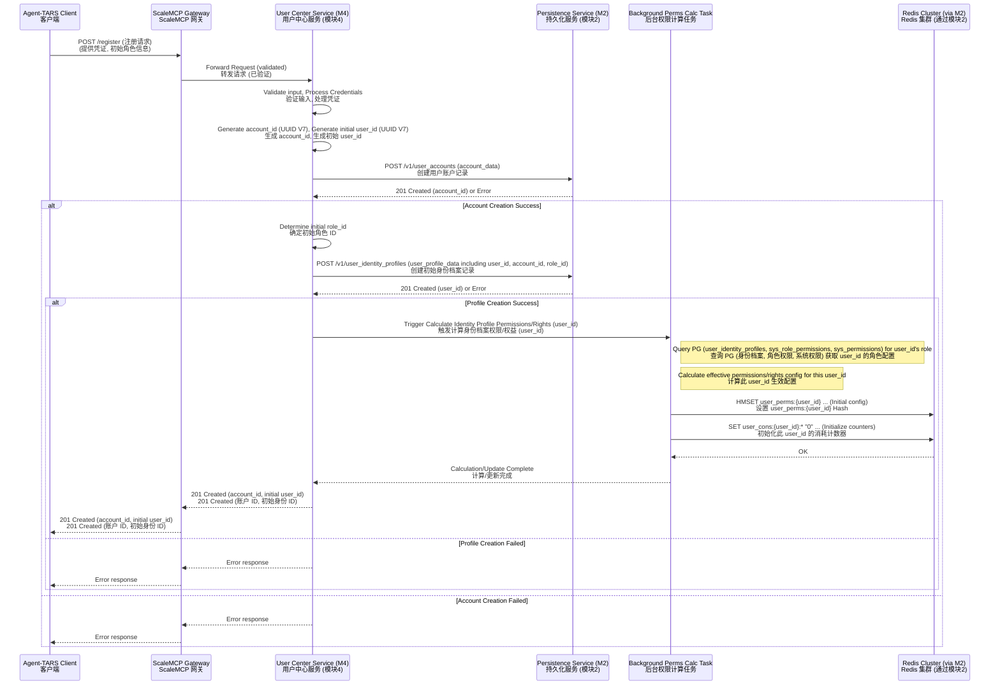
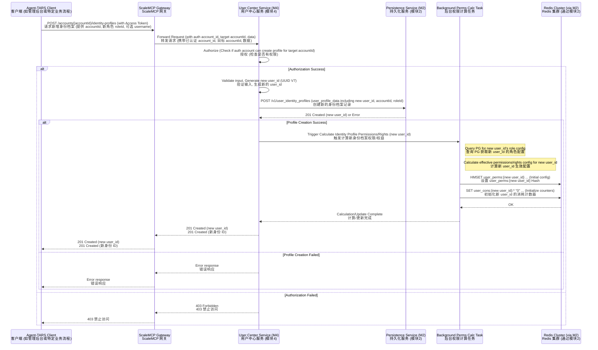
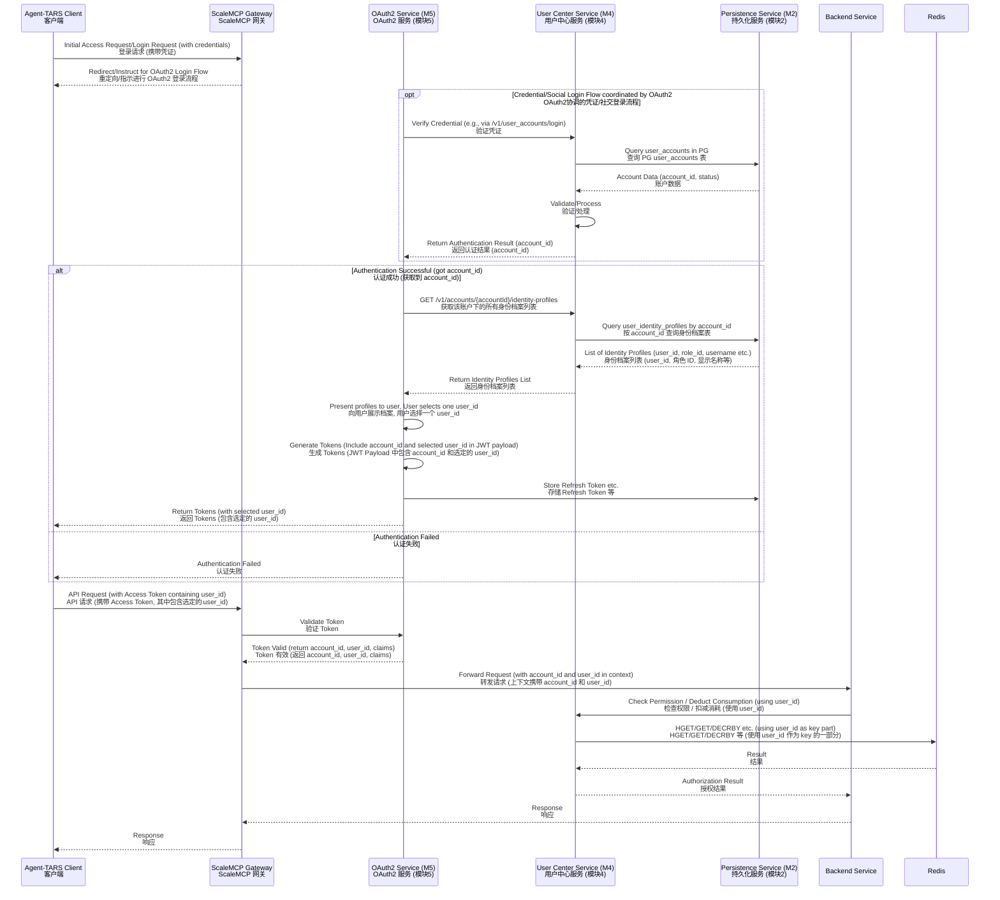
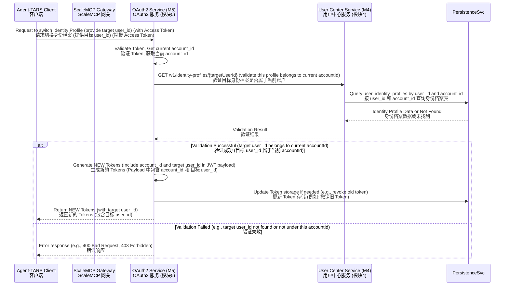
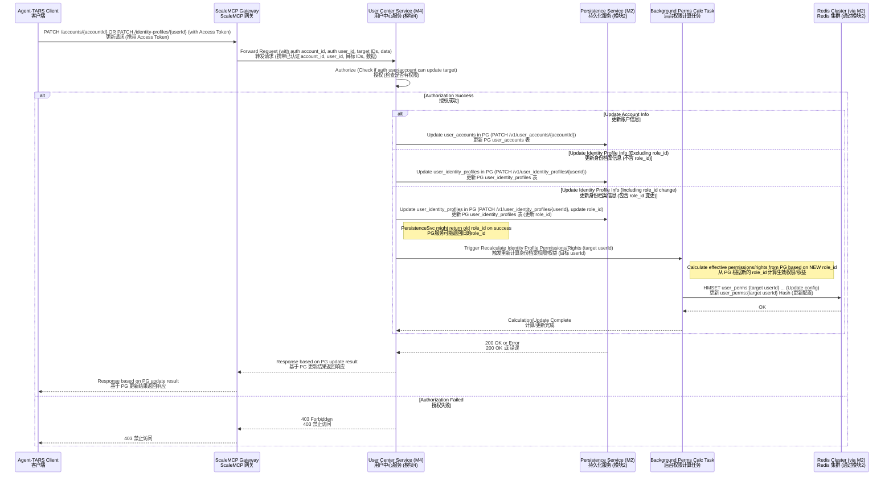
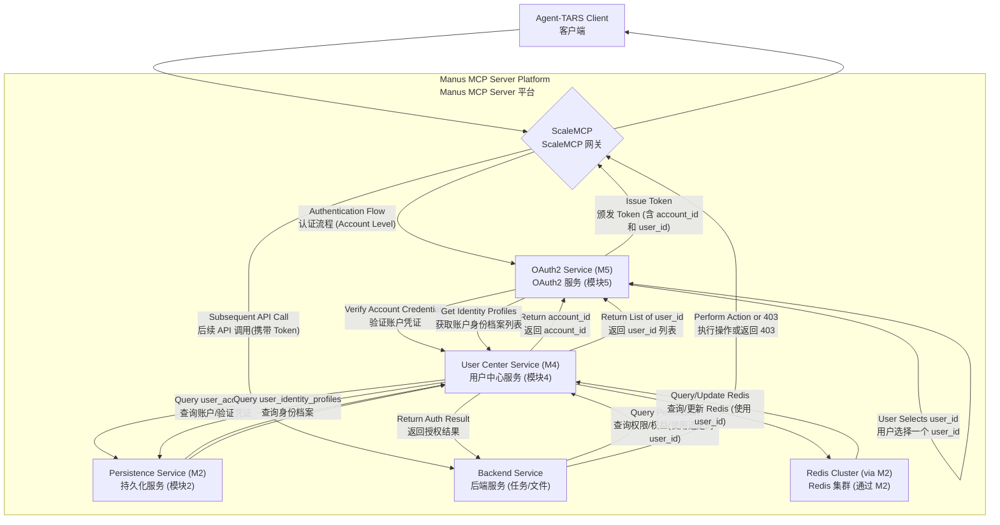

# 模块4: 用户中心服务 (`sys.service.user_center`) 详细设计文档 (修订版)

## 1. 引言

本文档详述 Manus MCP Server 平台中用户中心服务（`sys.service.user_center`）的设计。用户中心服务是平台的核心基础设施服务之一，负责用户账户生命周期管理、身份信息维护及权限相关的基础支持。本设计遵循《Agent-TARS与Manus MCP Server联合架构设计与集成开发：总体战略及模块化计划修订版 V4》及《模块1：核心架构原则与Manus MCP Server命名空间机制设计》确立的原则和规范，并依赖《模块2：持久化服务设计》提供的底层数据存储能力。

本次修订根据用户审阅反馈，对用户身份、多重角色表达、权限及权益管理方案进行了重大调整：明确了用户名字段的用途；核心调整是引入了用户账户 (`user_account`) 与用户身份档案 (`user_identity_profile`) 的分离概念，一个用户账户下可以关联多个具有独立 `user_id` 的身份档案，每个身份档案对应一个特定的角色或上下文。权限和权益严格关联到这些具有独立 `user_id` 的身份档案。 这彻底改变了原先基于单一 `user_id` 聚合多重角色和权益的设计，以更准确地支持用户多重角色下的独立身份和权益管理需求。同时，维持并细化了基于 Redis 的高性能用户实时权限及权益管理方案，该方案现在作用于用户身份档案 (`user_id`) 层面。

用户中心服务在联合架构中的定位是所有需要用户身份和权限信息服务的上层业务模块的基础依赖。它不处理具体的业务逻辑（如任务执行、文件管理），但为这些业务提供用户身份验证（通过与模块5 OAuth2服务协作）和授权决策所需的用户及权限数据。

核心目标:

- 提供安全、高效、可扩展的用户账户及身份档案管理功能。
- 为用户提供统一的身份验证入口（通过配合OAuth2）。
- 管理平台的账户和身份档案基本信息。
- 支撑一个用户账户下拥有多个具备独立 `user_id` 的身份档案。
- 支撑百万级并发用户规模下的用户身份档案数据访问和实时权限/权益校验、消耗需求，权限/权益与身份档案 (`user_id`) 严格关联。
- 支持灵活的用户角色与权益管理，以身份档案为载体。

主要功能范围:

- 用户注册（支持多种方式）、登录、注销。
- 用户账户基本信息、用户身份档案（特定角色下）的查询、修改。
- 用户密码管理（修改、重置流程）。
- 用户账户及身份档案状态管理（激活、锁定等）。
- 用户身份档案的角色 (`role_id`) 表达与管理。
- 为用户账户新增身份档案（新增角色身份）的能力。
- 为认证授权流程（与模块5集成）提供用户账户和身份档案信息，并支持用户在多身份档案中选择/切换当前使用的 `user_id`。
- 提供基于 Redis 的高性能用户身份档案实时权限及权益查询和消耗能力。

## 2. API接口规范

用户中心服务对外提供 RESTful API 接口，供内部其他模块或通过 ScaleMCP 间接供 Agent-TARS 客户端调用。所有 API 遵循统一的接口版本控制 (`/v1/`) 和错误处理规范。

URL 前缀: `/sys/service/user_center/v1`

通用请求头部：

- `Content-Type`: `application/json`
- `X-Request-Id`: 请求的唯一标识符
- `X-Account-Id`: (如果已认证) 当前操作用户的账户 ID (UUID V7)
- `X-User-Id`: (如果已认证并选择了身份档案) 当前操作用户使用的身份档案 ID (UUID V7)
- `Authorization`: (如果需要认证) 访问令牌 (例如 `Bearer <token>`)

通用响应结构 (成功):

```json
{
  "code": 0,
  "message": "string",
  "data": "object or array"
}
```

通用响应结构 (失败):

```json
{
  "code": 10000,
  "message": "string",
  "details": "object or string"
}
```

*API 接口定义（2.1 - 2.6）主要与用户账户和身份档案的基本信息管理相关，核心改动（多身份档案、权限、权益）体现在数据模型和权限管理方案部分。新增的权限/权益相关 API 将在相关章节说明。* 需要新增 API 用于：
- 查询用户账户下的所有身份档案列表。
- 创建新的用户身份档案（为用户账户新增角色身份）。

## 3. 数据模型设计

用户中心服务的数据模型围绕用户账户、用户身份档案及其关联的权限和权益构建。这些数据将通过模块2持久化服务进行存储和管理。

### 3.1 逻辑模型 (修订版)

核心逻辑实体包括：

-   用户账户 (User Account): 平台的用户账户，包含登录凭证（邮箱/手机/密码哈希或社交 ID）和账户级别的基本信息。一个用户账户代表一个实际的个人或组织实体。通过 `account_id` 唯一标识。
-   用户身份档案 (User Identity Profile): 用户账户下的一个具体身份或角色上下文。一个用户账户可以拥有多个身份档案。每个身份档案具有独立的 `user_id`，关联特定的角色 (`role_id`)，并拥有该角色下对应的权限和权益。用户在使用平台服务时，通过选择一个身份档案来确定当前使用的 `user_id` 及其对应的权限/权益。
-   权限/权益 (Permission/Right): 具体的、细粒度的操作许可或资源配额定义。
-   用户身份档案实时权限/权益状态 (User Identity Profile Real-time Permissions/Rights State): 存储在 Redis 中，包含特定 `user_id` (身份档案) 当前拥有的所有权限/权益的集合、启用状态及消耗数据。

### 3.2 物理模型 (数据库表结构 - 修订版)

基于上述逻辑模型和模块2持久化服务的设计原则（特别是UUID V7作为ID、`account_id` 或 `user_id` 作为主要分片键、使用PostgreSQL存储结构化数据），重新设计数据库表结构。这些表将由 Persistence Service 模块管理。

重要提示: 权限 (`sys_permissions`), 角色 (`sys_roles`), 角色权限配置 (`sys_role_permissions`) 等定义性元数据仍存储在 PostgreSQL 中作为事实来源。用户身份档案 (`user_identity_profiles`) 记录账户与特定角色 `user_id` 的关联。而用户身份档案（`user_id`）的实时、生效权限和权益状态将主要存储在 Redis 中，以支持高并发查询和原子操作。

#### 3.2.1 `user_accounts` 表 (用户账户实体 - 新增)

此表存储账户级别的、与特定身份档案无关的信息。

| 字段名称          | 数据类型                   | 约束           | 索引策略               | 说明                                   |
| :---------------- | :------------------------- | :------------- | :--------------------- | :------------------------------------- |
| `account_id`      | `UUID`                     | `PRIMARY KEY`  | 主键索引               | 用户账户唯一标识符 (UUID V7)             |
| `email`           | `VARCHAR(255)`             | `NULL`, `UNIQUE` | 可选唯一索引（如果非空） | 邮箱地址，可作为登录凭据                 |
| `phone_number_cn` | `VARCHAR(20)`              | `NULL`, `UNIQUE` | 可选唯一索引（如果非空） | 中国大陆手机号，可作为登录凭据           |
| `password_hash`   | `TEXT`                     | `NULL`         | 无                     | 密码哈希值 (包含盐值和算法信息)            |
| `status`          | `VARCHAR(50)`              | `NOT NULL`     | 可选索引               | 账户状态 (e.g., 'active', 'inactive', 'suspended') |
| `created_at`      | `TIMESTAMP WITH TIME ZONE` | `NOT NULL`     | 索引                   | 创建时间                               |
| `updated_at`      | `TIMESTAMP WITH TIME ZONE` | `NOT NULL`     | 索引                   | 最后更新时间                           |
| `profile_data`    | `JSONB`                    | `NULL`         | 无                     | 账户级别属性 (e.g., 账户名称, 绑定手机等) |
| `sharding_key`    | `UUID`                     | `NOT NULL`     | 分片键索引             | 冗余 `account_id` 作为分片键           |

*   字段说明: 此表存储了原 `users` 表中的账户核心凭证和状态字段。`account_id` 是账户的唯一标识。
*   分片策略: 基于 `account_id` 进行分片。

#### 3.2.2 `user_identity_profiles` 表 (用户身份档案实体 - 原 `users` 表修订)

此表存储用户账户下的身份档案，每个身份档案代表一个特定的角色或上下文，具有独立的 `user_id`。

| 字段名称          | 数据类型                   | 约束           | 索引策略               | 说明                                                                 |
| :---------------- | :------------------------- | :------------- | :--------------------- | :------------------------------------------------------------------- |
| `user_id`         | `UUID`                     | `PRIMARY KEY`  | 主键索引               | 用户身份档案唯一标识符 (UUID V7)，用于权限/权益关联和 API 调用上下文   |
| `account_id`      | `UUID`                     | `NOT NULL`     | 索引, 分片键           | 关联的用户账户 ID (`user_identity_profiles.account_id` REFERENCES `user_accounts.account_id`) |
| `role_id`         | `UUID`                     | `NOT NULL`     | 索引                   | 关联的角色 ID (`user_identity_profiles.role_id` REFERENCES `sys_roles.role_id`) |
| `username`        | `VARCHAR(128)`             | `NOT NULL`     | 无                     | 身份档案的显示名称，仅用于前端UI显示，允许存在重名                   |
| `status`          | `VARCHAR(50)`              | `NOT NULL`     | 可选索引               | 身份档案状态 (e.g., 'active', 'inactive', 'suspended')               |
| `created_at`      | `TIMESTAMP WITH TIME ZONE` | `NOT NULL`     | 索引                   | 创建时间                                                             |
| `updated_at`      | `TIMESTAMP WITH TIME ZONE` | `NOT NULL`     | 索引                   | 最后更新时间                                                         |
| `profile_data`    | `JSONB`                    | `NULL`         | 无 (本期不使用GIN索引)   | 其他身份档案属性，JSONB格式 (e.g., nickname, avatar_url for this specific profile) |
| `sharding_key`    | `UUID`                     | `NOT NULL`     | 分片键索引             | 冗余 `account_id` 作为分片键                                         |

*   字段说明与修订点:
    *   `user_id`: 仍然是 PK，但现在明确代表的是一个身份档案，而不是整个账户。它是权限/权益关联的主体。
    *   `account_id`: 新增字段，将身份档案链接到其所属的用户账户。
    *   `role_id`: 新增字段，将身份档案链接到其代表的角色。一个身份档案严格对应一个 `role_id`。
    *   `username`: 保留并明确为身份档案的显示名称。
    *   移除 `email`, `phone_number_cn`, `password_hash`, `roles`, `tiers` 字段，这些属于账户级别信息或已由 `role_id` 字段取代。
*   关系: `user_identity_profiles.account_id` REFERENCES `user_accounts.account_id`, `user_identity_profiles.role_id` REFERENCES `sys_roles.role_id`.
*   分片策略: 基于 `account_id` 进行分片，以保持同一账户下的所有身份档案存储在一起，方便按账户查询其所有身份档案。

#### 3.2.3 `user_social_accounts` 表 (社交账号关联 - 修订)

关联到用户账户 (`account_id`)。

| 字段名称      | 数据类型                   | 约束               | 索引策略       | 说明                   |
| :------------ | :------------------------- | :----------------- | :------------- | :--------------------- |
| `id`          | `UUID`                     | `PRIMARY KEY`      | 主键索引       | 记录唯一标识符 (UUID V7) |
| `account_id`  | `UUID`                     | `NOT NULL`         | 索引, 分片键   | 关联用户账户 ID          |
| `provider`    | `VARCHAR(50)`              | `NOT NULL`         | 索引           | 社交平台提供商           |
| `social_id`   | `VARCHAR(255)`             | `NOT NULL`, `UNIQUE` | 唯一索引（复合 `provider`） | 社交平台提供的唯一ID |
| `created_at`  | `TIMESTAMP WITH TIME ZONE` | `NOT NULL`         | 索引           | 关联时间               |

*   关系: `user_social_accounts.account_id` REFERENCES `user_accounts.account_id`
*   约束: `UNIQUE (provider, social_id)`
*   分片策略: 基于 `account_id` 进行分片。

#### 3.2.4 `login_history` 表 (登录历史 - 修订)

关联到用户账户 (`account_id`)。

| 字段名称      | 数据类型               | 约束       | 索引策略 | 说明       |
| :------------ | :--------------------- | :--------- | :------- | :--------- |
| `id`          | `UUID`                 | `PRIMARY KEY` | 主键索引 | 记录唯一标识符 (UUID V7) |
| `account_id`  | `UUID`                 | `NOT NULL` | 索引, 分片键 | 用户账户 ID     |
| `timestamp`   | `TIMESTAMP WITH TIME ZONE` | `NOT NULL` | 索引     | 登录时间   |
| `login_method`| `VARCHAR(50)`          | `NULL`     | 索引     | 登录方式   |
| `ip_address`  | `VARCHAR(45)`          | `NULL`     | 可选索引 | 登录 IP 地址 |
| `user_agent`  | `TEXT`                 | `NULL`     | 无       | 用户代理信息 |
| `success`     | `BOOLEAN`              | `NOT NULL` | 可选索引 | 是否成功登录 |
| `details`     | `JSONB`                | `NULL`     | 可选索引 | 其他详情   |

*   关系: `login_history.account_id` REFERENCES `user_accounts.account_id`
*   分片策略: 基于 `account_id` 进行分片，也可能考虑基于时间进行分区。

#### 3.2.5 权限与权益定义元数据表 (`sys_permissions`, `sys_roles`, `sys_role_permissions`)

这三张表作为系统权限、角色及角色权限配置的事实来源，设计基本同原文档，但 `sys_roles` 现在更明确地代表可赋予身份档案的“角色类型”。`user_roles` 表因引入 `user_identity_profiles` 表而废弃。

*   `sys_permissions` 表：定义系统所有权限/权益项。
*   `sys_roles` 表：定义所有角色类型。
*   `sys_role_permissions` 表：定义每个角色类型 (`role_id`) 包含哪些权限/权益 (`permission_id`) 及其配置 (`config JSONB`)。

这些表的读写通常通过用户中心服务的后台管理功能或由特定业务流程触发。

### 3.3 用户身份档案权限与权益管理的实现 (基于 Redis - 修订)

核心思想： 权限和权益严格关联到 `user_identity_profiles.user_id`。 当身份档案 (`user_id`) 创建或其关联的 `role_id` 配置发生变化时，由用户中心服务启动后台任务（或通过事件触发）计算该 `user_id` 生效的权限和权益集合及其具体配置，并将计算结果存储在 Redis 中。

设计方案核心:

1.  权限与权益定义 (事实来源 - PostgreSQL): 使用 `sys_permissions`, `sys_roles`, `sys_role_permissions` 表定义权限/权益项、角色类型以及角色与权限的关联配置。
2.  用户身份档案关联角色 (事实来源 - PostgreSQL): `user_identity_profiles` 表记录了每个 `user_id` (身份档案) 关联的唯一 `role_id`。
3.  用户身份档案实时生效权限及权益状态 (实时校验和消耗 - Redis):
    *   计算逻辑: 当 `user_identity_profiles` 表中的某个 `user_id` 记录被创建或其 `role_id` 字段发生变化时，触发后台任务：
        1.  获取该 `user_id` 关联的 `role_id`。
        2.  根据 `role_id`，从 `sys_role_permissions` 和 `sys_permissions` 表查询该角色包含的所有权限/权益项及其配置。
        3.  计算该 `user_id` 最终生效的权限/权益集合及其具体配置。
        4.  使用 `HMSET` 或管道原子性地更新 `user_perms:{user_id}` Hash 中的所有字段。
        5.  对于消耗型权益，初始化或更新其配置字段（如 `limit`, `resets_at`），不影响已有消耗计数（如果身份档案是更新而非新建）。
        6.  消耗型权益重置: 对于有时限的消耗型权益，定期任务或根据 `resets_at` 触发，将对应的 `user_cons:{user_id}:<right_name>` String Key 设置回 "0"。
    *   Redis 数据结构设计:
        *   Key: `user_perms:{user_id}` (Hash) - 存储特定 `user_id` (身份档案) 的每项权限/权益的配置和状态。`user_id` 来自 `user_identity_profiles` 表。使用 Key Tag `{}` 按 `user_id` 分片。
            ```
            -- Redis Key Example (using Key Tag for sharding):
            user_perms:{<user_id_from_profile>}
               - <permission_name_1>: <JSON string of effective config> -- e.g., "task:create": '{"enabled":true, "limit":-1}'
               - <permission_name_2>: <JSON string of effective config> -- e.g., "model:gpt4:calls": '{"enabled":true, "limit":100, "resets_at":1678881994}'
               - ... other permissions/rights from the associated role_id
            ```
            这里的配置是根据该身份档案关联的唯一 `role_id` 计算得出的生效值。
        *   Key: `user_cons:{user_id}:<right_name>` (String) - 存储特定 `user_id` (身份档案) 消耗型权益的当前消耗值。仅用于需要原子操作的消耗项。使用 Key Tag `{}` 按 `user_id` 分片。
            ```
            -- Redis Key Example (using Key Tag for sharding):
            user_cons:{<user_id_from_profile>}:model:gpt4:calls -> "42" -- 特定身份档案 (user_id) 的当前消耗次数
            user_cons:{<user_id_from_profile>}:storage:quota_bytes -> "536870912" -- 特定身份档案的当前占用字节数
            ```
    *   数据存储和查询逻辑 (User Center 内部实现): 同原文档的 Redis 方案，但所有操作的主体都是传入的特定 `user_id` (身份档案 ID)。
        *   更新: `user_identity_profiles` 创建或更新 `role_id` 时触发。
        *   查询 (授权检查): `check_permission(user_id, permission_name)` 调用，根据传入的 `user_id` 查询其对应的 Redis Key `user_perms:{user_id}` 和 `user_cons:{user_id}:<right_name>`。
        *   消耗扣减 (实时): `deduct_right_consumption(user_id, right_name, amount)` 调用，根据传入的 `user_id` 原子操作其对应的 Redis Key `user_cons:{user_id}:<right_name>`。

权限设计与用户权益业务需求对齐 (整合反馈点):

-   多重角色用户权益计算示例修正:
    > 例如，如果用户账户同时拥有表示‘1、KOL、KOC和普通C端用户-基础会员’角色的身份档案 A (其 `user_id` 为 `user_id_1`) 和表示‘2、中小企业(SMB)客户-高级会员’角色的身份档案 B (其 `user_id` 为 `user_id_2`)，其中身份档案 A (`user_id_1`) 在其基础会员角色下配置提供 50 次模型调用（`model:gpt4:calls`），身份档案 B (`user_id_2`) 在其高级会员角色下配置提供 100 次模型调用。
    > 在 Redis 中，权益限额将分别存储在与这两个独立 `user_id` 关联的 Key 中：
    > -   `user_perms:{user_id_1}` Hash 中 `model:gpt4:calls` 字段的 `limit` 可能是 50。
    > -   `user_perms:{user_id_2}` Hash 中 `model:gpt4:calls` 字段的 `limit` 可能是 100。
    > -   对应的消耗计数分别存储在：`user_cons:{user_id_1}:model:gpt4:calls` 和 `user_cons:{user_id_2}:model:gpt4:calls`。
    > 当用户使用 `user_id_1` 进行服务调用时，消耗和权限检查是针对 `user_id_1` 的配额（50次）。当用户切换到 `user_id_2` 使用服务时，消耗和权限检查是针对 `user_id_2` 的配额（100次）。不同身份档案 (`user_id`) 之间的权益是完全独立的，不聚合，不共享。

优缺点分析:

*   优点:
    *   精确支持多重身份档案/角色下的独立权限和权益: 每个身份档案 (`user_id`) 有独立的权限和权益配置及消耗计数，完美匹配用户反馈中对多角色独立权益的需求。
    *   高性能实时授权检查和消耗扣减: 方案核心仍是基于 Redis，与原方案类似，提供 O(1) 级别的快速读写能力。
    *   清晰的数据模型: 将账户级别信息与身份档案级别信息分离，模型更清晰，易于理解和管理。
*   缺点:
    *   账户管理复杂性增加: 需要同时管理 `user_accounts` 和 `user_identity_profiles` 两张表及其关联。
    *   数据一致性挑战: PG 和 Redis 之间的一致性同步仍然存在，需要在 `user_identity_profiles` 创建/更新时可靠触发 Redis 更新。
    *   Redis 内存占用: 每个身份档案都需要存储其权限状态和消耗计数，用户账户数量 * 身份档案数量 * 权限数量可能导致更高的内存需求。
    *   客户端和业务服务需要感知 `user_id` 的含义: 业务服务在调用用户中心 API 时必须提供当前使用的 `user_id`，这要求调用方对当前用户所在的身份档案有明确认知。

总结建议:

采纳基于 `user_accounts` + `user_identity_profiles` (带独立 `user_id`) + Redis 的方案。 这是唯一能够准确实现用户反馈中关于“为新增角色创建新的 `user_id` 实例”以及“权限/权益与特定角色 `user_id` 关联”的设计。尽管增加了数据模型和流程的复杂性，但在满足核心业务需求方面，它是更准确和可行的方案。

API 接口影响 (新增/修订):

基于新的身份档案和权限管理方案，用户中心需要提供以下 API 供其他服务调用：

*   `sys.service.user_center.get_account_identity_profiles`:
    *   端点: `/sys/service/user_center/v1/accounts/{accountId}/identity-profiles`
    *   方法: `GET`
    *   描述: 获取用户账户下所有身份档案 (`user_id`s) 的列表及其概要信息（如关联角色名称、显示名称）。用于登录成功后向用户展示可选身份。
    *   请求体: (None)
    *   响应体 (200 OK):
        ```json
        {
          "code": 0,
          "message": "Identity profiles retrieved successfully.",
          "data": {
            "identity_profiles": [
              {
                "user_id": "uuid",
                "role_id": "uuid",
                "role_name": "string",
                "username": "string", // 身份档案显示名称
                "status": "string",
                "created_at": "timestamp"
              },
              ...
            ]
          }
        }
        ```
*   `sys.service.user_center.create_identity_profile`:
    *   端点: `/sys/service/user_center/v1/accounts/{accountId}/identity-profiles`
    *   方法: `POST`
    *   描述: 为现有用户账户创建一个新的身份档案（新增角色身份）。
    *   请求体:
        ```json
        {
          "role_id": "string", // 要新增的角色 ID
          "username": "string", // (Optional) 为此身份档案指定的显示名称
          "profile_data": "object" // (Optional) 此身份档案的附加属性
        }
        ```
    *   响应体 (201 Created):
        ```json
        {
          "code": 0,
          "message": "Identity profile created successfully.",
          "data": {
            "user_id": "uuid" // 新创建身份档案的 user_id
          }
        }
        ```
    *   状态码: `400 Bad Request`, `403 Forbidden` (无权创建), `404 Not Found` (账户不存在), `409 Conflict` (如同一角色类型身份档案不允许重复), `500 Internal Server Error`。
*   `sys.service.user_center.check_permission`: (基本同原文档，明确操作主体是传入的 `user_id`)
    *   端点: `/sys/service/user_center/v1/identity-profiles/{userId}/permissions/check`
    *   方法: `POST` (或 `GET` 带参数)
    *   描述: 检查特定身份档案 (`userId`) 是否拥有指定权限/权益，并根据需要检查消耗限制。
    *   请求体:
        ```json
        {
          "permission_name": "string", // 要检查的权限/权益名称
          "required_amount": "number" // (Optional) 如果是消耗型，检查是否至少有此数量的剩余
        }
        ```
    *   响应体 (200 OK): 同原文档，判断结果针对传入的 `userId`。
*   `sys.service.user_center.deduct_right_consumption`: (基本同原文档，明确操作主体是传入的 `user_id`)
    *   端点: `/sys/service/user_center/v1/identity-profiles/{userId}/rights/deduct`
    *   方法: `POST`
    *   描述: 对特定身份档案 (`userId`) 的消耗型权益进行原子性扣减。
    *   请求体:
        ```json
        {
          "right_name": "string", // 要扣减的权益名称
          "amount": "number"      // 扣减数量
        }
        ```
    *   响应体 (200 OK): 同原文档，扣减结果针对传入的 `userId`。
    *   状态码: `400 Bad Request`, `403 Forbidden` (无权扣减或配额不足针对此 `userId`), `404 Not Found` ( `userId` 不存在), `500 Internal Server Error`。
*   `sys.service.user_center.get_identity_profile_permissions`: (基本同原文档，明确操作主体是传入的 `user_id`)
    *   端点: `/sys/service/user_center/v1/identity-profiles/{userId}/permissions`
    *   方法: `GET`
    *   描述: 获取特定身份档案 (`userId`) 所有生效的权限和权益列表及其配置。
    *   响应体 (200 OK): 同原文档，返回结果针对传入的 `userId`。

*(原 API 接口定义 2.1 - 2.6 需要调整，例如用户注册、登录现在应围绕 `user_accounts` 展开，用户信息更新应区分是账户信息还是身份档案信息。此处不再列出所有细节，但在核心流程中体现。)*

## 4. 核心业务流程 (修订版)

核心业务流程需要更新以反映账户与身份档案分离以及权限/权益关联到身份档案 (`user_id`) 的新模型。

### 4.1 用户注册流程 (修订版)

新注册用户初始只有一个用户账户和一个默认角色身份档案。



*用户注册流程示意图 (创建账户和初始身份档案)*

### 4.2 为用户账户新增角色身份流程 (修订版)

为一个已存在的用户账户创建新的身份档案，每个新身份档案对应一个新角色，并拥有独立的 `user_id`。



*新增用户身份档案 (新增角色身份) 流程示意图*

### 4.3 用户认证与身份档案选择流程 (与模块5 OAuth2服务集成 - 修订版)

认证发生在账户 (`account_id`) 级别。认证成功后，用户选择一个身份档案 (`user_id`) 进行后续服务访问。



*用户认证与身份档案选择流程示意图*

### 4.4 用户身份档案切换流程 (修订版)

用户已登录并使用某个身份档案 (`user_id`)。用户请求切换到同一账户下的另一个身份档案。



*用户身份档案切换流程示意图*

### 4.5 用户信息更新流程 (修订版)

区分更新账户信息和更新身份档案信息。更新身份档案的 `role_id` 时触发 Redis 更新。



*用户信息更新流程示意图 (区分账户与身份档案，体现 role_id 变更触发 Redis 更新)*

## 5. 用户认证与授权集成方案 (修订版)

用户中心服务与模块5 OAuth2 服务的集成是平台认证授权体系的核心。

-   认证: OAuth2 服务调用用户中心 API 对用户账户 (`account_id`) 的凭证进行验证。成功认证后，用户中心向 OAuth2 返回 `account_id` 以及该账户下的所有身份档案列表 (`user_id`s)。OAuth2 或客户端引导用户选择一个身份档案，并将选定的 `account_id` 和 `user_id` 包含在颁发的 JWT Token 中。
-   授权:
    -   废弃基于 PostgreSQL 多表 JOIN 的细粒度授权检查。
    -   新的细粒度授权: 需要进行细粒度授权检查的业务服务，在接收到已通过 OAuth2/ScaleMCP 认证的请求（请求中携带用户账户 ID `account_id` 和当前使用的身份档案 ID `user_id`）后，会调用用户中心服务提供的高性能 API (`check_permission`, `deduct_right_consumption`) 来获取当前使用的 `user_id` 的实时权限/权益状态或进行消耗扣减。
    -   用户中心服务在处理这些 API 调用时，直接查询和操作 Redis 中与传入的 `user_id` 关联的用户身份档案实时生效权限 (`user_perms:{user_id}`) 和消耗计数 (`user_cons:{user_id}:<right_name>`)，并进行快速决策和响应。
-   集成方式:
    -   OAuth2 服务调用用户中心 API 进行账户认证和获取账户下的身份档案列表。
    -   业务服务 直接调用用户中心提供的权限/权益 API (`check_permission`, `deduct_right_consumption`, `get_identity_profile_permissions`) 进行细粒度授权检查和消耗管理。这些调用通过 ScaleMCP 进行服务发现和路由。
    -   用户中心服务依赖 Persistence Service 管理 PostgreSQL 数据，并利用 Persistence Service 提供的 Redis Cluster 连接能力操作 Redis。


*认证授权集成示意图 (修订版 - 认证账户，授权检查基于选定的身份档案 user_id)*

令牌机制:

-   OAuth2 服务颁发 JWT Access Token，其中必须包含用户账户 ID (`account_id`) 和用户当前选择使用的身份档案 ID (`user_id`)。`scope` claim 可用于粗粒度的服务访问控制，但细粒度权限检查基于 `user_id` 调用用户中心 API 完成。
-   用户中心不直接处理 Token 的生成或验证，它只提供用户账户认证能力、身份档案列表以及实时权限/权益查询/扣减能力 (基于 `user_id`)。

## 6. 技术选型与考量 (初步) (同原文档，新增 Redis 相关监控)

技术选型基本同原文档，关键在于利用 Persistence Service 提供的 Redis Cluster 能力支撑基于 `user_id` 的高性能权限/权益读写。

| 技术领域         | 技术选型建议              | 考量与理由                                                                 |
| :--------------- | :------------------------ | :------------------------------------------------------------------------- |
| 密码哈希         | Argon2, BCrypt, scrypt    | 安全性高。                                                               |
| 核心服务框架     | 平台统一框架 (异步 IO)    | 高性能，支持高并发。                                                     |
| 编程语言         | Go, Java, C++ (平台主流)  | 效率高，社区成熟。                                                       |
| 权限/权益实时存储 | Redis Cluster ( via M2 ) | 高性能实时读写，支持百万身份档案并发校验和原子扣减。 利用平台基础设施。 |
| 异步任务/通知    | Kafka                   | 解耦，削峰填谷，事件驱动，用于触发 Redis 权限状态更新（基于身份档案创建/更新事件）。 |
| 服务间通信       | MCP Protocol (via ScaleMCP) | 遵循平台标准。                                                           |
| 元数据存储       | PostgreSQL (via M2)      | 存储账户、身份档案、权限/角色定义等结构化元数据。                          |

## 7. 与模块1和模块2的集成 (修订版)

### 7.1 模块1（核心架构原则与命名空间机制）集成 (同原文档)

用户中心服务必须遵循模块1原则和命名空间机制。
- 服务命名空间: `sys.service.user_center`。
- 新增 API 命名空间: `sys.service.user_center.get_account_identity_profiles`, `sys.service.user_center.create_identity_profile`, `sys.service.user_center.check_permission`, `sys.service.user_center.deduct_right_consumption`, `sys.service.user_center.get_identity_profile_permissions` 等。

### 7.2 模块2（持久化服务）集成 (修订版)

用户中心服务通过调用 Persistence Service API 操作所有数据。

-   数据存储与管理:
    -   PostgreSQL 数据: 用户账户 (`user_accounts`), 用户身份档案 (`user_identity_profiles`), 社交账号 (`user_social_accounts`), 登录历史 (`login_history`), 系统权限/角色定义 (`sys_permissions`, `sys_roles`, `sys_role_permissions`) 的 CRUD 通过 Persistence Service API 完成。
    -   Redis 数据: 用户身份档案实时生效权限/权益状态 (`user_perms:{user_id}`) 和消耗计数 (`user_cons:{user_id}:<right_name>`) 的读写，通过调用 Persistence Service 提供的 Redis 操作代理 API 或直接访问能力完成。Persistence Service 管理连接和分片。
-   API 调用方式: 通过内部服务通信框架调用 Persistence Service API。
-   数据模型映射: 维护逻辑模型与 Persistence Service API 数据结构的映射。
-   数据一致性: 依赖 Persistence Service 保证底层 PG 和 Redis 的原子操作一致性。跨存储（PG 到 Redis）的一致性由用户中心服务的后台计算和同步机制负责（例如，身份档案创建/更新事件触发 Redis 刷新）。
-   事务管理: 依赖 Persistence Service 提供的原子操作能力。对于涉及 PG 和 Redis 的操作，通过异步事件和后台任务处理。
-   性能与可扩展性: 依靠 Persistence Service 管理 PG 分片，并完全依赖 Persistence Service 管理的 Redis Cluster 提供的高性能读写能力来支撑百万身份档案 (`user_id`) 规模下的实时权限校验和消耗扣减。

## 8. 安全性设计 (修订版)

安全性是设计的重中之重，需考虑账户和身份档案两层。

-   数据传输安全: 同原文档。
-   密码存储与处理: 同原文档，应用于 `user_accounts` 表。
-   输入验证: 同原文档。
-   访问控制:
    -   API 层面：OAuth2 确保请求已认证（获得 `account_id` 和 `user_id`）。
    -   服务间调用授权: 调用用户中心 API (特别是更新、创建身份档案、查询其他账户/身份档案信息) 需要进行基于调用方模块身份和账户/身份档案 ID 的授权检查。例如，普通用户只能更新自己的账户或身份档案信息，管理员可以操作所有用户。
    -   细粒度授权检查: 在需要访问资源的业务服务中进行，调用 `check_permission` 或 `deduct_right_consumption` API 时，传入当前请求使用的 `user_id`。用户中心服务基于此 `user_id` 查询 Redis 进行授权判断。业务服务必须确保传入的 `user_id` 是合法的（即来自已验证的 Token 且用户有权使用）。
    -   内部 Redis 访问：通过 Persistence Service 隔离，只有用户中心服务（特别是后台任务）有权修改 `user_perms` 和 `user_cons` 等敏感 Keys。
-   敏感信息保护:
    -   同原文档，API 不返回敏感凭证信息。
    -   API 返回的身份档案列表、权限列表等数据应仅包含用户有权查看的信息。 例如，用户只能查询自己账户下的身份档案列表和自己当前使用身份档案 (`user_id`) 的权限列表。
    -   日志中避免记录敏感信息。
-   防常见 Web 攻击: 同原文档。

## 9. 部署与运维考量 (初步) (同原文档，新增 Redis 相关监控)

部署、高可用、技术栈同原文档。

-   监控指标:
    -   业务指标: 用户账户注册/登录率、身份档案创建率、API 调用次数（按账户级别和身份档案级别划分）、`check_permission` 调用次数和成功率（按 `user_id` 或 overall）、`deduct_right_consumption` 调用次数和成功率（按 `user_id` 或 overall）、用户账户/身份档案增长率。
    -   性能指标: API 延迟/QPS/错误率（按类型，重点关注权限相关 API）、服务实例资源利用率。
    -   依赖指标: 对 Persistence Service API 的调用延迟/成功率/错误率、对 Redis 的读写 QPS、延迟、错误率、Redis 内存使用、Redis Cluster 状态。
    -   后台任务指标: 用户身份档案权限计算任务的执行频率、成功率、处理时长、等待队列长度。
    -   数据一致性监控: 监控 PostgreSQL (user_identity_profiles) 与 Redis (user_perms, user_cons) 之间的一致性延迟。
-   日志: 统一日志格式，记录关键操作、警告、错误，以及权限检查结果和消耗扣减事件 (需包含关联的 user_id)，方便审计和问题追踪。

这份详细设计文档已根据用户审阅反馈，对核心的用户身份、多重角色表达和权限管理方案进行了修订，引入了用户账户与身份档案分离的模型，明确了权限和权益与身份档案 (`user_id`) 的关联，并细化了基于 Redis 实现高性能实时校验和消耗扣减的方案。文档更新了数据模型、核心流程和 API 接口说明。后续开发实现应严格遵循本规范，并根据实际开发和测试情况进行必要的细化和调整。