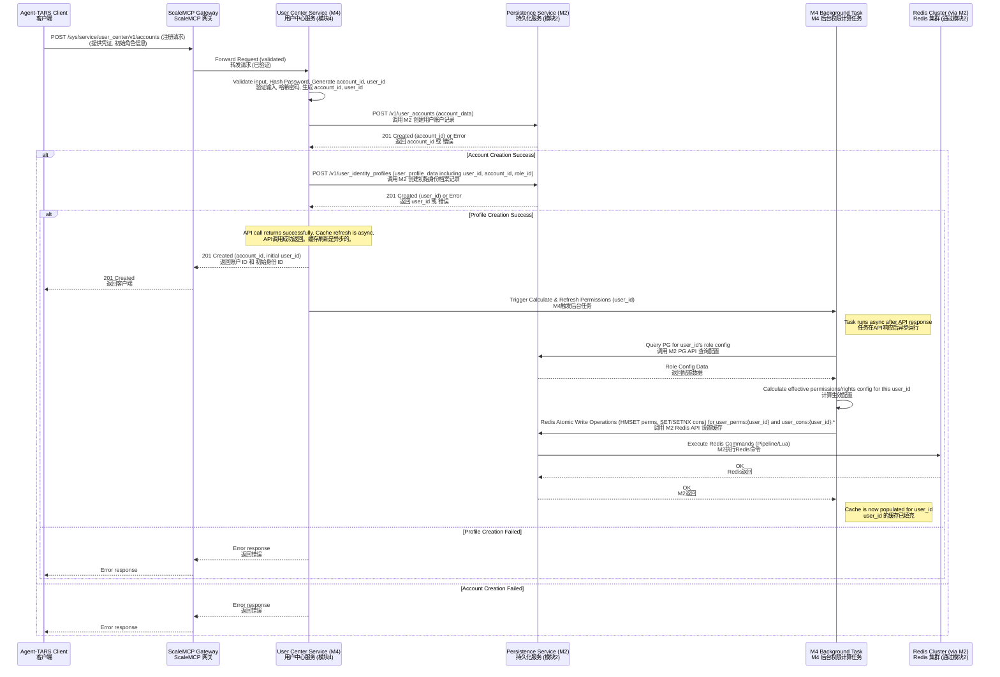
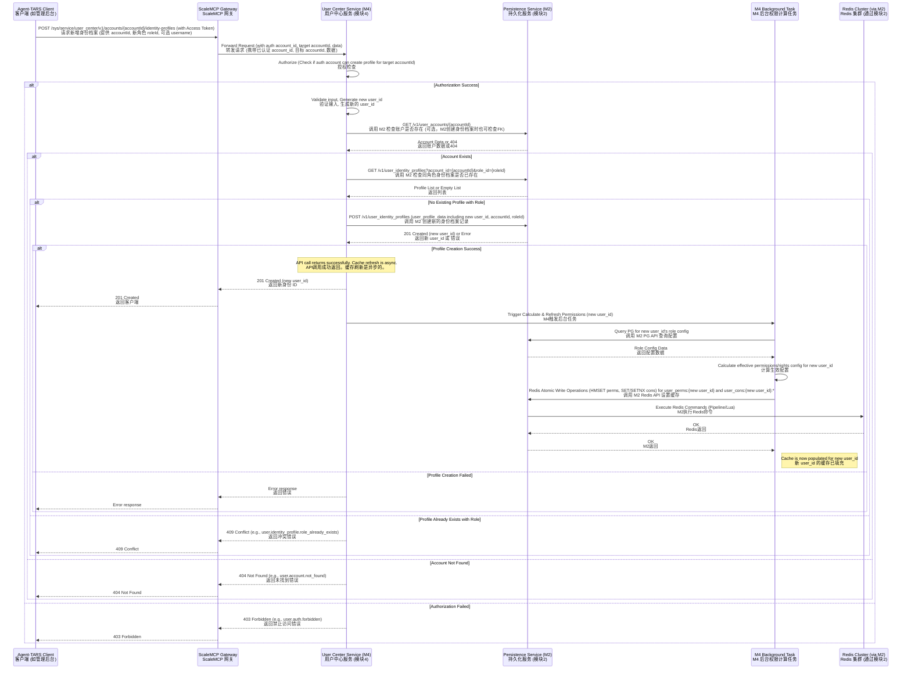
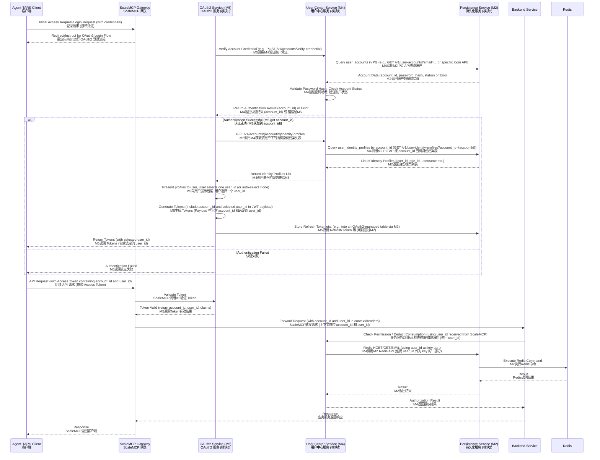
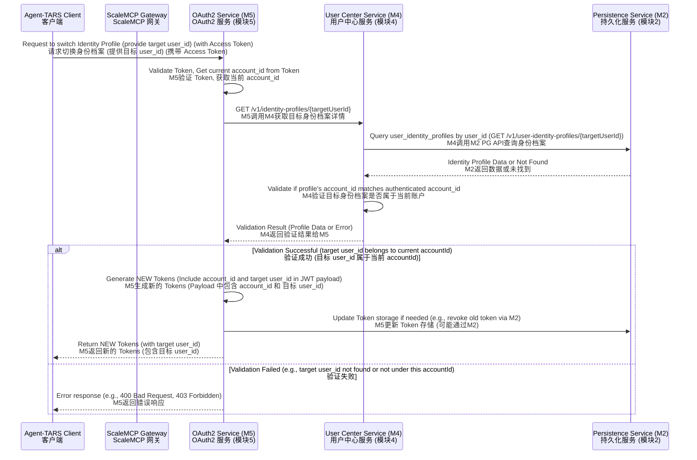
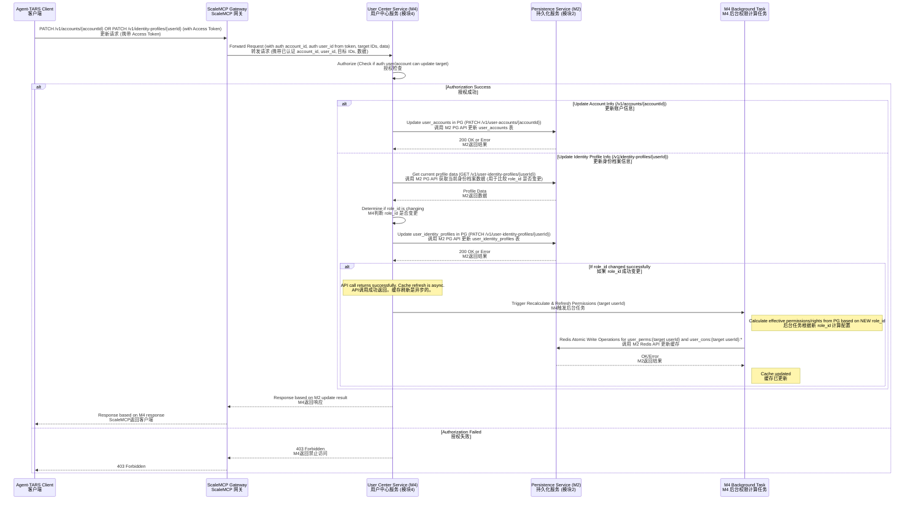

# 模块4：DetailedDesign - 用户中心服务API实现指南

本文档作为《技术文档完善项目执行计划》中的P0级核心交付物，详细阐述 Manus MCP Server 平台用户中心服务（`sys.service.user_center`，简称M4）对外暴露的API接口的内部实现逻辑、与持久化服务（`sys.storage.persistence`，简称M2）的交互细节，以及相关的核心业务流程、错误处理机制。

本文档严格依据以下已完成的P0级文档及修订：
*   《模块4：用户中心服务详细设计文档 (修订版)》：定义了M4的核心业务需求、用户账户与身份档案分离的模型、主要API列表及数据模型。
*   《模块2：DetailedDesign - 持久化服务详细实现规范》：阐述了M2的API实现逻辑、与底层存储的交互。
*   《模块2：DetailedDesign - 数据库设计与优化指南》：定义了M4所需使用的PostgreSQL表结构、索引、分片策略等，由M2管理。
*   《模块2：DetailedDesign - Redis缓存架构设计》：定义了M4所需使用的Redis数据结构、集群和一致性策略，由M2管理和暴露访问能力。
*   《模块4：用户中心服务与模块2 持久化服务联合开发技术文档 (修订版)》：明确了M4与M2之间的数据结构依赖和API接口契约。

本指南旨在提供足够的实现细节，包括数据流、控制流和服务间交互，以支持基于文档的AI代码生成。

## 1. API接口总览

用户中心服务对外提供一组RESTful API，主要用于用户账户和身份档案的生命周期管理、信息查询以及权限/权益相关的基础支持。所有API遵循 `/sys/service/user_center/v1` 的URL前缀、通用请求头部和响应结构，具体请参考《模块4：用户中心服务详细设计文档 (修订版)》。

核心API分组：

*   账户管理: 用户注册、登录（通常通过M5 OAuth2服务协调）、账户信息查询/修改/删除、密码管理。
*   身份档案管理: 查询用户账户下的身份档案列表、创建新的身份档案、身份档案信息查询/修改/删除。
*   权限与权益: 检查特定身份档案的权限、扣减特定身份档案的消耗型权益、查询特定身份档案的所有权限/权益配置。

本指南将重点阐述部分关键API的实现逻辑，特别是涉及账户与身份档案联动以及与M2交互的部分。

## 2. 核心API实现逻辑与M2交互

本节详细描述用户中心服务中部分核心API的内部处理流程，突出M4如何通过调用M2 Persistence Service的API来完成数据操作。

### 2.1 用户注册 (`POST /v1/accounts`)

创建一个新的用户账户及其初始身份档案。

API 输入:

```json
{
  "email": "string",        // 可选，邮箱
  "phone_number_cn": "string", // 可选，手机号
  "password": "string",     // 明文密码
  "initial_role_id": "string", // 必需，为初始身份档案指定的角色ID
  "initial_username": "string", // 必需，初始身份档案显示名称
  "account_profile_data": "object", // 可选，账户级别附加信息
  "identity_profile_data": "object" // 可选，初始身份档案附加信息
}
```

处理流程:

1.  输入验证: 校验输入参数，例如：email/phone格式、密码复杂度、`initial_role_id` 和 `initial_username` 非空。至少提供 email, phone_number_cn 之一作为登录凭证。
2.  凭证处理: 对输入的明文密码进行加盐哈希处理。
3.  生成ID: 生成新的用户账户UUID (`account_id`, UUID V7) 和新的用户身份档案UUID (`user_id`, UUID V7)。
4.  创建账户 (调用 M2):
    *   调用 M2 API：`POST /sys/storage/persistence/v1/user-accounts`
    *   请求体：包含生成的 `account_id`、哈希后的 `password_hash`、邮箱/手机号、初始状态（如 'active'）、创建时间、更新时间以及 `account_profile_data`。请求体中包含 `sharding_key` 字段，其值为 `account_id`。
    *   处理 M2 响应：检查M2响应，如果创建失败（如邮箱/手机号已存在，M2返回409 Conflict），则终止流程，返回错误（例如 M4 定义的错误码 `user.account.already_exists`）。如果成功，继续下一步。
    ```json
    // M2 POST /v1/user-accounts 请求体示例
    {
      "account_id": "a1b2c3d4-...",
      "email": "user@example.com",
      "password_hash": "...",
      "status": "active",
      "created_at": "...",
      "updated_at": "...",
      "profile_data": { ... },
      "sharding_key": "a1b2c3d4-..."
    }
    ```
5.  创建初始身份档案 (调用 M2):
    *   调用 M2 API：`POST /sys/storage/persistence/v1/user-identity-profiles`
    *   请求体：包含生成的 `user_id`、关联的 `account_id`、指定的 `initial_role_id`、`initial_username`、初始状态（如 'active'）、创建时间、更新时间以及 `identity_profile_data`。请求体中包含 `sharding_key` 字段，其值为关联的 `account_id`。
    *   处理 M2 响应：检查M2响应。如果失败，需要触发对已创建的 `user_accounts` 记录的补偿删除或标记清理（重要：跨M2 API调用的原子性通过补偿或Saga模式处理，不依赖M2的分布式事务）。如果成功，继续下一步。
    ```json
    // M2 POST /v1/user-identity-profiles 请求体示例
    {
      "user_id": "u1v2w3x4-...",
      "account_id": "a1b2c3d4-...",
      "role_id": "r1s2t3u4-...", // 来自输入 initial_role_id
      "username": "Initial User", // 来自输入 initial_username
      "status": "active",
      "created_at": "...",
      "updated_at": "...",
      "profile_data": { ... },
      "sharding_key": "a1b2c3d4-..." // 与 account_id 相同
    }
    ```
6.  触发权限缓存刷新:
    *   M4 内部触发一个后台任务或向消息队列发送事件，通知系统需要计算新创建的 `user_id` 的生效权限和权益配置，并刷新Redis缓存。这个任务的执行在API响应返回后异步进行。
7.  返回响应: 返回成功响应，包含新生成的 `account_id` 和初始 `user_id`。

### 2.2 为用户账户新增身份档案 (`POST /v1/accounts/{accountId}/identity-profiles`)

为一个已存在的用户账户创建新的身份档案。

API 输入:

*   URL Path: `{accountId}` (目标用户账户ID)
*   请求体:
    ```json
    {
      "role_id": "string",    // 必需，为新身份档案指定的角色ID
      "username": "string",   // 必需，新身份档案显示名称
      "profile_data": "object" // 可选，新身份档案附加信息
    }
    ```

处理流程:

1.  输入验证: 校验输入参数，例如：`accountId` 格式、`role_id` 和 `username` 非空。
2.  授权检查: 校验调用方是否有权限为目标 `accountId` 添加身份档案（通常只有管理员或特定业务流程有此权限）。如果API调用方自身已认证为某个用户账户，还需检查 `accountId` 是否与调用方账户ID一致（如果允许用户自己添加身份档案）。
3.  检查账户存在性 (调用 M2):
    *   调用 M2 API: `GET /sys/storage/persistence/v1/user-accounts/{accountId}`
    *   处理 M2 响应: 如果 M2 返回 404 Not Found，则终止流程，返回错误（例如 M4 定义的错误码 `user.account.not_found`）。如果成功，获取账户信息（确保账户状态允许添加身份档案）。
4.  检查身份档案唯一性 (调用 M2):
    *   新的身份档案模型规定一个账户下同一种角色只能有一个身份档案（`user_identity_profiles` 表的 `(account_id, role_id)` UNIQUE 约束）。
    *   调用 M2 API: `GET /sys/storage/persistence/v1/user-identity-profiles?account_id={accountId}&role_id={roleId}` (M2需支持按 account_id 和 role_id 过滤查询)
    *   处理 M2 响应: 如果 M2 返回包含记录的列表，则终止流程，返回错误（例如 M4 定义的错误码 `user.identity_profile.role_already_exists`）。
5.  生成ID: 生成新的用户身份档案UUID (`user_id`, UUID V7)。
6.  创建身份档案 (调用 M2):
    *   调用 M2 API：`POST /sys/storage/persistence/v1/user-identity-profiles`
    *   请求体：包含生成的 `user_id`、路径参数 `{accountId}`、输入参数 `role_id` 和 `username`、初始状态（如 'active'）、创建时间、更新时间以及 `profile_data`。请求体中包含 `sharding_key` 字段，其值为关联的 `account_id`。
    *   处理 M2 响应：检查M2响应。如果创建失败，返回错误。如果成功，继续下一步。
7.  触发权限缓存刷新:
    *   M4 内部触发后台任务或向消息队列发送事件，通知系统需要计算新创建的 `user_id` 的生效权限和权益配置，并刷新Redis缓存。异步进行。
8.  返回响应: 返回成功响应，包含新生成的 `user_id`。

### 2.3 查询账户下的所有身份档案 (`GET /v1/accounts/{accountId}/identity-profiles`)

获取特定用户账户下的所有身份档案列表，通常在用户登录成功后用于展示可选身份。

API 输入:

*   URL Path: `{accountId}` (目标用户账户ID)

处理流程:

1.  输入验证: 校验输入参数，例如：`accountId` 格式。
2.  授权检查: 校验调用方是否有权限查询目标 `accountId` 的身份档案列表（通常用户只能查询自己的，管理员可以查询所有）。
3.  查询身份档案列表 (调用 M2):
    *   调用 M2 API：`GET /sys/storage/persistence/v1/user-identity-profiles?account_id={accountId}`
    *   处理 M2 响应：M2返回与该 `accountId` 关联的所有身份档案列表。M4接收并处理结果。
4.  关联角色名称 (可选调用 M2):
    *   如果需要返回身份档案关联的角色名称而不是ID，M4可以根据M2返回的 `role_id` 列表，批量调用 M2 API 查询角色名称：`GET /sys/storage/persistence/v1/sys-roles/{roleId}` 或批量查询接口。
5.  返回响应: 返回成功响应，包含身份档案列表及其概要信息（`user_id`, `role_id`, `role_name`, `username`, `status`等）。

### 2.4 检查身份档案权限 (`POST /v1/identity-profiles/{userId}/permissions/check`)

检查特定用户身份档案 (`user_id`) 是否拥有指定权限/权益，并根据需要检查消耗限制。这是业务服务进行细粒度授权的核心API。

API 输入:

*   URL Path: `{userId}` (目标用户身份档案ID)
*   请求体:
    ```json
    {
      "permission_name": "string", // 必需，要检查的权限/权益名称
      "required_amount": "number"  // 可选，如果是消耗型权益，检查是否至少有此数量的剩余
    }
    ```

处理流程:

1.  输入验证: 校验输入参数，例如：`userId` 格式、`permission_name` 非空。
2.  授权检查: 校验调用方是否有权限为目标 `userId` 进行权限检查（通常调用此API的业务服务自身需要有特定的内部权限，且请求中的 `userId` 应来自已验证的Token）。M4需要验证这个 `userId` 确实是系统中的一个有效身份档案（可以缓存此信息）。
3.  获取权限配置 (调用 M2 Redis API):
    *   调用 M2 Redis API：获取 `user_perms:{userId}` Hash 中 `permission_name` 字段的值。M4调用的是M2提供的抽象接口，如 `persistence.redis.hget(userId, permission_name)`。M2内部负责构建完整的Key `mcp:user:perms:{userId}` 并路由到Redis Cluster。
    *   处理 M2 响应：
        *   如果 M2 Redis 返回 `nil` (Key 或 Field 不存在，即缓存未命中或权限不存在)：此 `userId` 的权限配置缓存缺失。M4 应返回拒绝授权（例如 M4 定义的错误码 `user.permission.config_missing`），并触发后台高优先级任务去刷新该 `userId` 的权限缓存（从PG读取计算后写回Redis）。
        *   如果 M2 Redis 返回 JSON string：解析JSON string获取权限配置（`enabled`, `limit` 等）。
4.  判断权限/检查限额:
    *   检查权限配置中的 `enabled` 字段，如果为 false，拒绝授权。
    *   如果 `permission_name` 是消耗型权益，且输入提供了 `required_amount`：
        *   从已解析的配置中获取 `limit`。
        *   获取当前消耗计数 (调用 M2 Redis API): 调用 M2 Redis API 获取 `user_cons:{userId}:permission_name` String Key 的值。M4调用如 `persistence.redis.get(userId, permission_name)`。M2内部构建Key `mcp:user:cons:{userId}:permission_name`。
        *   处理 M2 响应：如果 M2 Redis 返回 `nil` (Key不存在)：消耗计数缓存缺失。这通常不应发生如果权限配置存在。处理方式同权限配置缺失（拒绝授权，触发刷新）。如果返回计数，将其解析为数值。
        *   比较 (当前消耗 + `required_amount`) 是否超过 `limit`。如果超过，拒绝授权（例如 M4 定义的错误码 `user.right.insufficient`）。
5.  返回结果: 如果通过所有检查，返回授权成功。否则，返回相应的授权失败错误码和信息。

### 2.5 扣减身份档案消耗型权益 (`POST /v1/identity-profiles/{userId}/rights/deduct`)

对特定用户身份档案 (`user_id`) 的消耗型权益进行原子性扣减。这是业务服务消耗权益的核心API。

API 输入:

*   URL Path: `{userId}` (目标用户身份档案ID)
*   请求体:
    ```json
    {
      "right_name": "string", // 必需，要扣减的权益名称 (必须是消耗型)
      "amount": "number"      // 必需，扣减数量
    }
    ```

处理流程:

1.  输入验证: 校验输入参数，例如：`userId` 格式、`right_name` 非空、`amount` 大于0。
2.  授权检查: 校验调用方是否有权限为目标 `userId` 进行权益扣减（同权限检查API）。M4需要验证这个 `userId` 是有效身份档案。
3.  获取权益配置 (调用 M2 Redis API):
    *   调用 M2 Redis API：获取 `user_perms:{userId}` Hash 中 `right_name` 字段的值。M4调用如 `persistence.redis.hget(userId, right_name)`。
    *   处理 M2 响应：
        *   如果 M2 Redis 返回 `nil`：权益配置缓存缺失。拒绝扣减（例如 M4 定义的错误码 `user.right.config_missing`），触发后台刷新。
        *   如果 M2 Redis 返回 JSON string：解析JSON string获取权益配置（`enabled`, `limit` 等）。检查 `enabled` 是否为 true。如果不是，拒绝扣减（`user.right.disabled`）。
4.  原子性检查并扣减 (调用 M2 Redis API 执行 Lua 脚本):
    *   如果权益启用且配置存在，调用 M2 Redis API 执行预定义的Lua脚本，该脚本负责在Redis端原子性地完成：
        *   读取 Key `user_cons:{userId}:right_name` 的当前值。
        *   获取 Key `user_perms:{userId}` Hash 中 `right_name` 字段的 `limit` 值。
        *   检查 (当前消耗 + `amount`) 是否超过 `limit`。
        *   如果未超过，执行 `INCRBY user_cons:{userId}:right_name amount`，返回新的消耗值（通常脚本返回0表示成功）。
        *   如果超过，返回一个特定错误码（例如 -1）。
    *   M4 调用 M2 提供执行Lua脚本的接口，如 `persistence.redis.eval_sha(script_sha, keys=[userId], args=[right_name, amount, limit])`。M2内部负责将 `userId` 映射为Redis Key Tag，并将请求路由到正确节点，执行脚本。
    ```lua
    -- Lua Script Pseudocode (executed within Redis via M2):
    -- KEYS[1]: user_cons:{userId}:right_name
    -- ARGV[1]: right_name
    -- ARGV[2]: amount (to deduct, positive value for INCRBY)
    -- ARGV[3]: limit

    local cons_key = KEYS[1]
    local perms_key = "mcp:user:perms:" .. ARGV[1]:match("{.*}") -- Extract user_id tag from cons_key and rebuild perms key
    local right_name = ARGV[1]:match(":(.*)$") -- Extract right_name from cons_key

    -- Get current consumption
    local current_cons = tonumber(redis.call('GET', cons_key) or '0')

    -- Get limit from perms hash
    -- NOTE: Accessing perms_key from a script whose KEYS arg only contains cons_key might be tricky
    -- Alternative: M4 passes limit as an ARGV, assuming it got the latest from a recent HGET.
    -- Safer: M4 passes limit as an ARGV obtained before calling the script. Let's assume this.
    local limit = tonumber(ARGV[3])

    -- Check if deduction is possible
    if limit ~= -1 and (current_cons + tonumber(ARGV[2])) > limit then
        return -1 -- Indicates insufficient rights
    end

    -- Perform atomic deduction (increment by amount)
    local new_cons = redis.call('INCRBY', cons_key, ARGV[2]) -- Note: amount should be positive for INCRBY if we track used, negative for DECRBY if we track remaining

    return new_cons -- Return new consumption value on success
    ```
    *   处理 M2 响应：
        *   如果Lua脚本执行返回 -1 (或其他表示不足的错误码)：扣减失败，返回错误（例如 M4 定义的错误码 `user.right.insufficient`）。
        *   如果Lua脚本执行返回新的消耗值：扣减成功。
5.  返回结果: 返回成功响应表示扣减成功，或失败响应包含相应的错误码。

### 2.6 查询身份档案所有权限 (`GET /v1/identity-profiles/{userId}/permissions`)

获取特定用户身份档案 (`user_id`) 所有生效的权限和权益列表及其配置。通常用于前端UI展示。

API 输入:

*   URL Path: `{userId}` (目标用户身份档案ID)

处理流程:

1.  输入验证: 校验输入参数，例如：`userId` 格式。
2.  授权检查: 校验调用方是否有权限查询目标 `userId` 的权限列表（通常用户只能查询自己的，管理员可以查询所有）。
3.  获取所有权限配置 (调用 M2 Redis API):
    *   调用 M2 Redis API：获取 `user_perms:{userId}` Hash 的所有字段和值。M4调用如 `persistence.redis.hgetall(userId)`。M2内部构建Key `mcp:user:perms:{userId}` 并路由。
    *   处理 M2 响应：
        *   如果 M2 Redis 返回空 (Key 不存在)：权限配置缓存缺失。返回错误（例如 M4 定义的错误码 `user.permission.config_missing`），触发后台高优先级任务刷新缓存。
        *   如果 M2 Redis 返回 Hash 内容 (Map<string, string>)：M4处理并解析每个Value (JSON string)。
4.  （可选）关联消耗计数: 对于列表中的消耗型权益，M4可能需要显示当前消耗。可以对每个消耗型权益，调用 M2 Redis API 获取其消耗计数：`persistence.redis.get(userId, right_name)`。考虑到可能需要多次调用，可以考虑使用 M2 提供的批量GET接口或Pipeline功能。
5.  返回响应: 返回成功响应，包含权限/权益名称、配置详情（以及可选的当前消耗）。

## 3. 核心业务流程图

这些流程图已在《模块4：用户中心服务详细设计文档 (修订版)》中提供，此处再次列出以方便参考，并补充实现层面的关键交互说明。

### 3.1 用户注册流程

涵盖了账户和初始身份档案的创建，以及触发权限缓存初始化的过程。



### 3.2 为用户账户新增角色身份流程

体现为现有账户创建新身份档案 (`user_id`) 并初始化其权限缓存的过程。



### 3.3 用户认证与身份档案选择流程 (与模块5 OAuth2服务集成)

此流程主要涉及M5和M4的协作。认证发生在账户级别，成功后M4提供身份档案列表供M5（或客户端）选择。



### 3.4 用户身份档案切换流程

用户已登录，切换当前使用的身份档案 (`user_id`)。这通常通过OAuth2服务完成，M4提供数据支持。



### 3.5 用户信息更新流程

区分账户信息和身份档案信息的更新。更新身份档案的 `role_id` 会触发权限缓存刷新。



## 4. 错误处理和错误码

用户中心服务（M4）定义一套自己的业务错误码，用于标识具体的业务异常情况，并将其映射到标准的HTTP状态码。M4也需要处理来自M2持久化服务或其他依赖服务的错误。

错误处理原则:

*   M4 API应返回清晰的、面向调用方的业务错误码和错误信息。
*   对于来自M2或其他服务的底层错误，M4应捕获并进行适当的转换或包装，避免将底层技术细节暴露给API调用方。
*   核心业务流程中的错误（如数据不存在、验证失败、配额不足）应有明确的业务错误码。
*   系统级错误（如依赖服务不可用、内部处理异常）应返回通用的服务器错误（500或503），并在内部记录详细日志。

错误码定义 (示例):

M4的错误码应具有结构化前缀，例如 `user.<category>.<reason>`。

| 错误码                            | HTTP Status | 说明                                                                                             | 可能触发场景                                                                 |
| :-------------------------------- | :---------- | :----------------------------------------------------------------------------------------------- | :--------------------------------------------------------------------------- |
| `user.validation.invalid_input`   | 400         | 输入参数格式错误、缺少必需字段或值无效。                                                         | 注册、创建身份档案、更新请求等参数校验失败。                               |
| `user.auth.unauthorized`          | 401         | 未提供认证凭证或认证失败。 (通常由OAuth2/ScaleMCP处理，但在M4内部授权检查时可能返回)               | 未认证的请求访问需要认证的API。                                                |
| `user.auth.forbidden`             | 403         | 已认证用户无权执行请求的操作。                                                                   | 非管理员尝试操作其他用户账户/身份档案；特定业务权限检查失败。                    |
| `user.account.not_found`          | 404         | 指定的用户账户不存在。                                                                           | 按 accountId 查询账户或其身份档案时 M2 返回 404。                              |
| `user.identity_profile.not_found` | 404         | 指定的用户身份档案不存在。                                                                       | 按 userId 查询身份档案、权限、消耗时 M2 返回 404 或 Redis 缓存缺失且 PG 也不存在。 |
| `user.account.already_exists`     | 409         | 尝试创建的用户账户已存在 (如邮箱/手机号)。                                                         | 注册时 M2 返回账户凭证唯一性冲突。                                            |
| `user.identity_profile.role_already_exists` | 409     | 尝试为用户账户添加身份档案时，该账户已存在相同角色的身份档案。                                       | 创建身份档案时，M4 调用 M2 检查或 M2 强制执行 UNIQUE 约束返回冲突。             |
| `user.right.insufficient`         | 403         | 执行需要消耗型权益的操作时，可用配额不足。                                                       | 调用 `deduct_right_consumption` 时，Redis Lua 脚本判断配额不足返回错误码。      |
| `user.permission.config_missing`  | 500/404     | 用户身份档案的权限/权益配置缓存缺失且无法立即从事实来源获取。通常是临时状态或内部数据不一致。          | 检查权限或扣减时 Redis 缓存未命中且后台刷新未完成。                            |
| `user.right.disabled`             | 403         | 尝试消耗的权益当前对该身份档案处于禁用状态。                                                     | 检查权益配置时 `enabled` 字段为 false。                                     |
| `user.dependency.persistence_unavailable` | 503     | 依赖的持久化服务不可用或返回通用性服务错误。                                                       | 调用 M2 API 时发生连接错误或 M2 返回 5xx 错误。                                |
| `user.internal.error`             | 500         | 用户中心服务内部发生未预期或未处理的逻辑错误。                                                     | 内部代码异常、逻辑错误等。                                                     |

异常处理机制:

*   输入验证异常: 使用标准的验证库，将验证失败转换为结构化的 `user.validation.invalid_input` 错误。
*   授权异常: 内部授权检查失败时，返回 `user.auth.forbidden`。
*   M2 API 调用异常:
    *   捕获调用 M2 API 返回的 HTTP 状态码和错误体。
    *   根据 M2 返回的错误码和状态码，映射到 M4 的业务错误码。例如，M2 返回 404 for account -> M4 返回 `user.account.not_found`。M2 返回 409 for unique constraint -> M4 返回 `user.account.already_exists` 或 `user.identity_profile.role_already_exists`。
    *   对于 M2 返回的 5xx 错误或网络错误，M4 记录详细日志，并返回 `user.dependency.persistence_unavailable` 或 `user.internal.error`。
*   Redis 缓存异常:
    *   调用 M2 Redis API 失败时（如连接错误、命令执行错误）：记录日志，返回 `user.dependency.persistence_unavailable`。
    *   Redis 缓存未命中或 Key 不存在 (针对 `user_perms`, `user_cons`)：记录日志，返回 `user.permission.config_missing` 或类似错误，并触发后台刷新。
*   内部逻辑异常: 未捕获的panic或运行时错误应由服务框架层处理，返回500，并记录详细堆栈日志。

## 5. 持久化服务 (M2) 交互细节

M4通过直接调用M2提供的API接口与持久化层交互。以下是M4可能调用的M2主要接口类型及其数据格式说明，这些接口由M2负责实现。

PostgreSQL 数据操作 (通过 M2 的 RESTful API):

M4调用 M2 的 CRUD API 来操作 PG 数据。请求和响应遵循JSON格式。

*   创建记录 (POST):
    *   URL: `/sys/storage/persistence/v1/<entity-name-plural>`
    *   请求体: JSON 对象，包含要创建实体的字段值。通常包含 `UUID` 主键（由M4生成）、必要的外键、业务数据、时间戳以及用于分片的 `sharding_key`。
    *   响应体 (成功 201 Created): JSON 对象，通常包含新创建记录的主键ID和状态信息。
    *   响应体 (失败): JSON 对象，包含错误码、信息和详情。
    *   示例：`POST /v1/user-accounts`, `POST /v1/user-identity-profiles`
*   获取单条记录 (GET by ID):
    *   URL: `/sys/storage/persistence/v1/<entity-name-plural>/{id}`
    *   响应体 (成功 200 OK): JSON 对象，包含实体的全部或部分字段值。
    *   响应体 (失败 404 Not Found): 标准错误响应体。
    *   示例：`GET /v1/user-accounts/{accountId}`, `GET /v1/user-identity-profiles/{userId}`, `GET /v1/sys-roles/{roleId}`
*   查询记录列表 (GET with filters):
    *   URL: `/sys/storage/persistence/v1/<entity-name-plural>?<query-parameters>`
    *   查询参数: 根据需要支持过滤字段 (`account_id`, `role_id`等)、分页 (`limit`, `offset`)、排序 (`sort_by`, `sort_order`)。
    *   响应体 (成功 200 OK): JSON 数组，包含符合条件的实体记录列表。可能包含总数等元信息。
    *   示例：`GET /v1/user-identity-profiles?account_id={accountId}`, `GET /v1/user-identity-profiles?account_id={accountId}&role_id={roleId}`
*   更新记录 (PUT/PATCH by ID):
    *   URL: `/sys/storage/persistence/v1/<entity-name-plural>/{id}`
    *   请求体: JSON 对象，包含要更新的字段值。PATCH 只包含部分字段。
    *   响应体 (成功 200 OK): JSON 对象，可能包含更新后的记录或仅包含成功状态。
    *   示例：`PATCH /v1/user-accounts/{accountId}`, `PATCH /v1/user-identity-profiles/{userId}`
*   删除记录 (DELETE by ID):
    *   URL: `/sys/storage/persistence/v1/<entity-name-plural>/{id}`
    *   响应体 (成功 200 OK): JSON 对象，表示删除成功。
    *   示例：`DELETE /v1/user-accounts/{accountId}`, `DELETE /v1/user-identity-profiles/{userId}`

Redis 数据操作 (通过 M2 提供的抽象接口/SDK调用):

M4通过调用M2内部提供的库或抽象层来进行Redis操作，而不是直接使用Redis客户端库。这些M2提供的接口封装了Redis Cluster的细节和Key Tag处理。

*   `persistence.redis.hget(userId string, field string) (value string, error)`: 获取 `user_perms:{userId}` Hash 中指定字段的值。
*   `persistence.redis.hgetall(userId string) (map[string]string, error)`: 获取 `user_perms:{userId}` Hash 的所有字段和值。
*   `persistence.redis.hmset(userId string, data map[string]string) error`: 原子性设置 `user_perms:{userId}` Hash 的多个字段值。
*   `persistence.redis.get(userId string, rightName string) (value string, error)`: 获取 `user_cons:{userId}:<rightName>` String Key 的值。
*   `persistence.redis.set(userId string, rightName string, value string) error`: 设置 `user_cons:{userId}:<rightName>` String Key 的值。
*   `persistence.redis.incrby(userId string, rightName string, amount int64) (newValue int64, error)`: 对 `user_cons:{userId}:<rightName>` String Key 执行原子性增量操作。
*   `persistence.redis.eval_sha(scriptSHA string, userId string, args ...interface{}) (interface{}, error)`: 执行预加载的Lua脚本，Key处理基于 `userId`。M4传递脚本SHA和参数，M2负责将其发送到 `userId` 所在的槽位。

在M4的实现代码中，对M2的调用应通过依赖注入的M2客户端或SDK对象进行。

## 6. 对AI代码生成的指导意义

本文档为AI代码生成提供了以下关键信息：

*   明确的API契约: 每个API的输入、输出和预期行为有清晰描述。
*   详细的处理步骤: 每个API的内部处理流程被分解为逻辑清晰、可执行的步骤。
*   显式依赖调用: 明确标识M4何时、为何调用M2的特定API，包括请求的数据结构和预期响应。这使得AI能够理解服务间的交互边界和数据流。
*   数据模型一致性: 引用了底层数据库和缓存结构定义，AI可以关联API操作与数据存储的变化。
*   流程图可视化: 核心业务流程图提供了高层次的执行路径概览，辅助AI理解整体逻辑。
*   错误处理规范: 定义了错误码、错误类型和处理逻辑，AI可以生成相应的错误处理代码。
*   原子性需求说明: 强调了Redis操作的原子性需求，指导AI使用Lua脚本或原子命令。
*   异步操作识别: 区分了同步API响应和异步后台任务（如权限缓存刷新），帮助AI设计合理的并发模型。

通过遵循本文档提供的详细实现规范，AI代码生成工具应能为用户中心服务的API层、业务逻辑层以及与持久化服务的交互层生成高度准确和可执行的代码骨架和实现细节。

这份《模块4：DetailedDesign - 用户中心服务API实现指南》结合所有引用的P0级文档，为用户中心服务的核心API实现提供了全面、详细且AI可执行的规范。它解决了评审报告中指出的API实现细节缺失问题，为后续开发阶段奠定了坚实基础。