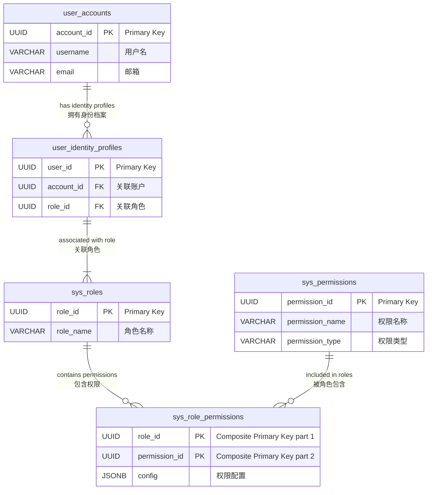

# 模块4：DetailedDesign - 权限管理系统设计

本文档作为《技术文档完善项目执行计划》中模块4的P0级交付物（任务编号P4.2），详细阐述Manus MCP Server用户中心服务（`sys.service.user_center`）中的权限管理系统设计。本设计紧密结合《模块4：用户中心服务详细设计文档（修订版）》中关于用户账户与身份档案分离的核心模型，以及《模块2：DetailedDesign - Redis缓存架构设计》中定义的高性能Redis缓存方案，旨在构建一个支持多身份档案、基于角色的访问控制（RBAC）体系，并提供毫秒级的权限校验能力。

## 1. 权限模型：基于多身份档案的RBAC模型

本权限管理系统基于修改后的RBAC模型，核心实体包括：

1.  权限 (Permission/Right): 平台中允许执行的原子操作或可消耗的资源配额。例如，`task:create` (创建任务操作), `model:gpt4:calls` (GPT-4 模型调用次数权益), `storage:quota_bytes` (存储空间配额权益)。权限是定义系统能力的最小单元。定义在`sys_permissions`表。
2.  角色 (Role): 权限的集合。一个角色定义了一组权限和权益配置。例如，"基础用户" 角色可能包含 `task:create` 权限和一定数量的 `model:gpt4:calls` 权益；"高级用户" 角色则可能拥有更多权限和更高的权益配额。定义在`sys_roles`表，角色与权限的关联及配置定义在`sys_role_permissions`表。
3.  用户账户 (User Account): 系统的顶层用户实体，通过`account_id`唯一标识。一个用户账户代表一个实际的个体或组织。用户账户拥有多个身份档案。定义在`user_accounts`表。
4.  用户身份档案 (User Identity Profile): 关联到特定用户账户 (`account_id`) 的一个具体身份或角色上下文。每个身份档案具有独立的 `user_id`，并且严格关联到一个且仅一个角色 (`role_id`)。权限和权益是赋给角色的，并通过身份档案 (`user_id`) 应用到用户。当用户以某个身份档案 (`user_id`) 进行操作时，其权限和权益由此身份档案关联的角色决定。定义在`user_identity_profiles`表。

模型关系概览：

-   权限 (`sys_permissions`) 被分配给角色 (`sys_roles`)，具体配置在 `sys_role_permissions` 表中定义 (多对多)。
-   用户账户 (`user_accounts`) 拥有多个用户身份档案 (`user_identity_profiles`) (一对多)。
-   每个用户身份档案 (`user_identity_profile`) 关联到一个特定的角色 (`sys_roles`) (多对一)。
-   用户身份档案 (`user_id`) 是权限和权益的实际主体。当用户使用某个 `user_id` 进行操作时，其所拥有的权限和权益是该 `user_id` 关联的 `role_id` 所定义的权限和权益。



***权限模型实体关系图***

这种模型支持一个用户账户通过拥有多个身份档案来具备多重角色属性，且每个角色属性（身份档案）下的权限和权益是独立管理和使用的。

数据结构（PostgreSQL）:

核心事实来源数据结构已在《模块2：DetailedDesign - 数据库设计与优化指南》和《模块4：用户中心服务详细设计文档（修订版）》中定义，主要涉及：

*   `sys_permissions`: 定义所有权限/权益。
*   `sys_roles`: 定义所有角色类型。
*   `sys_role_permissions`: 角色 (`role_id`) 与权限 (`permission_id`) 的关联及配置 (`config JSONB`)。
*   `user_accounts`: 用户账户顶层信息。
*   `user_identity_profiles`: 用户身份档案信息，包含 `user_id`, `account_id`, `role_id`。

### 重要约束说明（Mermaid ER图语法限制，实际SQL实现中包含）：

1. **复合主键约束**
   - `sys_role_permissions` 表使用复合主键：
     ```sql
     PRIMARY KEY (role_id, permission_id)
     ```

2. **外键约束**
   - `sys_role_permissions` 表：
     ```sql
     FOREIGN KEY (role_id) REFERENCES sys_roles(role_id)
     FOREIGN KEY (permission_id) REFERENCES sys_permissions(permission_id)
     ```
   - `user_identity_profiles` 表：
     ```sql
     FOREIGN KEY (account_id) REFERENCES user_accounts(account_id)
     FOREIGN KEY (role_id) REFERENCES sys_roles(role_id)
     ```

3. **唯一性约束**
   - `sys_roles` 表：
     ```sql
     UNIQUE (role_name)
     ```
   - `sys_permissions` 表：
     ```sql
     UNIQUE (permission_name)
     ```

4. **非空约束**
   - 所有主键字段：`NOT NULL`
   - `sys_roles.role_name`: `NOT NULL`
   - `sys_permissions.permission_name`: `NOT NULL`
   - `sys_permissions.permission_type`: `NOT NULL`

5. **数据类型详细说明**
   - UUID类型字段：`uuid` 类型
   - 名称字段：`VARCHAR(100)`
   - 类型字段：`VARCHAR(50)`
   - 配置字段：`JSONB`
   - 时间戳字段：`TIMESTAMP WITH TIME ZONE`

6. **级联删除规则**
   - 删除角色时级联删除角色权限关系：
     ```sql
     ON DELETE CASCADE
     ```
   - 删除权限时级联删除角色权限关系：
     ```sql
     ON DELETE CASCADE
     ```
   - 删除用户账户时级联删除身份档案：
     ```sql
     ON DELETE CASCADE
     ```

7. **索引设计**
   - 主键索引（自动创建）
   - 外键索引（建议创建）
   - 角色名称索引：
     ```sql
     CREATE INDEX idx_roles_name ON sys_roles(role_name);
     ```
   - 权限名称索引：
     ```sql
     CREATE INDEX idx_permissions_name ON sys_permissions(permission_name);
     ```
   - 权限类型索引：
     ```sql
     CREATE INDEX idx_permissions_type ON sys_permissions(permission_type);
     ```

## 2. 缓存集成：基于Redis的高性能权限数据存储

为了实现毫秒级的权限校验和权益消耗，用户身份档案 (`user_id`) 生效的权限及权益状态数据被计算后存储在Redis中。这一部分的设计直接采纳《模块2：DetailedDesign - Redis缓存架构设计》中的规范。

Redis Key 命名规范:

遵循 `project:module:entity:{id}:[sub_entity]:attribute` 规范，并利用Key Tags `{}` 按 `user_id` 进行分片。

*   用户身份档案 (`user_id`) 的生效权限配置: `mcp:user:perms:{user_id}`
*   用户身份档案 (`user_id`) 的消耗型权益计数: `mcp:user:cons:{user_id}:<right_name>`

Redis 数据结构选型:

1.  `mcp:user:perms:{user_id}` (Hash):
    *   存储特定 `user_id` (身份档案) 当前生效的所有权限和权益的配置。
    *   Hash Field 为权限/权益名称 (`<permission_name>`)。
    *   Hash Value 为该权限/权益的生效配置 JSON 字符串。例如：`{"enabled":true, "limit":100, "unit":"count", "resets_at":1678881994}`。
    *   选择 Hash 是因为可以高效地获取单个权限的配置 (`HGET`) 或所有权限的配置 (`HGETALL`)。
2.  `mcp:user:cons:{user_id}:<right_name>` (String):
    *   存储特定 `user_id` (身份档案) 特定消耗型权益 (`<right_name>`) 的当前已消耗数量。
    *   Value 为表示消耗数量的字符串（例如 "42"）。
    *   选择 String 是为了方便进行原子性的数值增减操作 (`INCRBY`, `DECRBY`)。

数据流与一致性:

*   PostgreSQL是权限/权益定义和用户身份档案角色关联的事实来源。
*   Redis 是用于实时读写的缓存。
*   一致性模型: 采用最终一致性。当PG中的数据发生变化（创建身份档案、更新身份档案的`role_id`、更新`sys_role_permissions`等）时，用户中心服务 (Module 4) 负责触发异步后台任务。该任务从PG读取最新数据，计算该 `user_id` 生效的权限和权益配置，然后调用持久化服务 (Module 2) 提供的Redis写操作，原子性地更新 `mcp:user:perms:{user_id}` Hash 和相关的 `mcp:user:cons:{user_id}:*` Strings。
*   通过 Persistence Service 提供的 Redis Cluster 客户端，利用 `{user_id}` Key Tag 确保 `user_perms:{user_id}` Hash 和 `user_cons:{user_id}:<right_name>` Strings 位于同一个Hash Slot，从而支持跨Key的原子操作（如Lua脚本）。

## 3. 计算与验证：核心算法与流程

### 3.1 生效权限计算与缓存刷新算法

该算法由用户中心服务 Module 4 的后台任务执行，用于计算特定用户身份档案 (`user_id`) 的生效权限和权益配置，并刷新Redis缓存。

触发时机:

-   创建新的 `user_identity_profiles` 记录时。
-   更新现有 `user_identity_profiles` 记录的 `role_id` 字段时。
-   更新 `sys_role_permissions` 记录时（需要找出所有受影响的 `user_id` 并批量触发刷新）。

算法步骤 (针对单个 `user_id`):

1.  输入: `target_user_id` (待计算权限的身份档案ID)。
2.  从 PostgreSQL 读取事实来源:
    *   查询 `user_identity_profiles` 表，获取 `target_user_id` 关联的 `role_id`。
    *   根据获取的 `role_id`，查询 `sys_role_permissions` 表，获取该角色关联的所有 `permission_id` 及其原始配置 (`config JSONB`)。
    *   根据获取的 `permission_id` 列表，查询 `sys_permissions` 表，获取权限的名称 (`permission_name`) 和类型 (`permission_type`)。
3.  计算生效配置:
    *   初始化一个空的生效权限配置映射 (例如，Map<string, JSONB>)。
    *   遍历从PG读取的每个角色权限关联记录：
        *   获取权限名称 (`permission_name`)、权限类型 (`permission_type`) 和原始配置 (`config JSONB`)。
        *   根据业务规则，可能需要基于 `permission_type` 或其他字段调整原始配置，生成最终生效的配置 (`effective_config JSONB`)。例如，对于消耗型权益，需要确保 `enabled` 字段存在。
        *   将 `permission_name` 作为 Key，`effective_config JSONB` 作为 Value，添加到生效权限配置映射中。
4.  构建 Redis 更新命令:
    *   准备 Redis `HMSET` 命令，Key 为 `mcp:user:perms:{target_user_id}`，Fields 和 Values 来自计算出的生效权限配置映射。
    *   准备 Redis `SETNX` 或 `SET` 命令，针对所有消耗型权益 (`permission_type` 为 'consumption') 对应的 `mcp:user:cons:{target_user_id}:<right_name>` Keys。
        *   如果是新建身份档案触发，使用 `SETNX ... "0"` 初始化计数器（如果不存在）。
        *   如果是 `role_id` 更新触发，根据新的角色配置 (`effective_config JSONB` 中的 `resets_at` 或其他标志) 决定是否将计数器 `SET ... "0"`。如果不需要重置，则不执行 SET 命令，保持原有计数。
5.  原子更新 Redis:
    *   调用 Persistence Service 提供的 Redis 写入接口，使用 Pipeline 或 Lua 脚本原子性地执行构建好的 `HMSET` 和 `SET`/`SETNX` 命令。
    *   可以先执行 `DEL mcp:user:perms:{target_user_id}` 清除旧Hash，再执行 `HMSET`，确保数据完全替换。
    *   Redis 操作应在 Persistence Service 中处理Key Tag `{target_user_id}` 的路由，确保命令在同一个节点执行。

伪代码 (仅核心逻辑):

```python
# Pseudocode for CalculateIdentityProfilePermissions (M4 Background Task)

function calculate_and_refresh(target_user_id):
    # 1. Read from PostgreSQL (via Persistence Service PG API)
    profile = persistence_svc.get_identity_profile(target_user_id)
    if profile is None:
        log.error(f"Identity profile not found: {target_user_id}")
        return

    role_id = profile.role_id
    
    # Query role permissions and permission definitions
    role_permissions_data = persistence_svc.query_role_permissions(role_id) 
    # This query joins sys_role_permissions and sys_permissions in PG
    # Returns list of {permission_name, permission_type, config}

    # 2. Calculate effective configuration
    effective_perms_config = {}
    consumption_rights_to_init = []

    for perm_data in role_permissions_data:
        perm_name = perm_data.permission_name
        perm_type = perm_data.permission_type
        raw_config = perm_data.config

        # Apply business logic to derive effective config (simplified)
        effective_config = raw_config 
        if perm_type == 'consumption':
            # Ensure consumption specific fields are present, set defaults if needed
            if 'enabled' not in effective_config: effective_config['enabled'] = True
            if 'limit' not in effective_config: effective_config['limit'] = -1 # -1 for unlimited
            # ... other consumption specific logic

            consumption_rights_to_init.append(perm_name) # Collect consumption rights names

        effective_perms_config[perm_name] = json.dumps(effective_config) # Store as JSON string

    # 3. Build Redis commands (via Persistence Service Redis API wrapper)
    redis_commands = []
    
    # Option 1: Clear and re-set the Hash (simpler, guarantees old permissions are removed)
    redis_commands.append(("DEL", f"mcp:user:perms:{target_user_id}"))
    redis_commands.append(("HMSET", f"mcp:user:perms:{target_user_id}", effective_perms_config)) # HMSET takes key, map

    # Option 2: Use HMSET directly (updates existing fields, adds new, doesn't remove old ones not in the new map)
    # Consider if old permissions should remain if removed from role - typically DEL+HMSET is safer

    # Initialize/Reset consumption counters
    for right_name in consumption_rights_to_init:
        # Check if this is a new profile or if role change mandates reset
        # Simplification: For new profile, use SETNX. For role change, determine reset logic.
        # P0 Simple: Use SETNX on new profiles, SET on role changes if reset is needed per new config
        # More complex logic needed here based on profile creation vs role update
        
        # Example for initialization on new profile:
        redis_commands.append(("SETNX", f"mcp:user:cons:{target_user_id}:{right_name}", "0"))
        
        # Example for potential reset on role update (logic within M4 task):
        # if is_role_change and should_reset_counter(old_config, new_config):
        #    redis_commands.append(("SET", f"mcp:user:cons:{target_user_id}:{right_name}", "0"))


    # 4. Atomic update Redis (via Persistence Service Redis API)
    success, result = persistence_svc.redis_execute_pipeline(redis_commands, key_tag=str(target_user_id)) 
    # Persistence Service ensures these commands run on the same Redis node due to key tag

    if success:
        log.info(f"Successfully refreshed permissions cache for user_id: {target_user_id}")
    else:
        log.error(f"Failed to refresh permissions cache for user_id: {target_user_id}, result: {result}")
        # Implement retry logic for background task
```

### 3.2 实时权限验证算法 (`check_permission`)

该算法由用户中心服务提供API，供业务服务在需要进行授权决策时调用。它主要依赖Redis缓存进行快速查找。

流程:

1.  输入: `calling_user_id` (发起请求的用户身份档案ID), `permission_name` (待检查的权限/权益名称), `required_amount` (可选，如果是消耗型权益，需要检查的消耗数量)。
2.  从 Redis 获取权限配置:
    *   调用 Persistence Service 提供的 Redis API: `persistence_svc.redis_hget(calling_user_id, permission_name)`。Persistence Service 内部构建Key `mcp:user:perms:{calling_user_id}` 并执行 `HGET`。
3.  处理 Redis 结果:
    *   缓存命中且值存在: 获取到权限配置 JSON 字符串。
        *   解析 JSON 字符串，检查 `enabled` 字段是否为 `true`。如果不是，则拒绝访问。
        *   检查权限类型。
            *   如果是普通权限 (`permission_type` != 'consumption'): 如果 `enabled` 为 `true`，则允许访问。
            *   如果是消耗型权益 (`permission_type` == 'consumption'):
                *   检查配置中的 `limit` (`-1` 表示无限)。
                *   如果 `limit` >= 0 (有限额)，则从 Redis 获取当前消耗计数：调用 Persistence Service Redis API: `persistence_svc.redis_get(calling_user_id, f"{permission_name}")`。Persistence Service 内部构建Key `mcp:user:cons:{calling_user_id}:{permission_name}` 并执行 `GET`。
                *   获取消耗计数后，检查 `(current_consumption_count + required_amount) <= limit`。如果满足条件，则允许访问；否则，拒绝访问 (配额不足)。
                *   消耗计数缓存未命中: 这是一个异常情况，理论上权限配置和计数器应同时存在。处理策略：可以认为当前消耗为 0 并继续检查限额；或者为了安全，直接拒绝访问并记录异常，同时触发该 `user_id` 的后台权限缓存刷新任务（高优先级）。
    *   缓存未命中: `mcp:user:perms:{calling_user_id}` 的 `permission_name` 字段缺失。
        *   这表示该 `user_id` 的权限缓存可能过期、被淘汰或尚未生成。
        *   处理策略：为了安全，直接拒绝访问该权限，并记录警告。必须立即触发该 `user_id` 的后台权限缓存刷新任务（高优先级），以便后续请求能够命中缓存。
4.  返回结果: 返回授权结果（允许/拒绝）及原因（如配额不足）。

伪代码 (`check_permission` API):

```python
# Pseudocode for check_permission API endpoint (M4 Service)

function check_permission_api(calling_user_id, permission_name, required_amount = 1):
    try:
        # 1. Get permission configuration from Redis (via Persistence Service)
        # Persistence Service handles key construction mcp:user:perms:{calling_user_id}
        perm_config_json_str = persistence_svc.redis_hget(calling_user_id, permission_name)

        if perm_config_json_str is None:
            # Cache miss for this specific permission field
            log.warning(f"Permission config cache miss for user_id: {calling_user_id}, permission: {permission_name}")
            # Trigger async background refresh for this user_id's cache (high priority)
            trigger_async_permission_refresh(calling_user_id)
            return {"allowed": False, "reason": "Permission configuration not available, refreshing cache."}

        # Cache Hit
        perm_config = json.loads(perm_config_json_str)

        # 2. Check enabled status
        if not perm_config.get("enabled", False): # Default to disabled if field missing
            return {"allowed": False, "reason": "Permission is disabled."}

        # 3. Check permission type and limits
        perm_type = perm_config.get("type", "standard") # Assume 'standard' if type missing
        
        if perm_type == "consumption":
            limit = perm_config.get("limit", -1) # -1 means unlimited
            unit = perm_config.get("unit", "count") # Default unit

            if limit >= 0: # Only check consumption if there is a finite limit
                # Get current consumption count from Redis (via Persistence Service)
                # Persistence Service handles key construction mcp:user:cons:{calling_user_id}:permission_name
                # Note: permission_name is used as right_name here
                current_consumption_str = persistence_svc.redis_get(calling_user_id, permission_name)

                current_consumption = 0
                if current_consumption_str is not None:
                    try:
                        current_consumption = int(current_consumption_str)
                    except ValueError:
                        log.error(f"Invalid consumption counter value in Redis for user_id: {calling_user_id}, right: {permission_name}, value: {current_consumption_str}")
                        # Handle corrupted data: maybe reset counter to 0 or deny
                        current_consumption = 0 # Assume 0 for safety

                # Check if consumption + required_amount exceeds limit
                if (current_consumption + required_amount) > limit:
                    return {"allowed": False, "reason": f"Consumption limit exceeded. Current: {current_consumption}, Required: {required_amount}, Limit: {limit} {unit}."}
                else:
                    # Enough quota
                    return {"allowed": True, "reason": "Quota sufficient."}
            else: # limit is -1 (unlimited)
                return {"allowed": True, "reason": "Unlimited consumption right."}
        else: # Standard permission type
             return {"allowed": True, "reason": "Standard permission granted."}

    except Exception as e:
        log.error(f"Error during permission check for user_id: {calling_user_id}, permission: {permission_name}, error: {e}")
        # In case of unexpected errors (e.g., Redis connection issue, JSON parse error)
        # For safety, deny access and log error.
        return {"allowed": False, "reason": "Internal error during permission check."}

# Note: trigger_async_permission_refresh is a function within M4 that dispatches a background task.
# persistence_svc is an object representing the interface to Module 2 Persistence Service APIs.
```

### 3.3 权益消耗扣减算法 (`deduct_right_consumption`)

该算法由用户中心服务提供API，供业务服务在实际消耗发生时调用。它使用Redis Lua脚本实现原子性检查和扣减。

流程:

1.  输入: `calling_user_id` (发起请求的用户身份档案ID), `right_name` (待扣减的权益名称), `amount` (扣减数量)。
2.  执行 Redis Lua 脚本:
    *   调用 Persistence Service 提供的 Redis Lua 执行接口：`persistence_svc.redis_eval(script, keys, args)`。
    *   Lua 脚本需要访问 `mcp:user:perms:{calling_user_id}` Hash (获取 `limit`) 和 `mcp:user:cons:{calling_user_id}:{right_name}` String (获取 `count` 并执行 `INCRBY`/`DECRBY`)。
    *   Lua 脚本的关键逻辑：
        *   从 `mcp:user:perms:{calling_user_id}` 中 `HGET` 获取 `right_name` 的配置 JSON 字符串。
        *   如果配置不存在、`enabled` 为 false、`limit` 为 -1 (无限)，或者 `amount` <= 0，则脚本可以根据情况返回特定值（例如，成功扣减0或返回错误码）。
        *   如果存在有限 `limit` (`limit` >= 0) 且 `enabled` 为 true：
            *   从 `mcp:user:cons:{calling_user_id}:{right_name}` 中 `GET` 获取当前 `count`。
            *   计算 `new_count = current_count + amount`。
            *   如果 `new_count <= limit`：执行 `SET mcp:user:cons:{calling_user_id}:{right_name} new_count` （或者更原子性的，如果只支持INCRBY，先INCRBY amount，再检查是否超限，超限则回滚或报警）。更推荐在脚本中计算并使用 SET 或通过原子比较设置命令。
            *   如果 `new_count > limit`：返回一个特定错误码或标志（例如，-1）。
        *   脚本的返回值应指示扣减是否成功以及新的消耗值（如果成功）。
3.  处理 Lua 脚本结果:
    *   根据 Lua 脚本的返回值判断扣减是否成功（例如，返回非负数表示成功，返回 -1 表示配额不足）。
    *   如果扣减成功，返回成功响应。
    *   如果扣减失败（配额不足或其他脚本内部定义的错误），返回失败响应（例如，403 Forbidden，并包含具体原因）。
    *   如果 Redis 操作本身失败（连接错误、脚本错误等），Persistence Service 会返回错误，用户中心服务应记录错误并返回内部错误响应（500 Internal Server Error）。
    *   如果权限配置 (`mcp:user:perms:{calling_user_id}`) 缺失: Lua 脚本内部应处理这种情况。如果无法获取权限配置，脚本应返回错误码。用户中心服务接收到此错误后，应拒绝扣减请求，并触发该 `user_id` 的后台权限缓存刷新任务。

Lua 脚本示例 (核心逻辑):

```lua
-- Example Lua Script for atomic consumption check and deduction
-- KEYS[1]: mcp:user:cons:{user_id}:right_name (consumption counter string)
-- KEYS[2]: mcp:user:perms:{user_id} (permissions hash key)
-- ARGV[1]: amount (amount to deduct/increase)
-- ARGV[2]: right_name (permission name, same as part of KEYS[1])

local counter_key = KEYS[1]
local perms_key = KEYS[2]
local amount = tonumber(ARGV[1])
local right_name = ARGV[2] -- Used to HGET from perms_key

-- 1. Get permission config from hash
local perm_config_json_str = redis.call('HGET', perms_key, right_name)

if not perm_config_json_str then
    -- Permission config missing, cannot proceed
    return -2 -- Custom error code for config missing
end

local perm_config = cjson.decode(perm_config_json_str) -- Requires cjson library

if not perm_config or not perm_config['enabled'] then
    -- Permission/Right is disabled or invalid config
    return -3 -- Custom error code for disabled/invalid
end

local limit = perm_config['limit'] or -1 -- Default to -1 (unlimited)
local unit = perm_config['unit'] or 'count' -- Default unit

if limit < 0 then
    -- Unlimited, deduction always allowed (but maybe still track consumption?)
    -- If just checking allowance for unlimited, return 0 or specific success code.
    -- If still need to increment counter for tracking even if unlimited:
    -- redis.call('INCRBY', counter_key, amount)
    -- return redis.call('GET', counter_key) -- Return new count
    return 0 -- Indicate success for unlimited right check/deduction
end

-- 2. Get current consumption count
local current_consumption_str = redis.call('GET', counter_key)
local current_consumption = 0
if current_consumption_str then
    current_consumption = tonumber(current_consumption_str)
    if not current_consumption then
         -- Handle corrupted data, counter is not a number
         return -4 -- Custom error code for corrupted data
    end
end

-- 3. Check limit and perform deduction
local new_consumption = current_consumption + amount

if new_consumption > limit then
    -- Limit exceeded
    return -1 -- Custom error code for limit exceeded
else
    -- Within limit, perform atomic increment/decrement
    redis.call('SET', counter_key, tostring(new_consumption)) -- Use SET for atomic update
    -- Alternatively, if only ever increasing: redis.call('INCRBY', counter_key, amount)
    return new_consumption -- Return the new consumption count
end
```

伪代码 (`deduct_right_consumption` API):

```python
# Pseudocode for deduct_right_consumption API endpoint (M4 Service)

function deduct_right_consumption_api(calling_user_id, right_name, amount):
    if amount <= 0:
        return {"success": False, "reason": "Deduction amount must be positive."}

    # Load Lua script (should be loaded once on service startup and use SHA)
    local lua_script_sha = load_or_get_script_sha("check_and_deduct_consumption.lua")

    # Define Redis Keys and Args for the Lua script
    counter_key = f"mcp:user:cons:{calling_user_id}:{right_name}"
    perms_key = f"mcp:user:perms:{calling_user_id}" # Key for permissions hash

    # Note: Need to get the limit from the perms_key within the Lua script for atomicity
    # So the Lua script args should include the right_name to look up the limit
    # ARGV: [amount, right_name]
    # KEYS: [counter_key, perms_key]

    keys = [counter_key, perms_key] # Pass actual keys to Redis EVAL
    args = [amount, right_name]

    try:
        # Execute Lua script via Persistence Service
        # Persistence Service ensures script runs on the correct node based on keys[1] key tag {calling_user_id}
        lua_result = persistence_svc.redis_eval_sha(lua_script_sha, keys, args, key_tag=str(calling_user_id))

        # 4. Process Lua script result
        if isinstance(lua_result, (int, float)) and lua_result >= 0:
            # Script returned new consumption count (>= 0), indicating success or unlimited right
            return {"success": True, "new_consumption": lua_result}
        elif lua_result == -1:
            return {"success": False, "reason": "Consumption limit exceeded."}
        elif lua_result == -2:
             log.warning(f"Consumption deduct failed for user_id: {calling_user_id}, right: {right_name}. Reason: Config missing.")
             # Trigger async background refresh as config is missing
             trigger_async_permission_refresh(calling_user_id)
             return {"success": False, "reason": "Consumption right configuration missing, refreshing cache."}
        elif lua_result == -3:
             return {"success": False, "reason": "Consumption right is disabled or invalid."}
        elif lua_result == -4:
             log.error(f"Consumption deduct failed for user_id: {calling_user_id}, right: {right_name}. Reason: Corrupted counter data.")
             # Handle corrupted data: Maybe trigger reset/refresh? For now, just deny.
             return {"success": False, "reason": "Consumption counter data corrupted."}
        else:
            log.error(f"Unexpected Lua script result for user_id: {calling_user_id}, right: {right_name}: {lua_result}")
            return {"success": False, "reason": "Unexpected result from consumption process."}

    except Exception as e:
        log.error(f"Error executing Lua script for user_id: {calling_user_id}, right: {right_name}, error: {e}")
        # Persistence Service might throw error on network issues etc.
        return {"success": False, "reason": "Internal error during consumption deduction."}

# Note: load_or_get_script_sha loads the script content, registers it with Redis and gets the SHA, caching the SHA.
```

## 4. API 设计 (用户中心内部API)

权限管理功能主要通过用户中心服务内部API暴露给其他模块或管理界面。以下是核心API的设计规范，调用这些API时需要已通过OAuth2认证，并在请求上下文或Token中提供操作的`account_id`和当前选定的`user_id`（对于需要身份档案上下文的操作）。

通用请求/响应结构遵循《模块4：用户中心服务详细设计文档（修订版）》中的定义。

### 4.1 获取用户账户下的所有身份档案列表

-   目的: 用户登录后，展示其拥有的所有身份档案，供用户选择。
-   端点: `/sys/service/user_center/v1/accounts/{accountId}/identity-profiles`
-   方法: `GET`
-   描述: 获取用户账户 (`accountId`) 下所有身份档案 (`user_id`s) 的列表及其概要信息。
-   路径参数:
    -   `accountId` (UUID): 用户账户 ID。
-   查询参数: (Optional)
    -   `status` (string): 按状态过滤身份档案 (e.g., 'active').
-   请求体: (None)
-   响应体 (200 OK):
    ```json
    {
      "code": 0,
      "message": "Identity profiles retrieved successfully.",
      "data": {
        "identity_profiles": [
          {
            "user_id": "uuid",
            "role_id": "uuid",
            "role_name": "string", // 可以通过JOIN sys_roles获取
            "username": "string", // 身份档案显示名称
            "status": "string",
            "created_at": "timestamp"
          },
          // ... more profiles
        ]
      }
    }
    ```
-   错误码: `403 Forbidden` (调用方无权查询此账户的身份档案), `404 Not Found` (账户不存在), `500 Internal Server Error`.
-   实现: 调用 Persistence Service PG API (`GET /v1/user-identity-profiles?account_id={accountId}`) 并 JOIN `sys_roles` 表获取 `role_name`。

### 4.2 为用户账户创建新的身份档案 (新增角色身份)

-   目的: 为现有用户账户添加一个新的身份档案，关联到一个新的角色。
-   端点: `/sys/service/user_center/v1/accounts/{accountId}/identity-profiles`
-   方法: `POST`
-   描述: 为指定的 `accountId` 创建一个新的身份档案 (`user_id`) 并关联 `roleId`。
-   路径参数:
    -   `accountId` (UUID): 目标用户账户 ID。
-   请求体:
    ```json
    {
      "role_id": "string", // 要关联的角色 ID (UUID)
      "username": "string", // (Optional) 为此身份档案指定的显示名称
      "profile_data": "object" // (Optional) 此身份档案的附加属性 (JSONB)
    }
    ```
-   响应体 (201 Created):
    ```json
    {
      "code": 0,
      "message": "Identity profile created successfully.",
      "data": {
        "user_id": "uuid" // 新创建身份档案的 user_id
      }
    }
    ```
-   错误码: `400 Bad Request` (输入参数非法), `403 Forbidden` (调用方无权操作), `404 Not Found` (账户或角色不存在), `409 Conflict` (如账户下已存在同种角色的身份档案), `500 Internal Server Error`.
-   实现:
    1.  生成新的 `user_id` (UUID V7)。
    2.  调用 Persistence Service PG API (`POST /v1/user-identity-profiles`) 创建身份档案记录，包含 `user_id`, `accountId`, `roleId`, `username`, `profile_data` 等。
    3.  如果PG创建成功，触发该新 `user_id` 的后台权限缓存刷新任务。

### 4.3 检查特定身份档案是否拥有某权限/权益

-   目的: 供业务服务进行细粒度的授权决策。
-   端点: `/sys/service/user_center/v1/identity-profiles/{userId}/permissions/check`
-   方法: `POST` (或 `GET` 带参数, `POST` 更适合携带 `required_amount` 和未来可能的复杂条件)
-   描述: 检查特定身份档案 (`userId`) 是否拥有指定权限/权益，并根据需要检查消耗限制。
-   路径参数:
    -   `userId` (UUID): 待检查的身份档案 ID。
-   请求体:
    ```json
    {
      "permission_name": "string", // 要检查的权限/权益名称
      "required_amount": "number" // (Optional, default 1) 如果是消耗型，检查是否至少有此数量的剩余
    }
    ```
-   响应体 (200 OK):
    ```json
    {
      "code": 0,
      "message": "Permission check completed.",
      "data": {
        "allowed": "boolean", // 是否允许访问
        "reason": "string"    // 允许或拒绝的原因 (e.g., "Granted", "Insufficient quota", "Permission disabled")
      }
    }
    ```
-   错误码: `400 Bad Request`, `404 Not Found` (身份档案不存在 - 可以在M4内部查PG，也可以依赖Redis缓存miss+PG回源失败), `500 Internal Server Error`.
-   实现: 执行上述 "实时权限验证算法 (`check_permission`)" 伪代码逻辑，主要调用 Persistence Service Redis HGET/GET API。

### 4.4 对特定身份档案的消耗型权益进行原子扣减

-   目的: 供业务服务在资源实际消耗后扣减权益计数。
-   端点: `/sys/service/user_center/v1/identity-profiles/{userId}/rights/deduct`
-   方法: `POST`
-   描述: 对特定身份档案 (`userId`) 的消耗型权益 (`rightName`) 进行原子性扣减。
-   路径参数:
    -   `userId` (UUID): 待扣减权益的身份档案 ID。
-   请求体:
    ```json
    {
      "right_name": "string", // 要扣减的权益名称
      "amount": "number"      // 扣减数量 (必须 > 0)
    }
    ```
-   响应体 (200 OK):
    ```json
    {
      "code": 0,
      "message": "Consumption deducted successfully.",
      "data": {
        "new_consumption": "number" // 扣减后的最新消耗值
      }
    }
    ```
-   错误码: `400 Bad Request`, `403 Forbidden` (无权扣减或配额不足针对此 `userId`), `404 Not Found` ( `userId` 不存在或权益不存在/未启用), `500 Internal Server Error`.
-   实现: 执行上述 "权益消耗扣减算法 (`deduct_right_consumption`)" 伪代码逻辑，主要调用 Persistence Service Redis EVAL API 执行 Lua 脚本。

### 4.5 获取特定身份档案所有生效权限和权益列表

-   目的: 供用户界面或需要展示用户详细权限/权益的模块调用。
-   端点: `/sys/service/user_center/v1/identity-profiles/{userId}/permissions`
-   方法: `GET`
-   描述: 获取特定身份档案 (`userId`) 所有生效的权限和权益列表及其计算后的配置。
-   路径参数:
    -   `userId` (UUID): 待查询的身份档案 ID。
-   请求体: (None)
-   响应体 (200 OK):
    ```json
    {
      "code": 0,
      "message": "Permissions retrieved successfully.",
      "data": {
        "permissions": { // 返回一个对象，key为权限名，value为配置
          "permission_name_1": { // 配置JSON对象
            "enabled": true,
            "limit": 100,
            "unit": "count"
            // ... other config fields
          },
          "permission_name_2": {
             "enabled": false
          }
          // ... more permissions
        }
        // Optionally include current consumption for consumption rights
        // "consumption_status": {
        //     "right_name_1": { "current": 42, "limit": 100, "unit": "count", "resets_at": 1678881994 },
        //     ...
        // }
      }
    }
    ```
-   错误码: `403 Forbidden` (调用方无权查询), `404 Not Found` (身份档案不存在), `500 Internal Server Error`.
-   实现: 调用 Persistence Service Redis API (`persistence_svc.redis_hgetall(userId)`). Persistence Service 内部构建Key `mcp:user:perms:{userId}` 并执行 `HGETALL`。如果缓存未命中，触发后台刷新并可选择从PG回源（但性能较低），或者返回空列表并提示刷新中。为获取消耗状态，需要对每个消耗型权益单独调用 Persistence Service Redis GET API，这可能引入 N+1 查询问题或需要 Persistence Service 提供批量GET能力，或在Lua脚本中批量获取。简单起见，P0阶段可以只返回权限配置。

## 5. 数据一致性保障与AI可执行性

数据一致性:

-   PG是事实来源，Redis是高性能缓存。
-   一致性是最终一致性。通过在PG数据变更（创建身份档案、更新角色、更新角色权限）时异步触发Redis缓存刷新任务来实现。
-   刷新任务从PG读取最新数据，计算生效配置，然后通过Persistence Service提供的原子Redis操作（Pipeline或Lua）更新Redis。
-   实时权限检查 (`check_permission`) 和消耗扣减 (`deduct_right_consumption`) 优先读/操作Redis。
-   如果Redis缓存缺失或过期，实时校验/扣减逻辑会拒绝操作（确保安全）并触发高优先级的后台缓存刷新任务，以便后续请求能够命中最新数据。
-   消耗扣减使用Redis Lua脚本保证原子性，避免并发问题。

AI 可执行性:

-   模型清晰: RBAC模型及其在账户-身份档案-角色-权限层级的映射关系明确，数据结构（PG表和Redis Keys/Types/Fields）详细定义。
-   算法具体: 权限计算（PG->Redis刷新）、实时校验（Redis读+逻辑判断）、原子扣减（Redis Lua）的算法流程和伪代码清晰，包括关键步骤、判断逻辑、依赖的Persistence Service API调用和异常处理。
-   API 规范: 提供的API端点、方法、参数、请求体、响应体和错误码具体，足以指导API接口的实现。
-   依赖明确: 清晰指出对Persistence Service PG API和Redis API的依赖，并说明调用时需要提供的关键信息（如`user_id`）。Redis Key命名和数据结构定义引用了模块2文档，保证了一致性。
-   异常处理: 考虑了缓存未命中、配置缺失、配额不足等核心异常情况，并给出了处理策略（拒绝、触发刷新、记录日志）。

这份文档提供了构建用户中心权限管理系统的详细蓝图，从数据模型到实现算法和API接口都进行了详细规范，特别是整合了多身份档案模型和高性能Redis缓存方案，应能有效指导后续的AI代码实现工作。